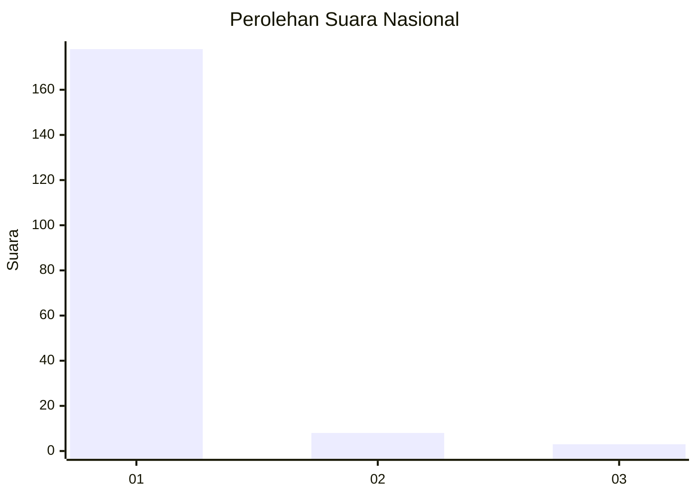
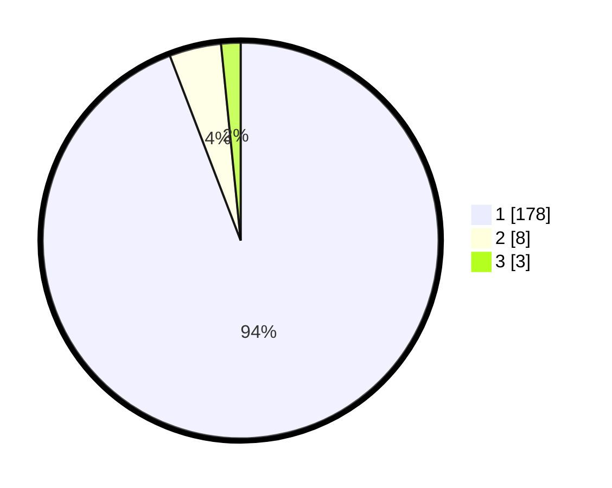

# Hasil

## Grafik

## Tabel

| No. | Nama Paslon    | Suara | Suara (raw) | Persentase |
|:--- |:-------------- | -----:| -----------:| ----------:|
| 1   | ANIES MUHAIMIN | 178   | [178][p-1]  | 94,18      |
| 2   | PRABOWO GIBRAN | 8     | [8][p-2]    | 4,23       |
| 3   | GANJAR MAHFUD  | 3     | [3][p-3]    | 1,59       |

[p-1]: https://github.com/gigit-pemilu/pemilu-2024/blob/main/pilpres/hitung-suara/sub/11-aceh/sub/08-aceh-utara/sub/15-sawang/sub/2015-teupin-rusep/sub/004-tps/sub/paslon-1.txt
[p-2]: https://github.com/gigit-pemilu/pemilu-2024/blob/main/pilpres/hitung-suara/sub/11-aceh/sub/08-aceh-utara/sub/15-sawang/sub/2015-teupin-rusep/sub/004-tps/sub/paslon-2.txt
[p-3]: https://github.com/gigit-pemilu/pemilu-2024/blob/main/pilpres/hitung-suara/sub/11-aceh/sub/08-aceh-utara/sub/15-sawang/sub/2015-teupin-rusep/sub/004-tps/sub/paslon-3.txt

## Foto C Plano

https://sirekap-obj-formc.kpu.go.id/bbf8/pemilu/ppwp/11/08/15/20/15/1108152015004-20240215-073548--c86c4036-bcfa-438b-aeb4-f426b902ca8f.jpg

https://sirekap-obj-formc.kpu.go.id/bbf8/pemilu/ppwp/11/08/15/20/15/1108152015004-20240215-074027--78b25f9b-9c78-4786-b085-7126d2af5412.jpg

https://sirekap-obj-formc.kpu.go.id/bbf8/pemilu/ppwp/11/08/15/20/15/1108152015004-20240215-073916--6eef6f69-e026-421c-9fca-b8a1986f8055.jpg

## Metadata

| Key        | Value               |
| ---------- | ------------------- |
| Time Stamp | 2024-02-16 16:25:10 |

