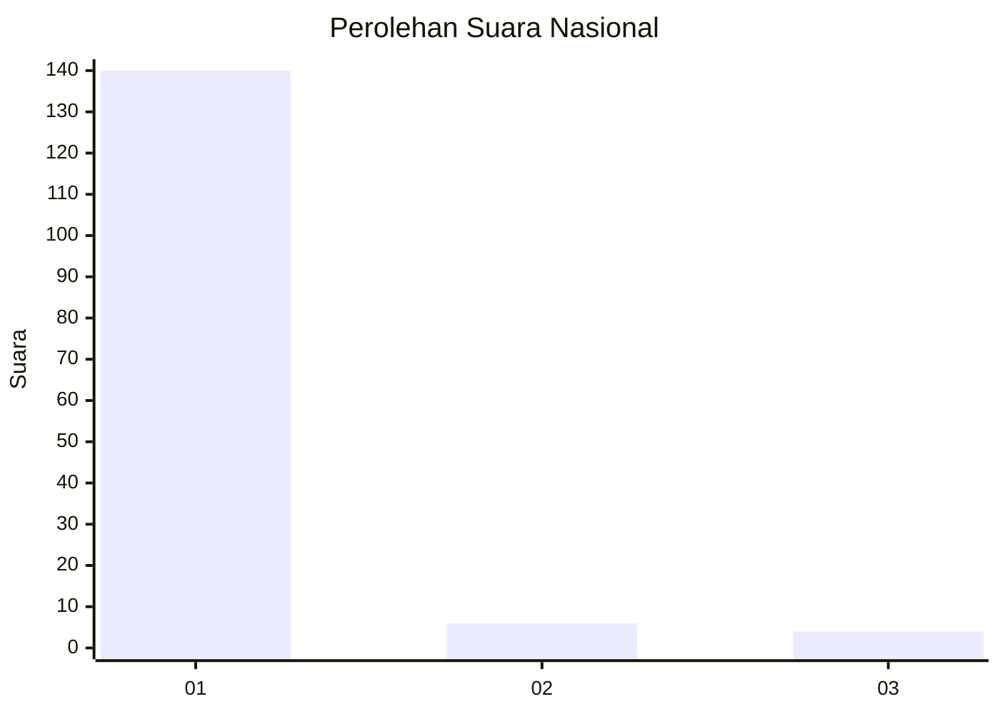
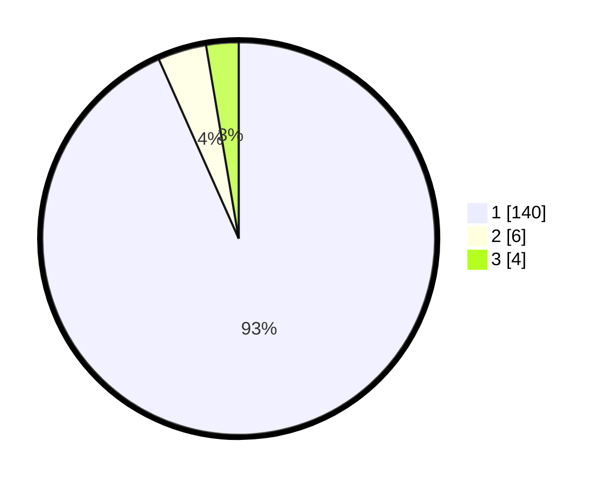

# Hasil

## Grafik

## Tabel

| No. | Nama Paslon    | Suara | Suara (raw) | Persentase |
|:--- |:-------------- | -----:| -----------:| ----------:|
| 1   | ANIES MUHAIMIN | 140   | [140][p-1]  | 93,33      |
| 2   | PRABOWO GIBRAN | 6     | [6][p-2]    | 4,00       |
| 3   | GANJAR MAHFUD  | 4     | [4][p-3]    | 2,67       |

[p-1]: https://github.com/gigit-pemilu/pemilu-2024/blob/main/pilpres/hitung-suara/sub/11-aceh/sub/08-aceh-utara/sub/15-sawang/sub/2015-teupin-rusep/sub/005-tps/sub/paslon-1.txt
[p-2]: https://github.com/gigit-pemilu/pemilu-2024/blob/main/pilpres/hitung-suara/sub/11-aceh/sub/08-aceh-utara/sub/15-sawang/sub/2015-teupin-rusep/sub/005-tps/sub/paslon-2.txt
[p-3]: https://github.com/gigit-pemilu/pemilu-2024/blob/main/pilpres/hitung-suara/sub/11-aceh/sub/08-aceh-utara/sub/15-sawang/sub/2015-teupin-rusep/sub/005-tps/sub/paslon-3.txt

## Foto C Plano

https://sirekap-obj-formc.kpu.go.id/d7c9/pemilu/ppwp/11/08/15/20/15/1108152015005-20240215-054021--5486dbdc-f43f-4758-b883-03c49af588bf.jpg

https://sirekap-obj-formc.kpu.go.id/d7c9/pemilu/ppwp/11/08/15/20/15/1108152015005-20240215-054133--d8388ea5-8dfb-4f68-af66-5d7e467b5b2a.jpg

https://sirekap-obj-formc.kpu.go.id/d7c9/pemilu/ppwp/11/08/15/20/15/1108152015005-20240215-054216--411a8ce4-1776-478f-a37c-8d7a91cf9668.jpg

## Metadata

| Key        | Value               |
| ---------- | ------------------- |
| Time Stamp | 2024-02-15 16:30:25 |

