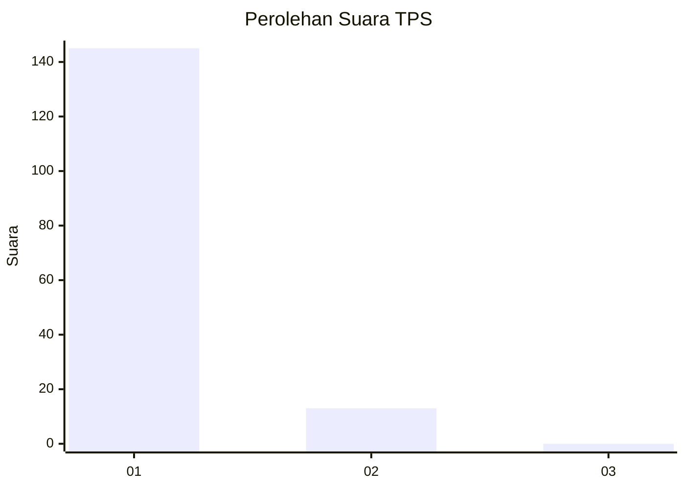
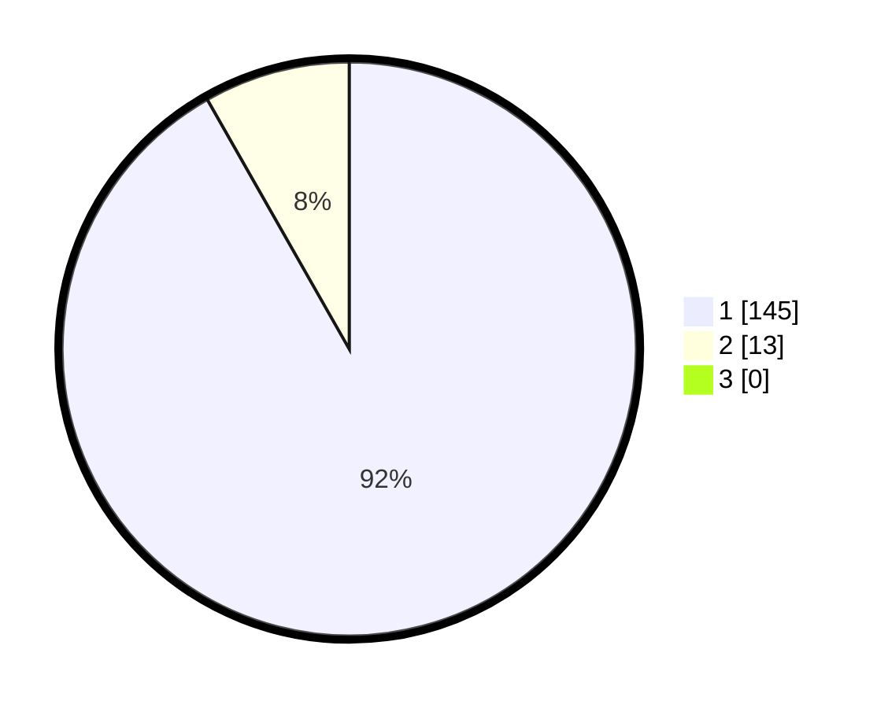

# Hasil

## Grafik

## Tabel

| No. | Nama Paslon    | Suara | Suara (raw) | Persentase |
|:--- |:-------------- | -----:| -----------:| ----------:|
| 1   | ANIES MUHAIMIN | 145   | [145][p-1]  | 91,77      |
| 2   | PRABOWO GIBRAN | 13    | [13][p-2]   | 8,23       |
| 3   | GANJAR MAHFUD  | 0     | [0][p-3]    | 0,00       |

[p-1]: https://github.com/gigit-pemilu/pemilu-2024-11-aceh/blob/main/pilpres/hitung-suara/sub/11-aceh/sub/08-aceh-utara/sub/15-sawang/sub/2015-teupin-rusep/sub/010-tps/sub/paslon-1.txt
[p-2]: https://github.com/gigit-pemilu/pemilu-2024-11-aceh/blob/main/pilpres/hitung-suara/sub/11-aceh/sub/08-aceh-utara/sub/15-sawang/sub/2015-teupin-rusep/sub/010-tps/sub/paslon-2.txt
[p-3]: https://github.com/gigit-pemilu/pemilu-2024-11-aceh/blob/main/pilpres/hitung-suara/sub/11-aceh/sub/08-aceh-utara/sub/15-sawang/sub/2015-teupin-rusep/sub/010-tps/sub/paslon-3.txt

## Foto C Plano

https://sirekap-obj-formc.kpu.go.id/fc90/pemilu/ppwp/11/08/15/20/15/1108152015010-20240222-171602--f1fc4703-5d72-4402-932e-c33aa9564012.jpg

https://sirekap-obj-formc.kpu.go.id/fc90/pemilu/ppwp/11/08/15/20/15/1108152015010-20240222-171803--741aec00-6620-49f1-8b1f-46ef25433c11.jpg

https://sirekap-obj-formc.kpu.go.id/fc90/pemilu/ppwp/11/08/15/20/15/1108152015010-20240222-172130--1ef5686c-abfb-47a8-ba45-4fc5c3a544d9.jpg

## Metadata

| Key        | Value               |
| ---------- | ------------------- |
| Time Stamp | 2024-02-24 22:31:28 |

