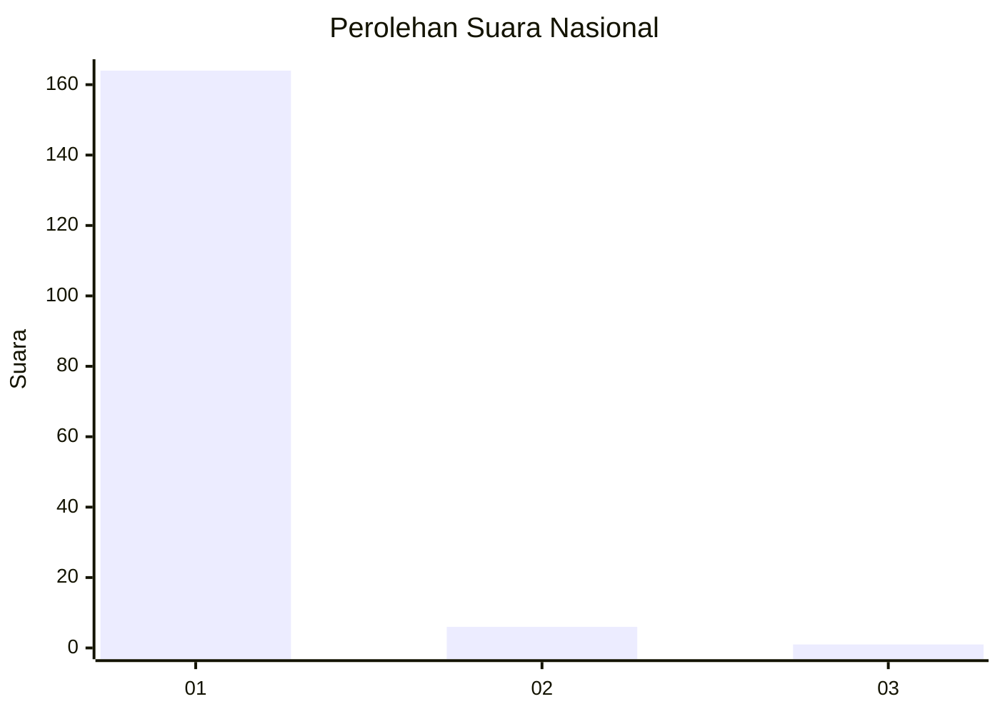
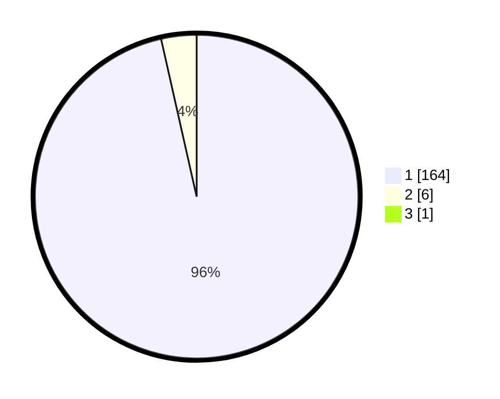

# Hasil

## Grafik

## Tabel

| No. | Nama Paslon    | Suara | Suara (raw) | Persentase |
|:--- |:-------------- | -----:| -----------:| ----------:|
| 1   | ANIES MUHAIMIN | 164   | [164][p-1]  | 95,91      |
| 2   | PRABOWO GIBRAN | 6     | [6][p-2]    | 3,51       |
| 3   | GANJAR MAHFUD  | 1     | [1][p-3]    | 0,58       |

[p-1]: https://github.com/gigit-pemilu/pemilu-2024/blob/main/pilpres/hitung-suara/sub/11-aceh/sub/08-aceh-utara/sub/15-sawang/sub/2016-ulee-geudong/sub/003-tps/sub/paslon-1.txt
[p-2]: https://github.com/gigit-pemilu/pemilu-2024/blob/main/pilpres/hitung-suara/sub/11-aceh/sub/08-aceh-utara/sub/15-sawang/sub/2016-ulee-geudong/sub/003-tps/sub/paslon-2.txt
[p-3]: https://github.com/gigit-pemilu/pemilu-2024/blob/main/pilpres/hitung-suara/sub/11-aceh/sub/08-aceh-utara/sub/15-sawang/sub/2016-ulee-geudong/sub/003-tps/sub/paslon-3.txt

## Foto C Plano

https://sirekap-obj-formc.kpu.go.id/dd46/pemilu/ppwp/11/08/15/20/16/1108152016003-20240215-034959--113440cf-26dc-4791-b490-a5570eed22fc.jpg

https://sirekap-obj-formc.kpu.go.id/dd46/pemilu/ppwp/11/08/15/20/16/1108152016003-20240215-035104--113c4f4c-73c3-4524-a793-de40a6b376fd.jpg

https://sirekap-obj-formc.kpu.go.id/dd46/pemilu/ppwp/11/08/15/20/16/1108152016003-20240215-035238--9f0debf1-5e59-4cea-a86f-50ca3e754474.jpg

## Metadata

| Key        | Value               |
| ---------- | ------------------- |
| Time Stamp | 2024-02-15 19:00:26 |

