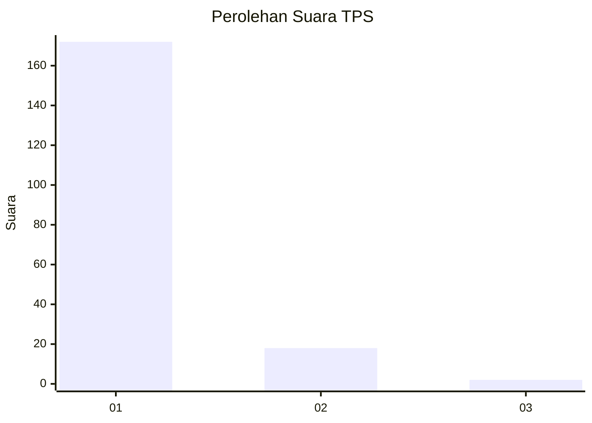
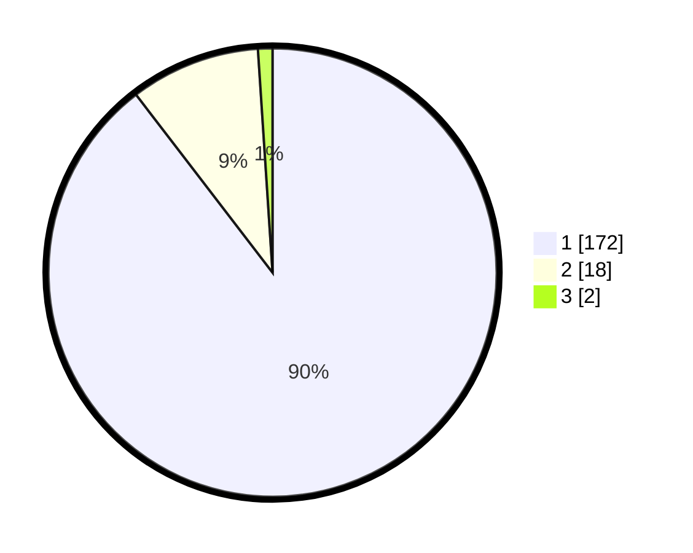

# Hasil

## Grafik

## Tabel

| No. | Nama Paslon    | Suara | Suara (raw) | Persentase |
|:--- |:-------------- | -----:| -----------:| ----------:|
| 1   | ANIES MUHAIMIN | 172   | [172][p-1]  | 89,58      |
| 2   | PRABOWO GIBRAN | 18    | [18][p-2]   | 9,38       |
| 3   | GANJAR MAHFUD  | 2     | [2][p-3]    | 1,04       |

[p-1]: https://github.com/gigit-pemilu/pemilu-2024-11-aceh/blob/main/pilpres/hitung-suara/sub/11-aceh/sub/08-aceh-utara/sub/15-sawang/sub/2018-cot-kumuneng/sub/001-tps/sub/paslon-1.txt
[p-2]: https://github.com/gigit-pemilu/pemilu-2024-11-aceh/blob/main/pilpres/hitung-suara/sub/11-aceh/sub/08-aceh-utara/sub/15-sawang/sub/2018-cot-kumuneng/sub/001-tps/sub/paslon-2.txt
[p-3]: https://github.com/gigit-pemilu/pemilu-2024-11-aceh/blob/main/pilpres/hitung-suara/sub/11-aceh/sub/08-aceh-utara/sub/15-sawang/sub/2018-cot-kumuneng/sub/001-tps/sub/paslon-3.txt

## Foto C Plano

https://sirekap-obj-formc.kpu.go.id/5b16/pemilu/ppwp/11/08/15/20/18/1108152018001-20240215-085703--4134f2b0-2bae-4184-9db7-771b8887b549.jpg

https://sirekap-obj-formc.kpu.go.id/5b16/pemilu/ppwp/11/08/15/20/18/1108152018001-20240215-085907--8c237f88-0d3b-45da-ab3f-39f6b45a4745.jpg

https://sirekap-obj-formc.kpu.go.id/5b16/pemilu/ppwp/11/08/15/20/18/1108152018001-20240215-085954--cff4b993-954d-4e10-b5f4-62b6ca07ade8.jpg

## Metadata

| Key        | Value               |
| ---------- | ------------------- |
| Time Stamp | 2024-02-15 17:30:25 |

