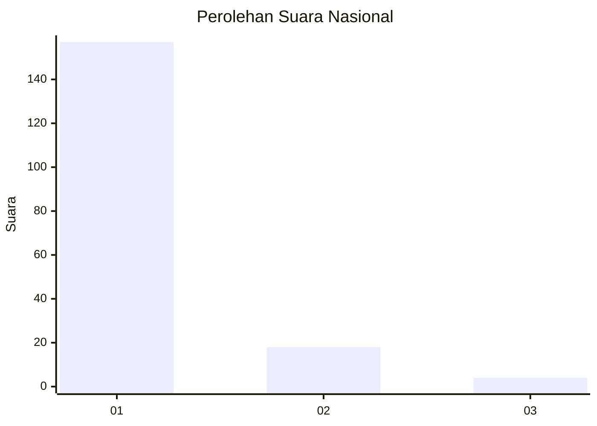
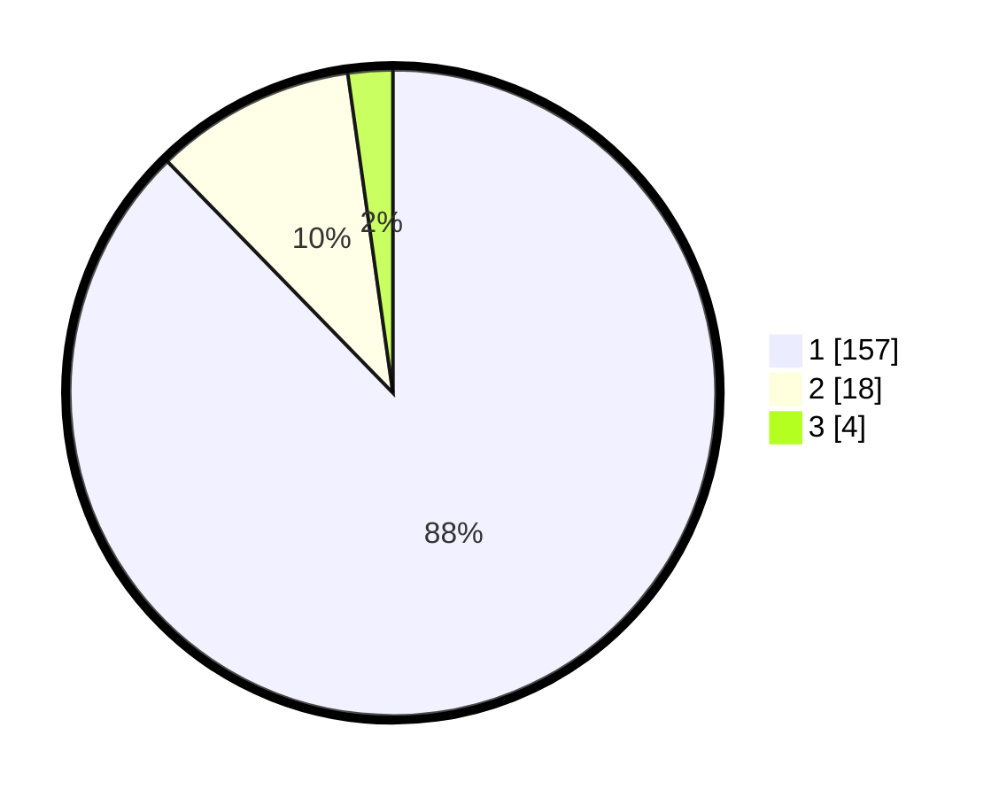

# Hasil

## Grafik

## Tabel

| No. | Nama Paslon    | Suara | Suara (raw) | Persentase |
|:--- |:-------------- | -----:| -----------:| ----------:|
| 1   | ANIES MUHAIMIN | 157   | [157][p-1]  | 87,71      |
| 2   | PRABOWO GIBRAN | 18    | [18][p-2]   | 10,06      |
| 3   | GANJAR MAHFUD  | 4     | [4][p-3]    | 2,23       |

[p-1]: https://github.com/gigit-pemilu/pemilu-2024/blob/main/pilpres/hitung-suara/sub/11-aceh/sub/08-aceh-utara/sub/15-sawang/sub/2020-paya-gaboh/sub/003-tps/sub/paslon-1.txt
[p-2]: https://github.com/gigit-pemilu/pemilu-2024/blob/main/pilpres/hitung-suara/sub/11-aceh/sub/08-aceh-utara/sub/15-sawang/sub/2020-paya-gaboh/sub/003-tps/sub/paslon-2.txt
[p-3]: https://github.com/gigit-pemilu/pemilu-2024/blob/main/pilpres/hitung-suara/sub/11-aceh/sub/08-aceh-utara/sub/15-sawang/sub/2020-paya-gaboh/sub/003-tps/sub/paslon-3.txt

## Foto C Plano

https://sirekap-obj-formc.kpu.go.id/a3c1/pemilu/ppwp/11/08/15/20/20/1108152020003-20240215-014709--db36a8d2-5646-463f-bb88-edaa0813f26d.jpg

https://sirekap-obj-formc.kpu.go.id/a3c1/pemilu/ppwp/11/08/15/20/20/1108152020003-20240215-014801--bd7ca61a-1f88-4594-b233-13d9333353cf.jpg

https://sirekap-obj-formc.kpu.go.id/a3c1/pemilu/ppwp/11/08/15/20/20/1108152020003-20240215-014856--f9b21a14-1982-43d7-a1cc-d225626dfd53.jpg

## Metadata

| Key        | Value               |
| ---------- | ------------------- |
| Time Stamp | 2024-02-15 16:30:25 |

