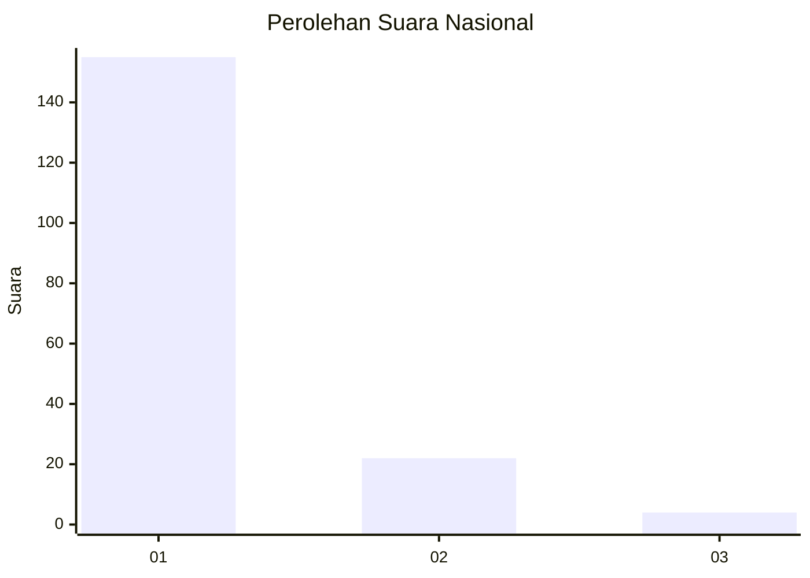
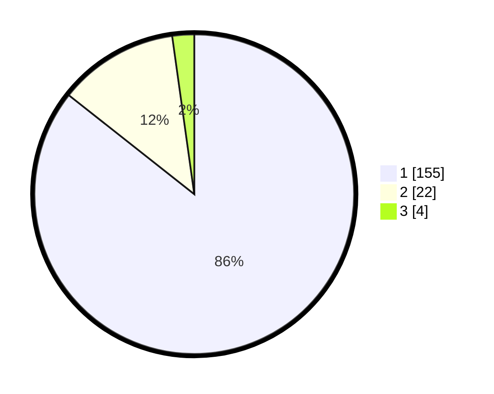

# Hasil

## Grafik

## Tabel

| No. | Nama Paslon    | Suara | Suara (raw) | Persentase |
|:--- |:-------------- | -----:| -----------:| ----------:|
| 1   | ANIES MUHAIMIN | 155   | [155][p-1]  | 85,64      |
| 2   | PRABOWO GIBRAN | 22    | [22][p-2]   | 12,15      |
| 3   | GANJAR MAHFUD  | 4     | [4][p-3]    | 2,21       |

[p-1]: https://github.com/gigit-pemilu/pemilu-2024/blob/main/pilpres/hitung-suara/sub/11-aceh/sub/08-aceh-utara/sub/15-sawang/sub/2022-paya-rabo-timu/sub/001-tps/sub/paslon-1.txt
[p-2]: https://github.com/gigit-pemilu/pemilu-2024/blob/main/pilpres/hitung-suara/sub/11-aceh/sub/08-aceh-utara/sub/15-sawang/sub/2022-paya-rabo-timu/sub/001-tps/sub/paslon-2.txt
[p-3]: https://github.com/gigit-pemilu/pemilu-2024/blob/main/pilpres/hitung-suara/sub/11-aceh/sub/08-aceh-utara/sub/15-sawang/sub/2022-paya-rabo-timu/sub/001-tps/sub/paslon-3.txt

## Foto C Plano

https://sirekap-obj-formc.kpu.go.id/6386/pemilu/ppwp/11/08/15/20/22/1108152022001-20240215-020122--2950f703-7848-49de-b31c-678ea197aeb9.jpg

https://sirekap-obj-formc.kpu.go.id/6386/pemilu/ppwp/11/08/15/20/22/1108152022001-20240215-020227--5312030c-6557-4543-a364-040a9da4e4ad.jpg

https://sirekap-obj-formc.kpu.go.id/6386/pemilu/ppwp/11/08/15/20/22/1108152022001-20240215-132710--da6ca3ac-047f-4df4-b353-29e84a8b6bf6.jpg

## Metadata

| Key        | Value               |
| ---------- | ------------------- |
| Time Stamp | 2024-02-15 16:30:25 |

