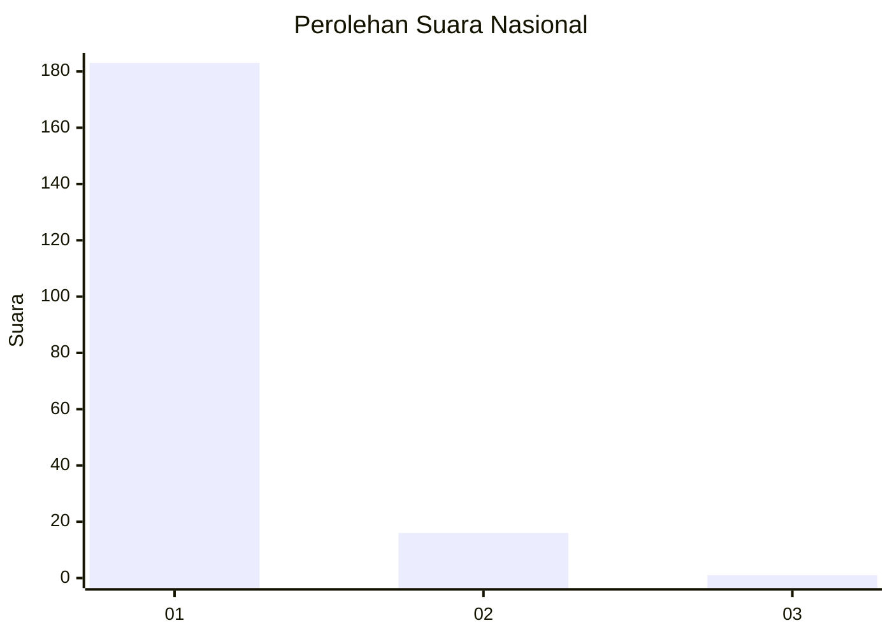
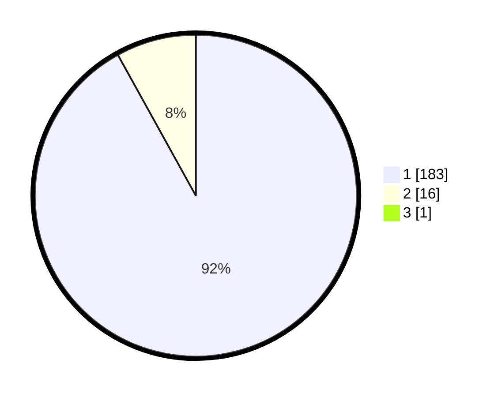

# Hasil

## Grafik

## Tabel

| No. | Nama Paslon    | Suara | Suara (raw) | Persentase |
|:--- |:-------------- | -----:| -----------:| ----------:|
| 1   | ANIES MUHAIMIN | 183   | [183][p-1]  | 91,50      |
| 2   | PRABOWO GIBRAN | 16    | [16][p-2]   | 8,00       |
| 3   | GANJAR MAHFUD  | 1     | [1][p-3]    | 0,50       |

[p-1]: https://github.com/gigit-pemilu/pemilu-2024/blob/main/pilpres/hitung-suara/sub/11-aceh/sub/08-aceh-utara/sub/15-sawang/sub/2027-babah-krueng/sub/001-tps/sub/paslon-1.txt
[p-2]: https://github.com/gigit-pemilu/pemilu-2024/blob/main/pilpres/hitung-suara/sub/11-aceh/sub/08-aceh-utara/sub/15-sawang/sub/2027-babah-krueng/sub/001-tps/sub/paslon-2.txt
[p-3]: https://github.com/gigit-pemilu/pemilu-2024/blob/main/pilpres/hitung-suara/sub/11-aceh/sub/08-aceh-utara/sub/15-sawang/sub/2027-babah-krueng/sub/001-tps/sub/paslon-3.txt

## Foto C Plano

https://sirekap-obj-formc.kpu.go.id/91ae/pemilu/ppwp/11/08/15/20/27/1108152027001-20240215-141652--b2375faa-42a1-43dd-b523-adc92095cbf8.jpg

https://sirekap-obj-formc.kpu.go.id/91ae/pemilu/ppwp/11/08/15/20/27/1108152027001-20240215-142229--6b254f00-7fca-41e4-88e7-aca89123e00b.jpg

https://sirekap-obj-formc.kpu.go.id/91ae/pemilu/ppwp/11/08/15/20/27/1108152027001-20240215-142406--e9c1e704-32b0-4eda-8124-975ef5e24f20.jpg

## Metadata

| Key        | Value               |
| ---------- | ------------------- |
| Time Stamp | 2024-02-15 22:40:13 |

