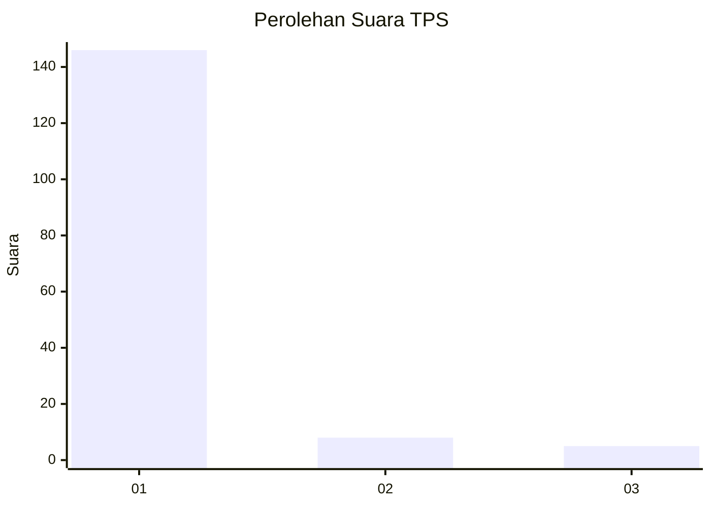
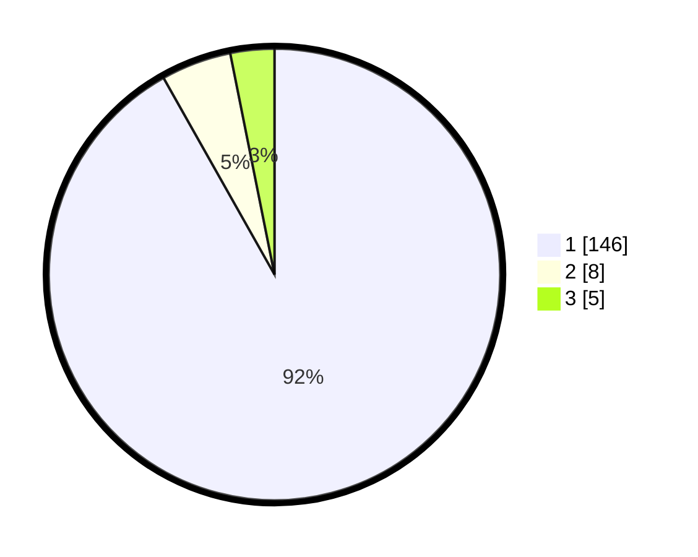

# Hasil

## Grafik

## Tabel

| No. | Nama Paslon    | Suara | Suara (raw) | Persentase |
|:--- |:-------------- | -----:| -----------:| ----------:|
| 1   | ANIES MUHAIMIN | 146   | [146][p-1]  | 91,82      |
| 2   | PRABOWO GIBRAN | 8     | [8][p-2]    | 5,03       |
| 3   | GANJAR MAHFUD  | 5     | [5][p-3]    | 3,14       |

[p-1]: https://github.com/gigit-pemilu/pemilu-2024-11-aceh/blob/main/pilpres/hitung-suara/sub/11-aceh/sub/08-aceh-utara/sub/15-sawang/sub/2028-jurong/sub/004-tps/sub/paslon-1.txt
[p-2]: https://github.com/gigit-pemilu/pemilu-2024-11-aceh/blob/main/pilpres/hitung-suara/sub/11-aceh/sub/08-aceh-utara/sub/15-sawang/sub/2028-jurong/sub/004-tps/sub/paslon-2.txt
[p-3]: https://github.com/gigit-pemilu/pemilu-2024-11-aceh/blob/main/pilpres/hitung-suara/sub/11-aceh/sub/08-aceh-utara/sub/15-sawang/sub/2028-jurong/sub/004-tps/sub/paslon-3.txt

## Foto C Plano

https://sirekap-obj-formc.kpu.go.id/23a7/pemilu/ppwp/11/08/15/20/28/1108152028004-20240214-155511--fd965227-a696-437a-b7b4-96d047b08211.jpg

https://sirekap-obj-formc.kpu.go.id/23a7/pemilu/ppwp/11/08/15/20/28/1108152028004-20240214-155654--5eaa29ad-7fa4-4e33-83b7-59643380ad70.jpg

https://sirekap-obj-formc.kpu.go.id/23a7/pemilu/ppwp/11/08/15/20/28/1108152028004-20240214-155732--a2569770-3beb-44d6-9517-67c3c4a611af.jpg

## Metadata

| Key        | Value               |
| ---------- | ------------------- |
| Time Stamp | 2024-02-15 17:00:25 |

