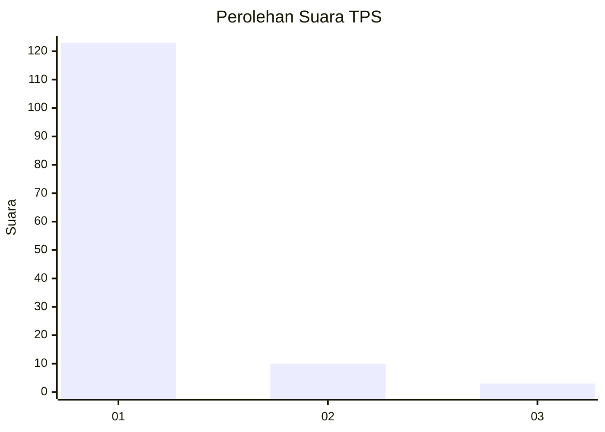
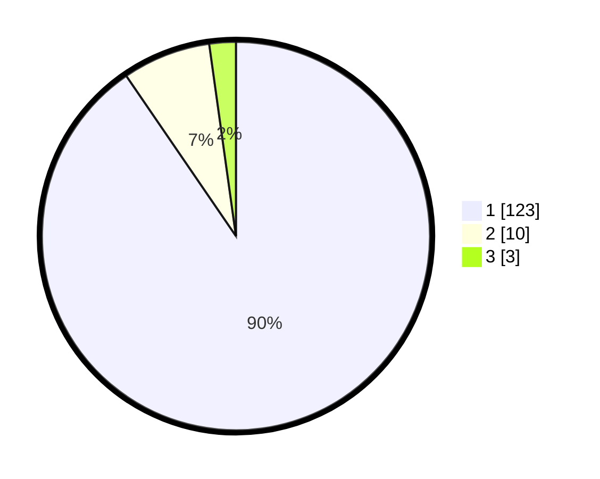

# Hasil

## Grafik

## Tabel

| No. | Nama Paslon    | Suara | Suara (raw) | Persentase |
|:--- |:-------------- | -----:| -----------:| ----------:|
| 1   | ANIES MUHAIMIN | 123   | [123][p-1]  | 90,44      |
| 2   | PRABOWO GIBRAN | 10    | [10][p-2]   | 7,35       |
| 3   | GANJAR MAHFUD  | 3     | [3][p-3]    | 2,21       |

[p-1]: https://github.com/gigit-pemilu/pemilu-2024-11-aceh/blob/main/pilpres/hitung-suara/sub/11-aceh/sub/08-aceh-utara/sub/15-sawang/sub/2030-lhok-jok/sub/001-tps/sub/paslon-1.txt
[p-2]: https://github.com/gigit-pemilu/pemilu-2024-11-aceh/blob/main/pilpres/hitung-suara/sub/11-aceh/sub/08-aceh-utara/sub/15-sawang/sub/2030-lhok-jok/sub/001-tps/sub/paslon-2.txt
[p-3]: https://github.com/gigit-pemilu/pemilu-2024-11-aceh/blob/main/pilpres/hitung-suara/sub/11-aceh/sub/08-aceh-utara/sub/15-sawang/sub/2030-lhok-jok/sub/001-tps/sub/paslon-3.txt

## Foto C Plano

https://sirekap-obj-formc.kpu.go.id/6b72/pemilu/ppwp/11/08/15/20/30/1108152030001-20240215-042457--8950f0c5-28f2-4334-866d-df75b945ae12.jpg

https://sirekap-obj-formc.kpu.go.id/6b72/pemilu/ppwp/11/08/15/20/30/1108152030001-20240215-042527--34f69910-6b55-41f8-ac86-be8e79eed24b.jpg

https://sirekap-obj-formc.kpu.go.id/6b72/pemilu/ppwp/11/08/15/20/30/1108152030001-20240215-042600--b032b8e7-2a85-4fc1-8c4d-52cf1fa81931.jpg

## Metadata

| Key        | Value               |
| ---------- | ------------------- |
| Time Stamp | 2024-02-17 16:00:02 |

