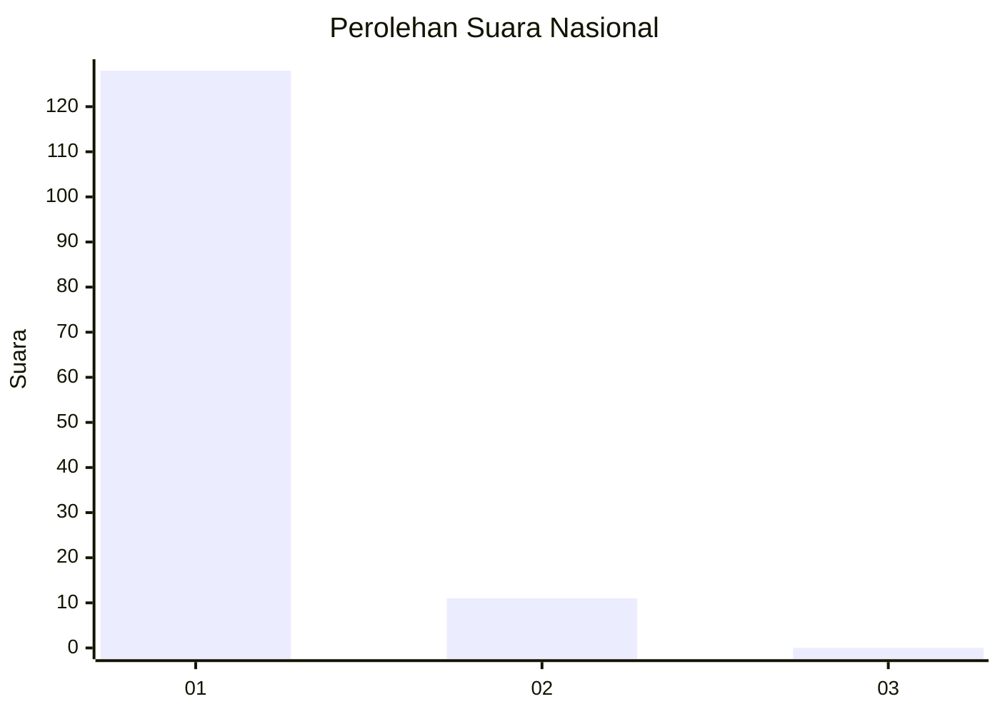
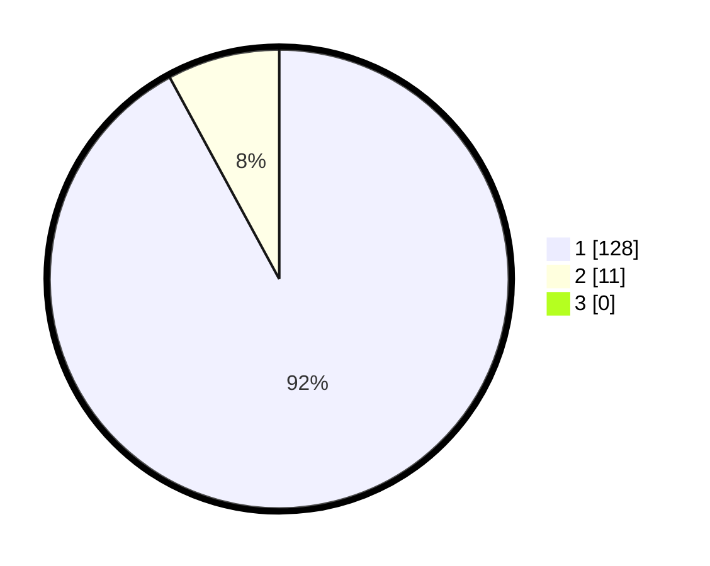

# Hasil

## Grafik

## Tabel

| No. | Nama Paslon    | Suara | Suara (raw) | Persentase |
|:--- |:-------------- | -----:| -----------:| ----------:|
| 1   | ANIES MUHAIMIN | 128   | [128][p-1]  | 92,09      |
| 2   | PRABOWO GIBRAN | 11    | [11][p-2]   | 7,91       |
| 3   | GANJAR MAHFUD  | 0     | [0][p-3]    | 0,00       |

[p-1]: https://github.com/gigit-pemilu/pemilu-2024/blob/main/pilpres/hitung-suara/sub/11-aceh/sub/08-aceh-utara/sub/15-sawang/sub/2030-lhok-jok/sub/002-tps/sub/paslon-1.txt
[p-2]: https://github.com/gigit-pemilu/pemilu-2024/blob/main/pilpres/hitung-suara/sub/11-aceh/sub/08-aceh-utara/sub/15-sawang/sub/2030-lhok-jok/sub/002-tps/sub/paslon-2.txt
[p-3]: https://github.com/gigit-pemilu/pemilu-2024/blob/main/pilpres/hitung-suara/sub/11-aceh/sub/08-aceh-utara/sub/15-sawang/sub/2030-lhok-jok/sub/002-tps/sub/paslon-3.txt

## Foto C Plano

https://sirekap-obj-formc.kpu.go.id/26a4/pemilu/ppwp/11/08/15/20/30/1108152030002-20240214-200350--b96fa796-2324-43a2-af20-844c56933314.jpg

https://sirekap-obj-formc.kpu.go.id/26a4/pemilu/ppwp/11/08/15/20/30/1108152030002-20240214-203656--c074e92e-519b-4a20-845e-1e9599a92b02.jpg

https://sirekap-obj-formc.kpu.go.id/26a4/pemilu/ppwp/11/08/15/20/30/1108152030002-20240214-200934--e402f26a-59b8-415b-999f-6f2b4f3b5e1d.jpg

## Metadata

| Key        | Value               |
| ---------- | ------------------- |
| Time Stamp | 2024-02-15 17:00:25 |

