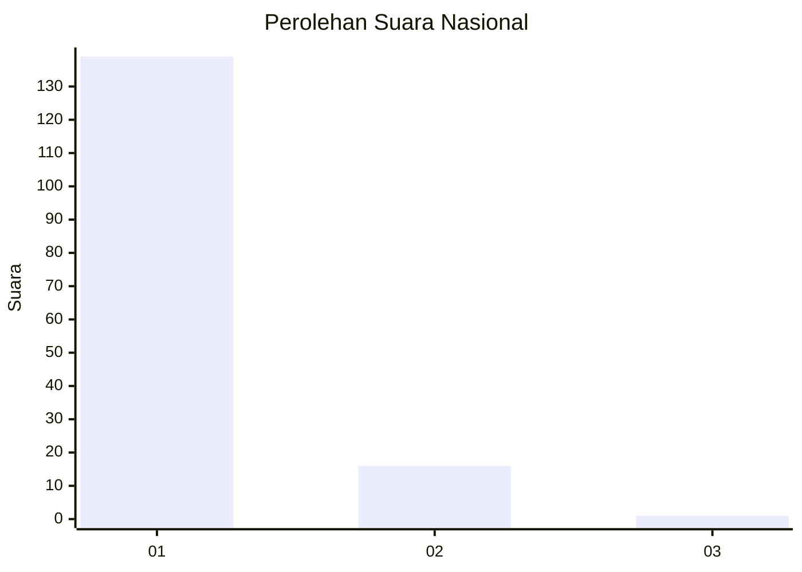
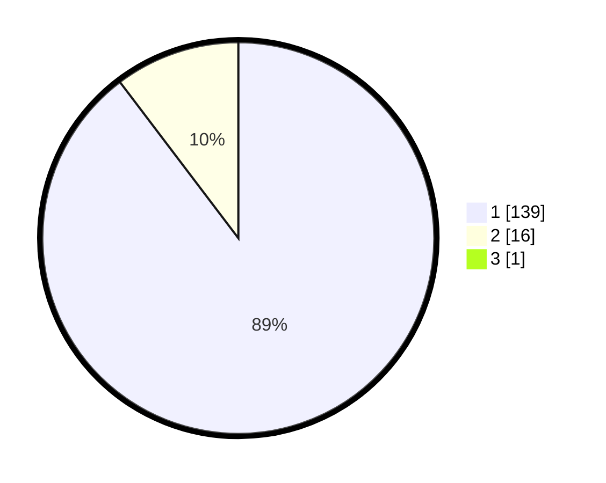

# Hasil

## Grafik

## Tabel

| No. | Nama Paslon    | Suara | Suara (raw) | Persentase |
|:--- |:-------------- | -----:| -----------:| ----------:|
| 1   | ANIES MUHAIMIN | 139   | [139][p-1]  | 89,10      |
| 2   | PRABOWO GIBRAN | 16    | [16][p-2]   | 10,26      |
| 3   | GANJAR MAHFUD  | 1     | [1][p-3]    | 0,64       |

[p-1]: https://github.com/gigit-pemilu/pemilu-2024/blob/main/pilpres/hitung-suara/sub/11-aceh/sub/08-aceh-utara/sub/15-sawang/sub/2032-sawang/sub/005-tps/sub/paslon-1.txt
[p-2]: https://github.com/gigit-pemilu/pemilu-2024/blob/main/pilpres/hitung-suara/sub/11-aceh/sub/08-aceh-utara/sub/15-sawang/sub/2032-sawang/sub/005-tps/sub/paslon-2.txt
[p-3]: https://github.com/gigit-pemilu/pemilu-2024/blob/main/pilpres/hitung-suara/sub/11-aceh/sub/08-aceh-utara/sub/15-sawang/sub/2032-sawang/sub/005-tps/sub/paslon-3.txt

## Foto C Plano

https://sirekap-obj-formc.kpu.go.id/dbfb/pemilu/ppwp/11/08/15/20/32/1108152032005-20240214-184719--fd164099-5834-4a95-99a1-f187e3703044.jpg

https://sirekap-obj-formc.kpu.go.id/dbfb/pemilu/ppwp/11/08/15/20/32/1108152032005-20240214-194121--c5cc592c-2e92-4c92-a9be-151ce1908111.jpg

https://sirekap-obj-formc.kpu.go.id/dbfb/pemilu/ppwp/11/08/15/20/32/1108152032005-20240214-194224--d221e106-030d-42c2-b3a1-8445ab8062e2.jpg

## Metadata

| Key        | Value               |
| ---------- | ------------------- |
| Time Stamp | 2024-02-15 17:00:25 |

