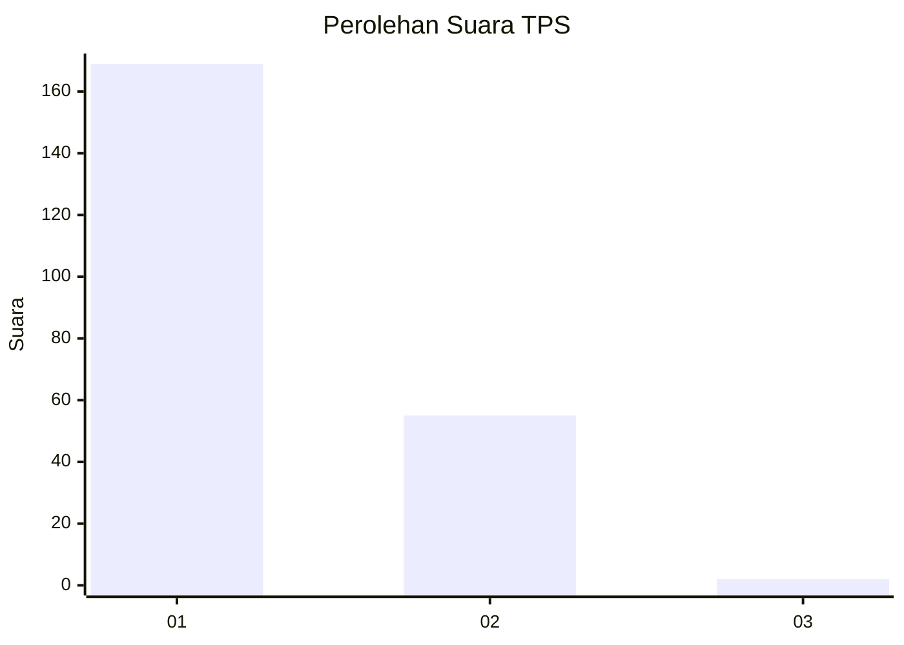
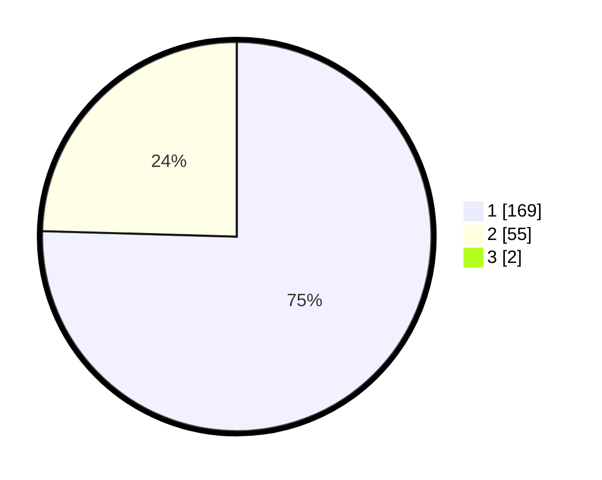

# Hasil

## Grafik

## Tabel

| No. | Nama Paslon    | Suara | Suara (raw) | Persentase |
|:--- |:-------------- | -----:| -----------:| ----------:|
| 1   | ANIES MUHAIMIN | 169   | [169][p-1]  | 74,78      |
| 2   | PRABOWO GIBRAN | 55    | [55][p-2]   | 24,34      |
| 3   | GANJAR MAHFUD  | 2     | [2][p-3]    | 0,88       |

[p-1]: https://github.com/gigit-pemilu/pemilu-2024-11-aceh/blob/main/pilpres/hitung-suara/sub/11-aceh/sub/08-aceh-utara/sub/15-sawang/sub/2032-sawang/sub/009-tps/sub/paslon-1.txt
[p-2]: https://github.com/gigit-pemilu/pemilu-2024-11-aceh/blob/main/pilpres/hitung-suara/sub/11-aceh/sub/08-aceh-utara/sub/15-sawang/sub/2032-sawang/sub/009-tps/sub/paslon-2.txt
[p-3]: https://github.com/gigit-pemilu/pemilu-2024-11-aceh/blob/main/pilpres/hitung-suara/sub/11-aceh/sub/08-aceh-utara/sub/15-sawang/sub/2032-sawang/sub/009-tps/sub/paslon-3.txt

## Foto C Plano

https://sirekap-obj-formc.kpu.go.id/a0e5/pemilu/ppwp/11/08/15/20/32/1108152032009-20240222-205245--8dd02595-4fd8-46ab-9e28-70b887d477d7.jpg

https://sirekap-obj-formc.kpu.go.id/a0e5/pemilu/ppwp/11/08/15/20/32/1108152032009-20240222-205432--971ddd66-0d53-42d7-aa6f-fe7390201527.jpg

https://sirekap-obj-formc.kpu.go.id/a0e5/pemilu/ppwp/11/08/15/20/32/1108152032009-20240222-205642--7107caf1-12d3-48af-86f3-4e486f240389.jpg

## Metadata

| Key        | Value               |
| ---------- | ------------------- |
| Time Stamp | 2024-02-24 22:31:28 |

