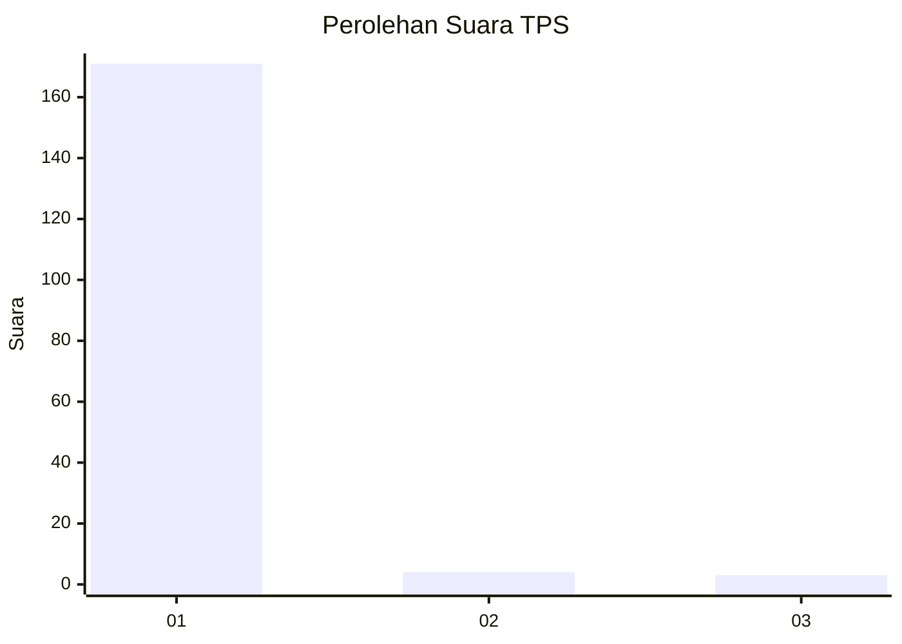
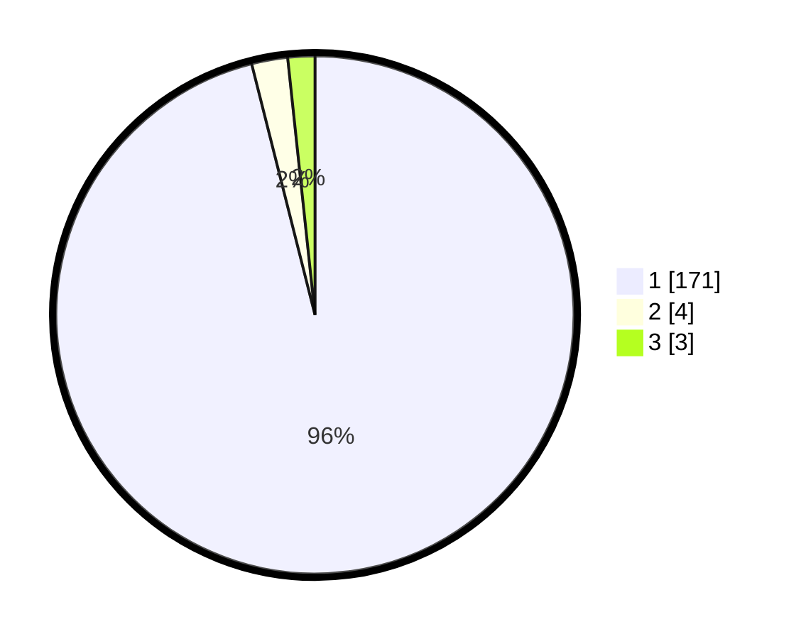

# Hasil

## Grafik

## Tabel

| No. | Nama Paslon    | Suara | Suara (raw) | Persentase |
|:--- |:-------------- | -----:| -----------:| ----------:|
| 1   | ANIES MUHAIMIN | 171   | [171][p-1]  | 96,07      |
| 2   | PRABOWO GIBRAN | 4     | [4][p-2]    | 2,25       |
| 3   | GANJAR MAHFUD  | 3     | [3][p-3]    | 1,69       |

[p-1]: https://github.com/gigit-pemilu/pemilu-2024-11-aceh/blob/main/pilpres/hitung-suara/sub/11-aceh/sub/08-aceh-utara/sub/15-sawang/sub/2032-sawang/sub/011-tps/sub/paslon-1.txt
[p-2]: https://github.com/gigit-pemilu/pemilu-2024-11-aceh/blob/main/pilpres/hitung-suara/sub/11-aceh/sub/08-aceh-utara/sub/15-sawang/sub/2032-sawang/sub/011-tps/sub/paslon-2.txt
[p-3]: https://github.com/gigit-pemilu/pemilu-2024-11-aceh/blob/main/pilpres/hitung-suara/sub/11-aceh/sub/08-aceh-utara/sub/15-sawang/sub/2032-sawang/sub/011-tps/sub/paslon-3.txt

## Foto C Plano

https://sirekap-obj-formc.kpu.go.id/aa19/pemilu/ppwp/11/08/15/20/32/1108152032011-20240215-094513--68d64cf8-96cc-42b1-b23a-72546c2458bb.jpg

https://sirekap-obj-formc.kpu.go.id/aa19/pemilu/ppwp/11/08/15/20/32/1108152032011-20240215-094730--d4b798e5-2d46-4e04-85e8-49593a0c2884.jpg

https://sirekap-obj-formc.kpu.go.id/aa19/pemilu/ppwp/11/08/15/20/32/1108152032011-20240215-032651--8f5b7698-c76f-47b6-afce-7f979bf5be5f.jpg

## Metadata

| Key        | Value               |
| ---------- | ------------------- |
| Time Stamp | 2024-02-19 12:00:00 |

