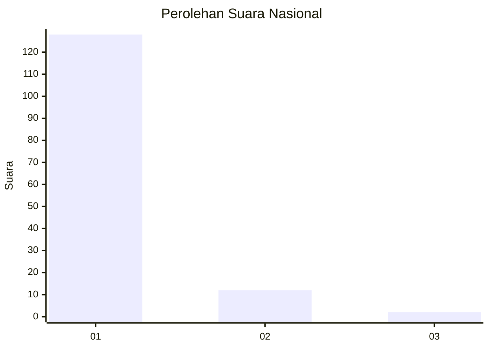
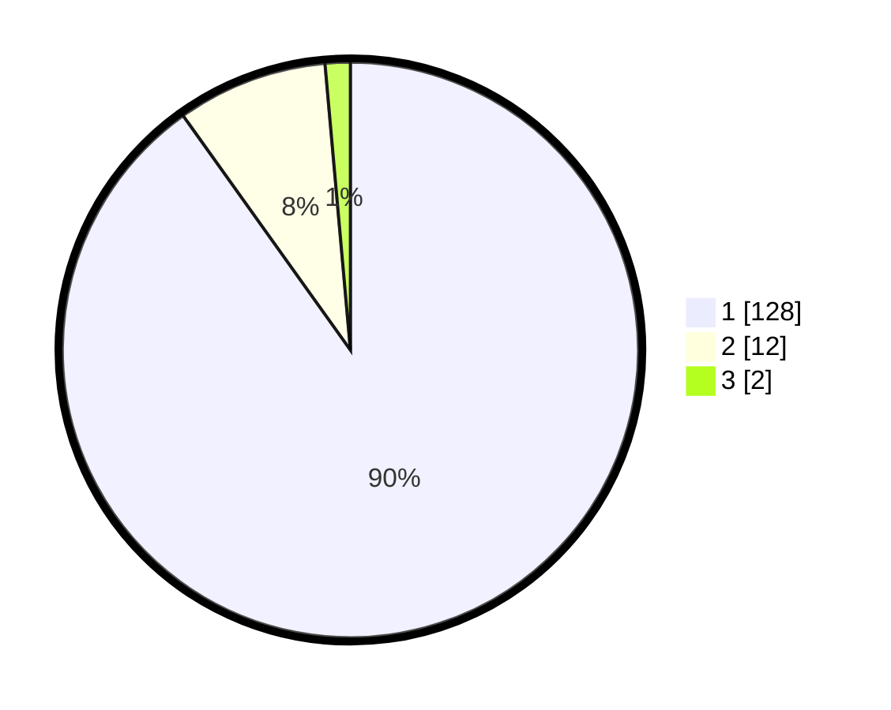

# Hasil

## Grafik

## Tabel

| No. | Nama Paslon    | Suara | Suara (raw) | Persentase |
|:--- |:-------------- | -----:| -----------:| ----------:|
| 1   | ANIES MUHAIMIN | 128   | [128][p-1]  | 90,14      |
| 2   | PRABOWO GIBRAN | 12    | [12][p-2]   | 8,45       |
| 3   | GANJAR MAHFUD  | 2     | [2][p-3]    | 1,41       |

[p-1]: https://github.com/gigit-pemilu/pemilu-2024/blob/main/pilpres/hitung-suara/sub/11-aceh/sub/08-aceh-utara/sub/15-sawang/sub/2034-riseh-teungoh/sub/001-tps/sub/paslon-1.txt
[p-2]: https://github.com/gigit-pemilu/pemilu-2024/blob/main/pilpres/hitung-suara/sub/11-aceh/sub/08-aceh-utara/sub/15-sawang/sub/2034-riseh-teungoh/sub/001-tps/sub/paslon-2.txt
[p-3]: https://github.com/gigit-pemilu/pemilu-2024/blob/main/pilpres/hitung-suara/sub/11-aceh/sub/08-aceh-utara/sub/15-sawang/sub/2034-riseh-teungoh/sub/001-tps/sub/paslon-3.txt

## Foto C Plano

https://sirekap-obj-formc.kpu.go.id/10c1/pemilu/ppwp/11/08/15/20/34/1108152034001-20240225-165851--8ffb5f07-af77-4225-8c7b-f8b407adb211.jpg

https://sirekap-obj-formc.kpu.go.id/10c1/pemilu/ppwp/11/08/15/20/34/1108152034001-20240225-170017--553ee089-a34f-4fec-975e-e4b33494bb46.jpg

https://sirekap-obj-formc.kpu.go.id/10c1/pemilu/ppwp/11/08/15/20/34/1108152034001-20240225-170137--642432a6-7165-4a98-8862-fd850b63f7f7.jpg

## Metadata

| Key        | Value               |
| ---------- | ------------------- |
| Time Stamp | 2024-02-28 19:00:00 |

