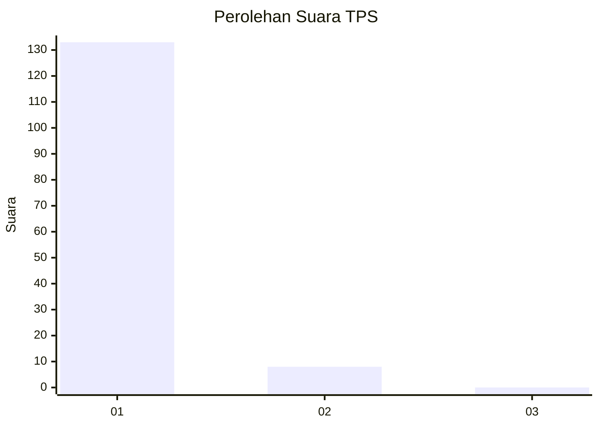
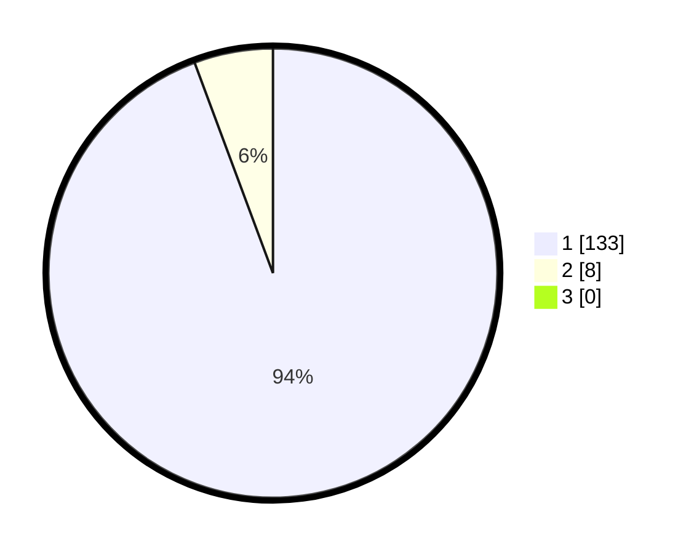

# Hasil

## Grafik

## Tabel

| No. | Nama Paslon    | Suara | Suara (raw) | Persentase |
|:--- |:-------------- | -----:| -----------:| ----------:|
| 1   | ANIES MUHAIMIN | 133   | [133][p-1]  | 94,33      |
| 2   | PRABOWO GIBRAN | 8     | [8][p-2]    | 5,67       |
| 3   | GANJAR MAHFUD  | 0     | [0][p-3]    | 0,00       |

[p-1]: https://github.com/gigit-pemilu/pemilu-2024-11-aceh/blob/main/pilpres/hitung-suara/sub/11-aceh/sub/08-aceh-utara/sub/15-sawang/sub/2034-riseh-teungoh/sub/002-tps/sub/paslon-1.txt
[p-2]: https://github.com/gigit-pemilu/pemilu-2024-11-aceh/blob/main/pilpres/hitung-suara/sub/11-aceh/sub/08-aceh-utara/sub/15-sawang/sub/2034-riseh-teungoh/sub/002-tps/sub/paslon-2.txt
[p-3]: https://github.com/gigit-pemilu/pemilu-2024-11-aceh/blob/main/pilpres/hitung-suara/sub/11-aceh/sub/08-aceh-utara/sub/15-sawang/sub/2034-riseh-teungoh/sub/002-tps/sub/paslon-3.txt

## Foto C Plano

https://sirekap-obj-formc.kpu.go.id/8482/pemilu/ppwp/11/08/15/20/34/1108152034002-20240225-184541--b1ba20be-e611-4a57-94c6-c812ecb9e652.jpg

https://sirekap-obj-formc.kpu.go.id/8482/pemilu/ppwp/11/08/15/20/34/1108152034002-20240225-184622--328fbfab-cd2a-4144-97fd-bc47582fbb27.jpg

https://sirekap-obj-formc.kpu.go.id/8482/pemilu/ppwp/11/08/15/20/34/1108152034002-20240225-184705--ca64d954-540c-4083-b5b9-791380a0c290.jpg

## Metadata

| Key        | Value               |
| ---------- | ------------------- |
| Time Stamp | 2024-02-28 21:00:00 |

