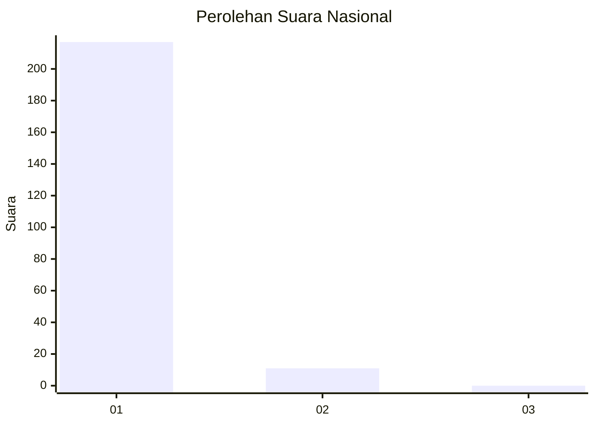
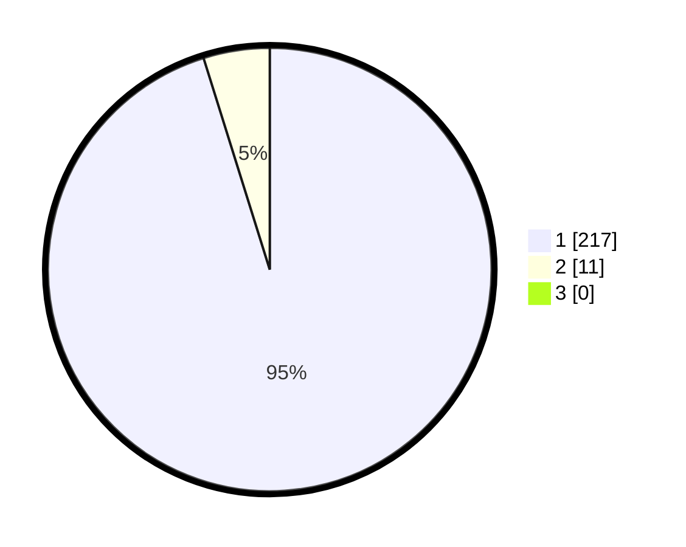

# Hasil

## Grafik

## Tabel

| No. | Nama Paslon    | Suara | Suara (raw) | Persentase |
|:--- |:-------------- | -----:| -----------:| ----------:|
| 1   | ANIES MUHAIMIN | 217   | [217][p-1]  | 95,18      |
| 2   | PRABOWO GIBRAN | 11    | [11][p-2]   | 4,82       |
| 3   | GANJAR MAHFUD  | 0     | [0][p-3]    | 0,00       |

[p-1]: https://github.com/gigit-pemilu/pemilu-2024/blob/main/pilpres/hitung-suara/sub/11-aceh/sub/08-aceh-utara/sub/15-sawang/sub/2035-riseh-tunong/sub/001-tps/sub/paslon-1.txt
[p-2]: https://github.com/gigit-pemilu/pemilu-2024/blob/main/pilpres/hitung-suara/sub/11-aceh/sub/08-aceh-utara/sub/15-sawang/sub/2035-riseh-tunong/sub/001-tps/sub/paslon-2.txt
[p-3]: https://github.com/gigit-pemilu/pemilu-2024/blob/main/pilpres/hitung-suara/sub/11-aceh/sub/08-aceh-utara/sub/15-sawang/sub/2035-riseh-tunong/sub/001-tps/sub/paslon-3.txt

## Foto C Plano

https://sirekap-obj-formc.kpu.go.id/9f30/pemilu/ppwp/11/08/15/20/35/1108152035001-20240215-012730--ca541a96-8196-494b-a0aa-59762c0b4664.jpg

https://sirekap-obj-formc.kpu.go.id/9f30/pemilu/ppwp/11/08/15/20/35/1108152035001-20240215-120142--9c181b38-1a6c-49cb-b294-dfef74e7017c.jpg

https://sirekap-obj-formc.kpu.go.id/9f30/pemilu/ppwp/11/08/15/20/35/1108152035001-20240215-110130--46f332b4-5cae-4589-99f9-ff9cd79e70a6.jpg

## Metadata

| Key        | Value               |
| ---------- | ------------------- |
| Time Stamp | 2024-02-15 18:00:26 |

