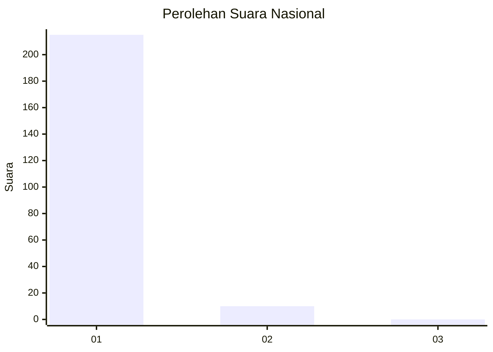
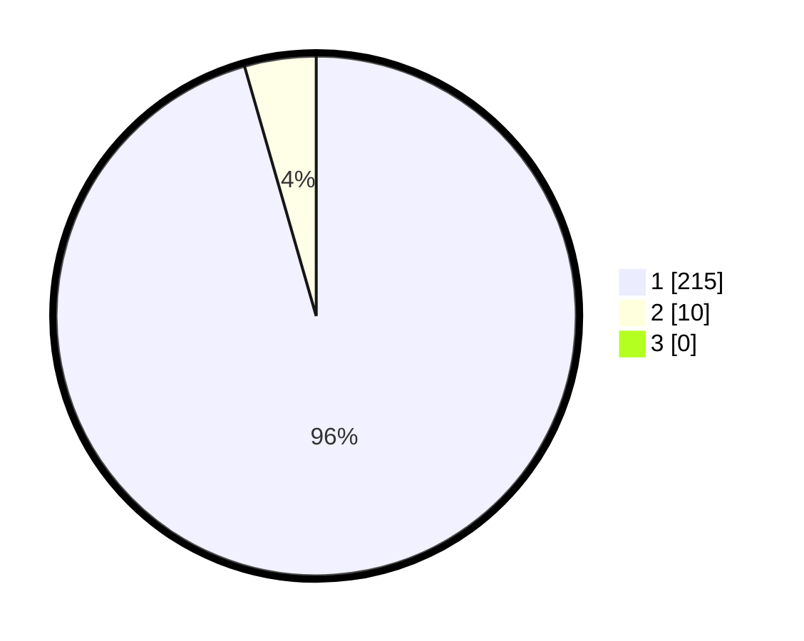

# Hasil

## Grafik

## Tabel

| No. | Nama Paslon    | Suara | Suara (raw) | Persentase |
|:--- |:-------------- | -----:| -----------:| ----------:|
| 1   | ANIES MUHAIMIN | 215   | [215][p-1]  | 95,56      |
| 2   | PRABOWO GIBRAN | 10    | [10][p-2]   | 4,44       |
| 3   | GANJAR MAHFUD  | 0     | [0][p-3]    | 0,00       |

[p-1]: https://github.com/gigit-pemilu/pemilu-2024/blob/main/pilpres/hitung-suara/sub/11-aceh/sub/08-aceh-utara/sub/15-sawang/sub/2035-riseh-tunong/sub/003-tps/sub/paslon-1.txt
[p-2]: https://github.com/gigit-pemilu/pemilu-2024/blob/main/pilpres/hitung-suara/sub/11-aceh/sub/08-aceh-utara/sub/15-sawang/sub/2035-riseh-tunong/sub/003-tps/sub/paslon-2.txt
[p-3]: https://github.com/gigit-pemilu/pemilu-2024/blob/main/pilpres/hitung-suara/sub/11-aceh/sub/08-aceh-utara/sub/15-sawang/sub/2035-riseh-tunong/sub/003-tps/sub/paslon-3.txt

## Foto C Plano

https://sirekap-obj-formc.kpu.go.id/c82d/pemilu/ppwp/11/08/15/20/35/1108152035003-20240214-194449--8708d3df-11ae-4ac5-8eb5-f7c19be10090.jpg

https://sirekap-obj-formc.kpu.go.id/c82d/pemilu/ppwp/11/08/15/20/35/1108152035003-20240214-194508--d6735559-c7d4-409f-9370-802068d746b6.jpg

https://sirekap-obj-formc.kpu.go.id/c82d/pemilu/ppwp/11/08/15/20/35/1108152035003-20240214-194555--9d946535-075d-4de5-962c-9379e624d45b.jpg

## Metadata

| Key        | Value               |
| ---------- | ------------------- |
| Time Stamp | 2024-02-17 16:00:02 |

