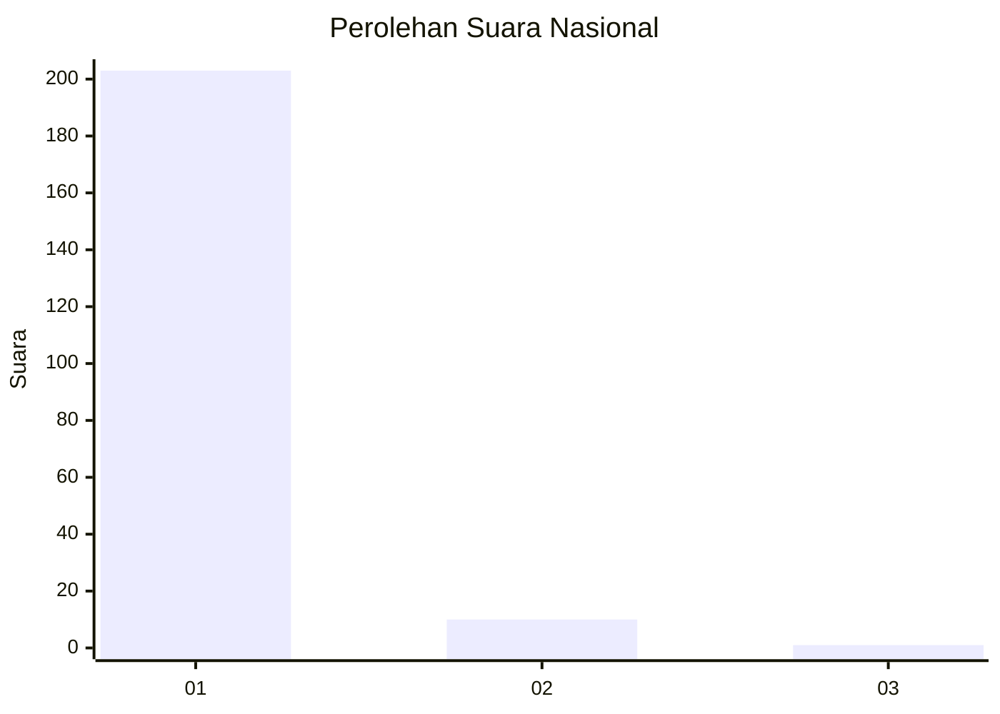
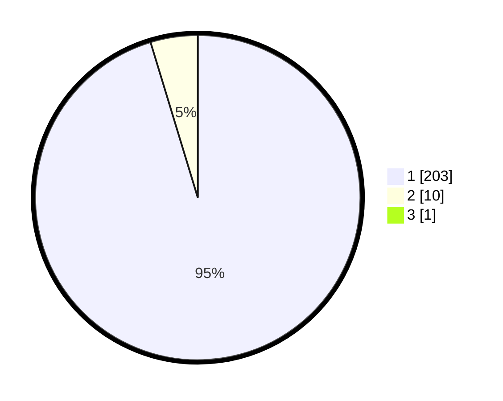

# Hasil

## Grafik

## Tabel

| No. | Nama Paslon    | Suara | Suara (raw) | Persentase |
|:--- |:-------------- | -----:| -----------:| ----------:|
| 1   | ANIES MUHAIMIN | 203   | [203][p-1]  | 94,86      |
| 2   | PRABOWO GIBRAN | 10    | [10][p-2]   | 4,67       |
| 3   | GANJAR MAHFUD  | 1     | [1][p-3]    | 0,47       |

[p-1]: https://github.com/gigit-pemilu/pemilu-2024/blob/main/pilpres/hitung-suara/sub/11-aceh/sub/08-aceh-utara/sub/15-sawang/sub/2035-riseh-tunong/sub/004-tps/sub/paslon-1.txt
[p-2]: https://github.com/gigit-pemilu/pemilu-2024/blob/main/pilpres/hitung-suara/sub/11-aceh/sub/08-aceh-utara/sub/15-sawang/sub/2035-riseh-tunong/sub/004-tps/sub/paslon-2.txt
[p-3]: https://github.com/gigit-pemilu/pemilu-2024/blob/main/pilpres/hitung-suara/sub/11-aceh/sub/08-aceh-utara/sub/15-sawang/sub/2035-riseh-tunong/sub/004-tps/sub/paslon-3.txt

## Foto C Plano

https://sirekap-obj-formc.kpu.go.id/d2ea/pemilu/ppwp/11/08/15/20/35/1108152035004-20240218-235644--fcb45ebc-33ec-48e7-9e4f-7f6c4fe0f2b0.jpg

https://sirekap-obj-formc.kpu.go.id/d2ea/pemilu/ppwp/11/08/15/20/35/1108152035004-20240214-155815--c564addf-5d06-42f9-ab3d-9da0c7dac5af.jpg

https://sirekap-obj-formc.kpu.go.id/d2ea/pemilu/ppwp/11/08/15/20/35/1108152035004-20240214-155534--7e122ae0-8d14-49bb-a815-dd428be6c11a.jpg

## Metadata

| Key        | Value               |
| ---------- | ------------------- |
| Time Stamp | 2024-02-19 06:16:00 |

