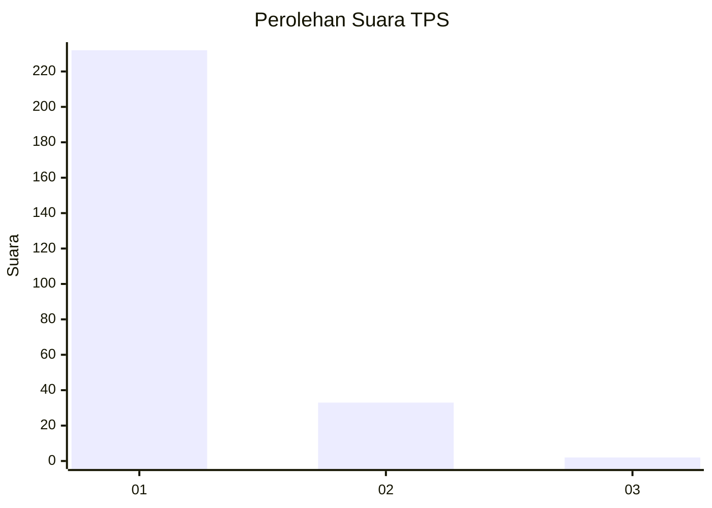
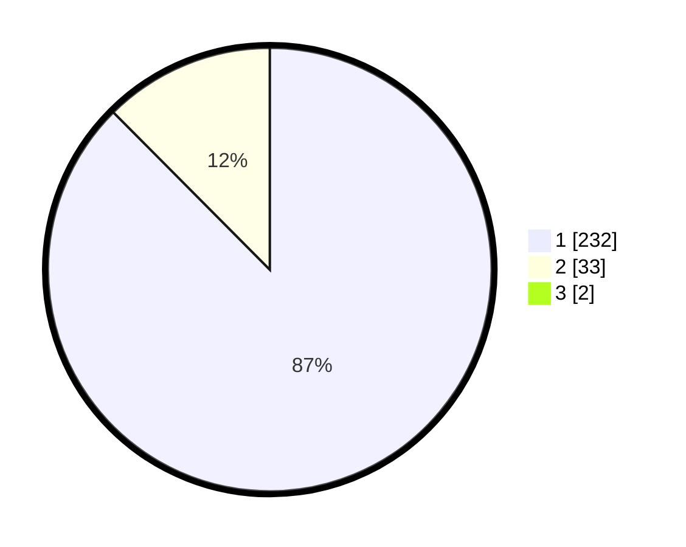

# Hasil

## Grafik

## Tabel

| No. | Nama Paslon    | Suara | Suara (raw) | Persentase |
|:--- |:-------------- | -----:| -----------:| ----------:|
| 1   | ANIES MUHAIMIN | 232   | [232][p-1]  | 86,89      |
| 2   | PRABOWO GIBRAN | 33    | [33][p-2]   | 12,36      |
| 3   | GANJAR MAHFUD  | 2     | [2][p-3]    | 0,75       |

[p-1]: https://github.com/gigit-pemilu/pemilu-2024-11-aceh/blob/main/pilpres/hitung-suara/sub/11-aceh/sub/08-aceh-utara/sub/15-sawang/sub/2035-riseh-tunong/sub/006-tps/sub/paslon-1.txt
[p-2]: https://github.com/gigit-pemilu/pemilu-2024-11-aceh/blob/main/pilpres/hitung-suara/sub/11-aceh/sub/08-aceh-utara/sub/15-sawang/sub/2035-riseh-tunong/sub/006-tps/sub/paslon-2.txt
[p-3]: https://github.com/gigit-pemilu/pemilu-2024-11-aceh/blob/main/pilpres/hitung-suara/sub/11-aceh/sub/08-aceh-utara/sub/15-sawang/sub/2035-riseh-tunong/sub/006-tps/sub/paslon-3.txt

## Foto C Plano

https://sirekap-obj-formc.kpu.go.id/cef6/pemilu/ppwp/11/08/15/20/35/1108152035006-20240222-014206--8be224eb-d777-44ac-b740-50cae90b9835.jpg

https://sirekap-obj-formc.kpu.go.id/cef6/pemilu/ppwp/11/08/15/20/35/1108152035006-20240222-014240--aa03a397-f925-4f6a-a453-2bb89ccec951.jpg

https://sirekap-obj-formc.kpu.go.id/cef6/pemilu/ppwp/11/08/15/20/35/1108152035006-20240222-014305--a13b9f1e-3670-4755-a3c5-634555601be2.jpg

## Metadata

| Key        | Value               |
| ---------- | ------------------- |
| Time Stamp | 2024-02-26 12:00:00 |

