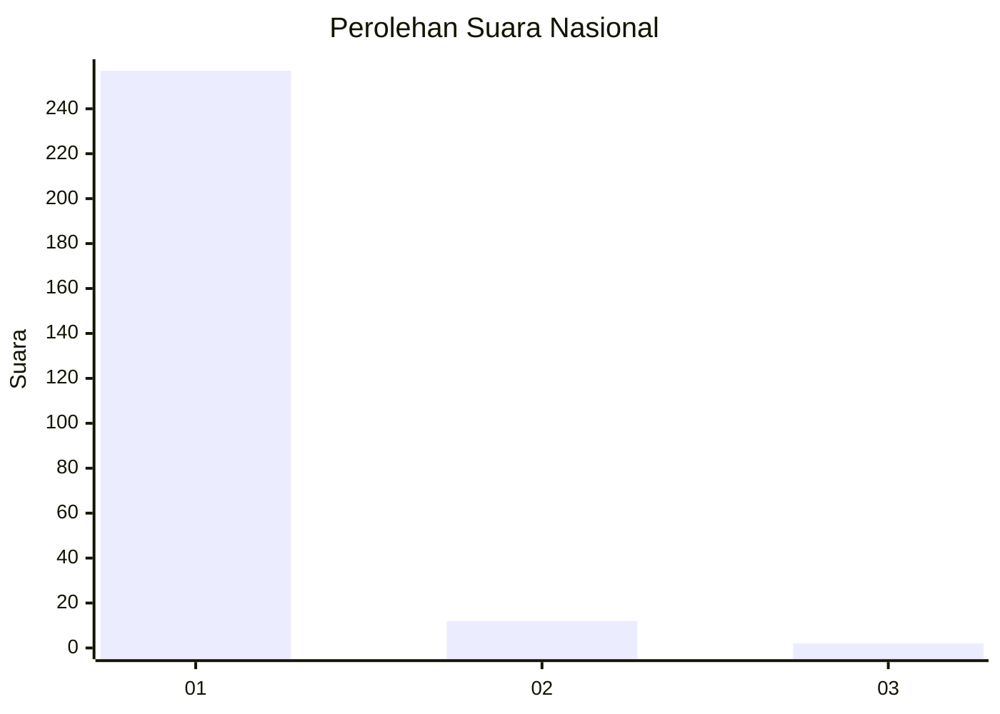
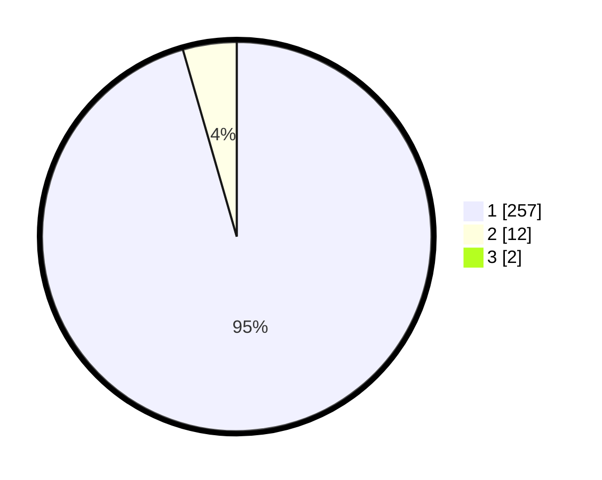

# Hasil

## Grafik

## Tabel

| No. | Nama Paslon    | Suara | Suara (raw) | Persentase |
|:--- |:-------------- | -----:| -----------:| ----------:|
| 1   | ANIES MUHAIMIN | 257   | [257][p-1]  | 94,83      |
| 2   | PRABOWO GIBRAN | 12    | [12][p-2]   | 4,43       |
| 3   | GANJAR MAHFUD  | 2     | [2][p-3]    | 0,74       |

[p-1]: https://github.com/gigit-pemilu/pemilu-2024/blob/main/pilpres/hitung-suara/sub/11-aceh/sub/08-aceh-utara/sub/15-sawang/sub/2035-riseh-tunong/sub/007-tps/sub/paslon-1.txt
[p-2]: https://github.com/gigit-pemilu/pemilu-2024/blob/main/pilpres/hitung-suara/sub/11-aceh/sub/08-aceh-utara/sub/15-sawang/sub/2035-riseh-tunong/sub/007-tps/sub/paslon-2.txt
[p-3]: https://github.com/gigit-pemilu/pemilu-2024/blob/main/pilpres/hitung-suara/sub/11-aceh/sub/08-aceh-utara/sub/15-sawang/sub/2035-riseh-tunong/sub/007-tps/sub/paslon-3.txt

## Foto C Plano

https://sirekap-obj-formc.kpu.go.id/63ab/pemilu/ppwp/11/08/15/20/35/1108152035007-20240226-211004--5169a51f-eaa8-4d70-b39b-7e0123eb57ed.jpg

https://sirekap-obj-formc.kpu.go.id/63ab/pemilu/ppwp/11/08/15/20/35/1108152035007-20240222-022259--b1beb46e-255f-4b7c-ace5-2df3efee0ab9.jpg

https://sirekap-obj-formc.kpu.go.id/63ab/pemilu/ppwp/11/08/15/20/35/1108152035007-20240222-022332--ba26a42a-5a03-4529-abc8-5a5ecc9ce102.jpg

## Metadata

| Key        | Value               |
| ---------- | ------------------- |
| Time Stamp | 2024-02-26 22:00:00 |

