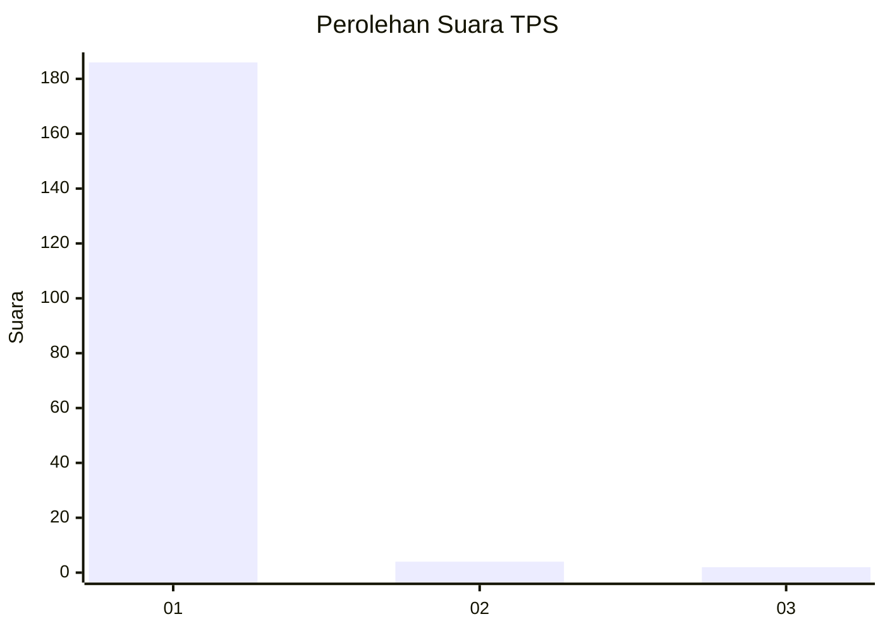
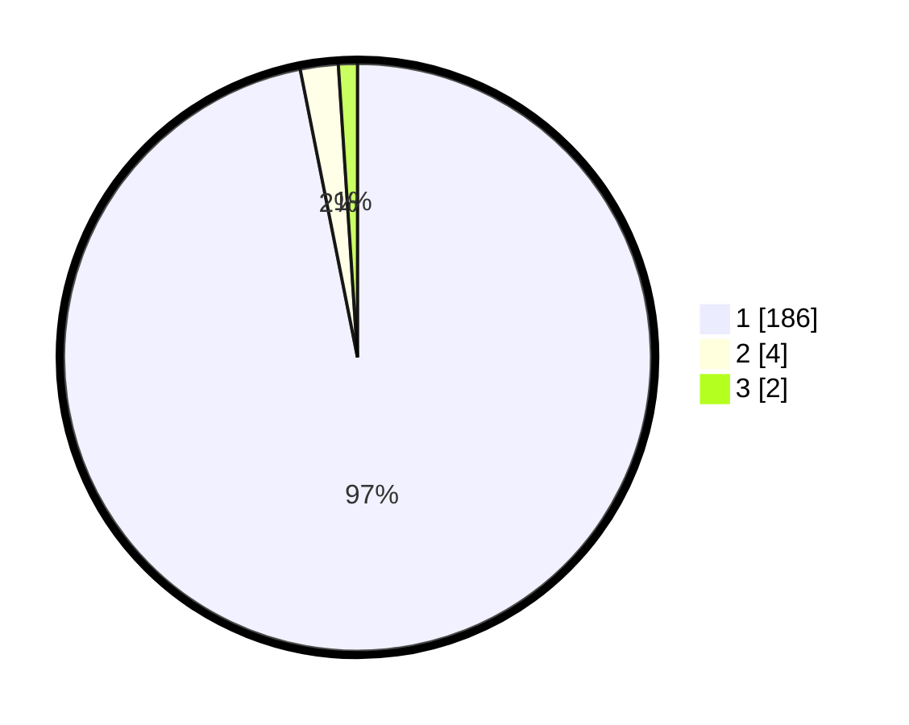

# Hasil

## Grafik

## Tabel

| No. | Nama Paslon    | Suara | Suara (raw) | Persentase |
|:--- |:-------------- | -----:| -----------:| ----------:|
| 1   | ANIES MUHAIMIN | 186   | [186][p-1]  | 96,88      |
| 2   | PRABOWO GIBRAN | 4     | [4][p-2]    | 2,08       |
| 3   | GANJAR MAHFUD  | 2     | [2][p-3]    | 1,04       |

[p-1]: https://github.com/gigit-pemilu/pemilu-2024-11-aceh/blob/main/pilpres/hitung-suara/sub/11-aceh/sub/08-aceh-utara/sub/15-sawang/sub/2036-gunci/sub/002-tps/sub/paslon-1.txt
[p-2]: https://github.com/gigit-pemilu/pemilu-2024-11-aceh/blob/main/pilpres/hitung-suara/sub/11-aceh/sub/08-aceh-utara/sub/15-sawang/sub/2036-gunci/sub/002-tps/sub/paslon-2.txt
[p-3]: https://github.com/gigit-pemilu/pemilu-2024-11-aceh/blob/main/pilpres/hitung-suara/sub/11-aceh/sub/08-aceh-utara/sub/15-sawang/sub/2036-gunci/sub/002-tps/sub/paslon-3.txt

## Foto C Plano

https://sirekap-obj-formc.kpu.go.id/c958/pemilu/ppwp/11/08/15/20/36/1108152036002-20240223-153057--ce9e42ce-45aa-4062-a2c4-114667fca2cf.jpg

https://sirekap-obj-formc.kpu.go.id/c958/pemilu/ppwp/11/08/15/20/36/1108152036002-20240223-153749--47c82ecf-4281-42ed-bc9e-984d497e4f70.jpg

https://sirekap-obj-formc.kpu.go.id/c958/pemilu/ppwp/11/08/15/20/36/1108152036002-20240223-154240--44e830ab-c206-43d9-98ff-f65e29591aa3.jpg

## Metadata

| Key        | Value               |
| ---------- | ------------------- |
| Time Stamp | 2024-02-24 22:31:28 |

