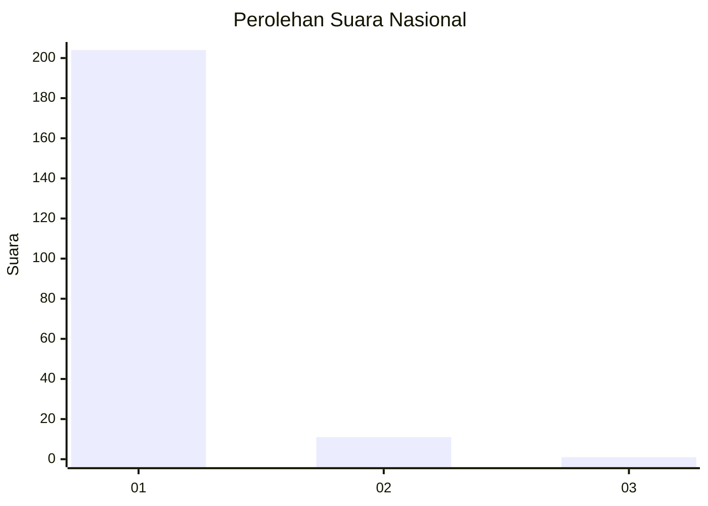
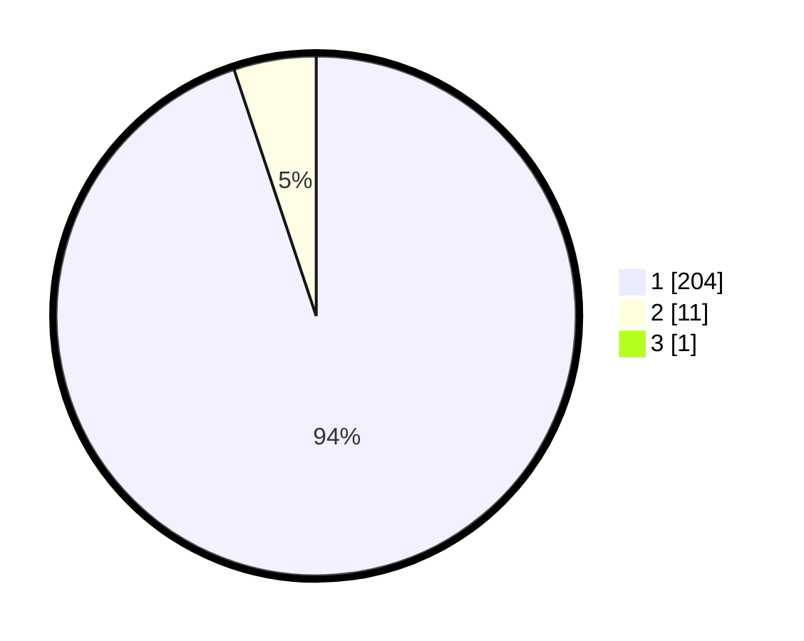

# Hasil

## Grafik

## Tabel

| No. | Nama Paslon    | Suara | Suara (raw) | Persentase |
|:--- |:-------------- | -----:| -----------:| ----------:|
| 1   | ANIES MUHAIMIN | 204   | [204][p-1]  | 94,44      |
| 2   | PRABOWO GIBRAN | 11    | [11][p-2]   | 5,09       |
| 3   | GANJAR MAHFUD  | 1     | [1][p-3]    | 0,46       |

[p-1]: https://github.com/gigit-pemilu/pemilu-2024/blob/main/pilpres/hitung-suara/sub/11-aceh/sub/08-aceh-utara/sub/15-sawang/sub/2036-gunci/sub/005-tps/sub/paslon-1.txt
[p-2]: https://github.com/gigit-pemilu/pemilu-2024/blob/main/pilpres/hitung-suara/sub/11-aceh/sub/08-aceh-utara/sub/15-sawang/sub/2036-gunci/sub/005-tps/sub/paslon-2.txt
[p-3]: https://github.com/gigit-pemilu/pemilu-2024/blob/main/pilpres/hitung-suara/sub/11-aceh/sub/08-aceh-utara/sub/15-sawang/sub/2036-gunci/sub/005-tps/sub/paslon-3.txt

## Foto C Plano

https://sirekap-obj-formc.kpu.go.id/efe0/pemilu/ppwp/11/08/15/20/36/1108152036005-20240223-171018--4b5af196-d310-4a1d-b3c4-c1406d6d2bef.jpg

https://sirekap-obj-formc.kpu.go.id/efe0/pemilu/ppwp/11/08/15/20/36/1108152036005-20240223-171141--35248bbe-80a9-4b02-bc21-ae9db4d024ed.jpg

https://sirekap-obj-formc.kpu.go.id/efe0/pemilu/ppwp/11/08/15/20/36/1108152036005-20240223-171614--66b1d854-af31-4cf3-833f-9014a346f99b.jpg

## Metadata

| Key        | Value               |
| ---------- | ------------------- |
| Time Stamp | 2024-02-25 11:00:00 |

