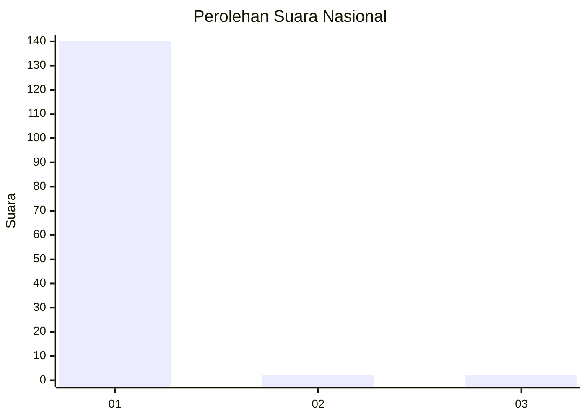
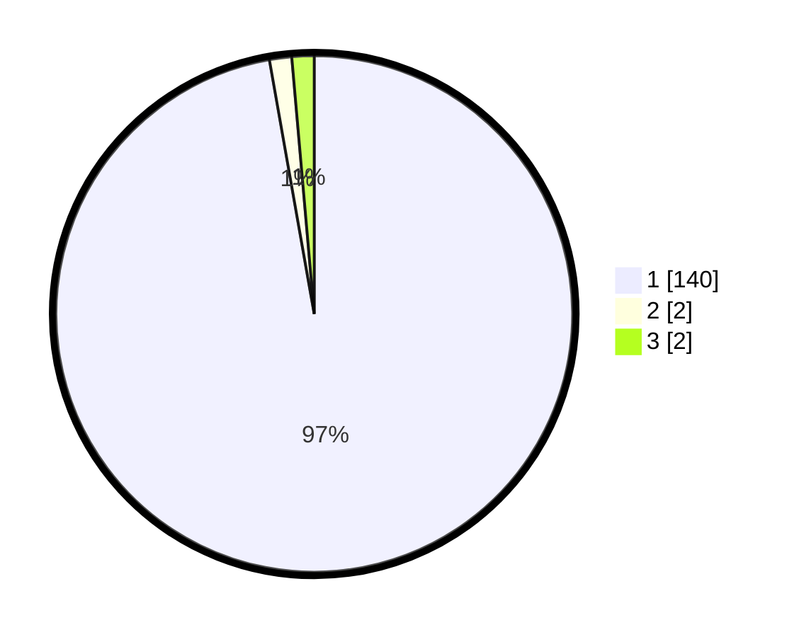

# Hasil

## Grafik

## Tabel

| No. | Nama Paslon    | Suara | Suara (raw) | Persentase |
|:--- |:-------------- | -----:| -----------:| ----------:|
| 1   | ANIES MUHAIMIN | 140   | [140][p-1]  | 97,22      |
| 2   | PRABOWO GIBRAN | 2     | [2][p-2]    | 1,39       |
| 3   | GANJAR MAHFUD  | 2     | [2][p-3]    | 1,39       |

[p-1]: https://github.com/gigit-pemilu/pemilu-2024/blob/main/pilpres/hitung-suara/sub/11-aceh/sub/08-aceh-utara/sub/15-sawang/sub/2036-gunci/sub/007-tps/sub/paslon-1.txt
[p-2]: https://github.com/gigit-pemilu/pemilu-2024/blob/main/pilpres/hitung-suara/sub/11-aceh/sub/08-aceh-utara/sub/15-sawang/sub/2036-gunci/sub/007-tps/sub/paslon-2.txt
[p-3]: https://github.com/gigit-pemilu/pemilu-2024/blob/main/pilpres/hitung-suara/sub/11-aceh/sub/08-aceh-utara/sub/15-sawang/sub/2036-gunci/sub/007-tps/sub/paslon-3.txt

## Foto C Plano

https://sirekap-obj-formc.kpu.go.id/2afc/pemilu/ppwp/11/08/15/20/36/1108152036007-20240215-090803--e22cb0f8-fa13-46f7-825a-c14f755b455f.jpg

https://sirekap-obj-formc.kpu.go.id/2afc/pemilu/ppwp/11/08/15/20/36/1108152036007-20240215-090946--a9a9f797-5ffc-4937-b7bd-28581f31eccd.jpg

https://sirekap-obj-formc.kpu.go.id/2afc/pemilu/ppwp/11/08/15/20/36/1108152036007-20240215-091126--7ce3e3ca-2a72-4cff-b895-ae39479bf1b9.jpg

## Metadata

| Key        | Value               |
| ---------- | ------------------- |
| Time Stamp | 2024-02-17 16:00:02 |

