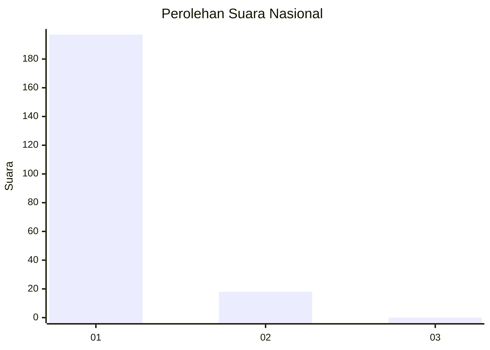
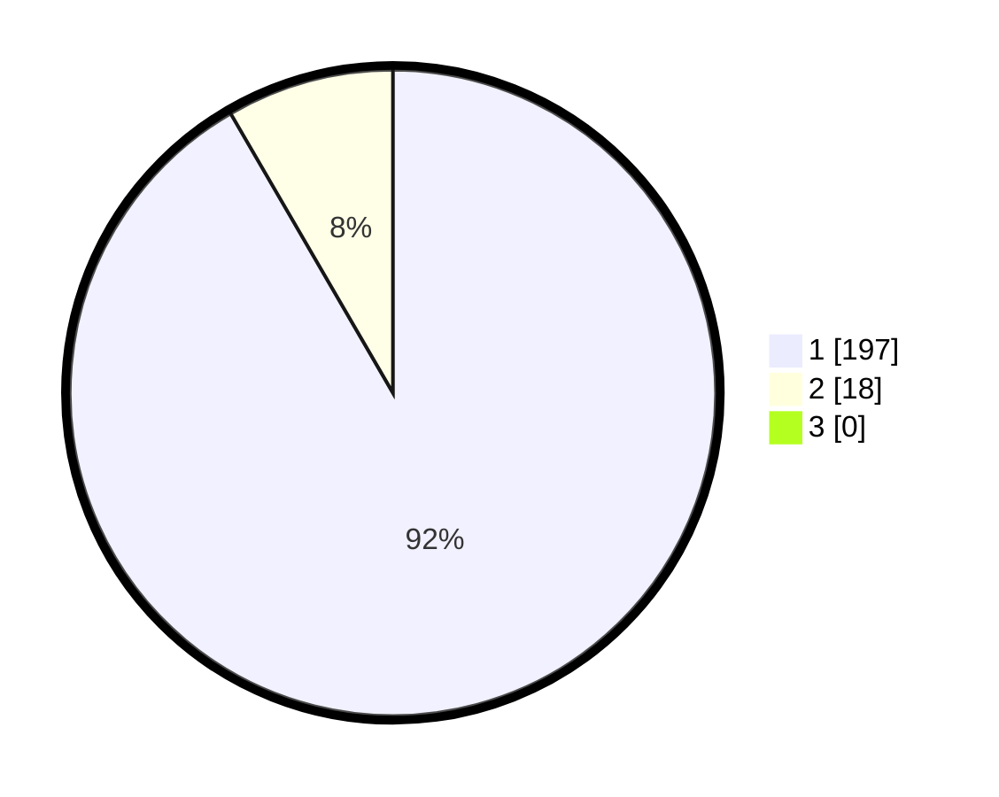

# Hasil

## Grafik

## Tabel

| No. | Nama Paslon    | Suara | Suara (raw) | Persentase |
|:--- |:-------------- | -----:| -----------:| ----------:|
| 1   | ANIES MUHAIMIN | 197   | [197][p-1]  | 91,63      |
| 2   | PRABOWO GIBRAN | 18    | [18][p-2]   | 8,37       |
| 3   | GANJAR MAHFUD  | 0     | [0][p-3]    | 0,00       |

[p-1]: https://github.com/gigit-pemilu/pemilu-2024/blob/main/pilpres/hitung-suara/sub/11-aceh/sub/08-aceh-utara/sub/15-sawang/sub/2037-kubu/sub/001-tps/sub/paslon-1.txt
[p-2]: https://github.com/gigit-pemilu/pemilu-2024/blob/main/pilpres/hitung-suara/sub/11-aceh/sub/08-aceh-utara/sub/15-sawang/sub/2037-kubu/sub/001-tps/sub/paslon-2.txt
[p-3]: https://github.com/gigit-pemilu/pemilu-2024/blob/main/pilpres/hitung-suara/sub/11-aceh/sub/08-aceh-utara/sub/15-sawang/sub/2037-kubu/sub/001-tps/sub/paslon-3.txt

## Foto C Plano

https://sirekap-obj-formc.kpu.go.id/dcce/pemilu/ppwp/11/08/15/20/37/1108152037001-20240215-064755--0480322d-9ce6-4f99-a207-cc367cead899.jpg

https://sirekap-obj-formc.kpu.go.id/dcce/pemilu/ppwp/11/08/15/20/37/1108152037001-20240215-065003--744e24d0-f2b9-49ca-aae9-0532fdae0778.jpg

https://sirekap-obj-formc.kpu.go.id/dcce/pemilu/ppwp/11/08/15/20/37/1108152037001-20240215-065220--347895ae-f64b-47f4-a453-0e9a1d6b8828.jpg

## Metadata

| Key        | Value               |
| ---------- | ------------------- |
| Time Stamp | 2024-02-17 16:00:02 |

