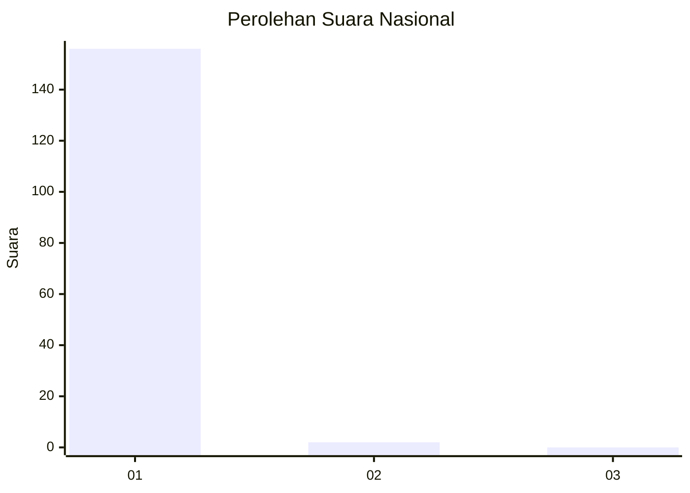
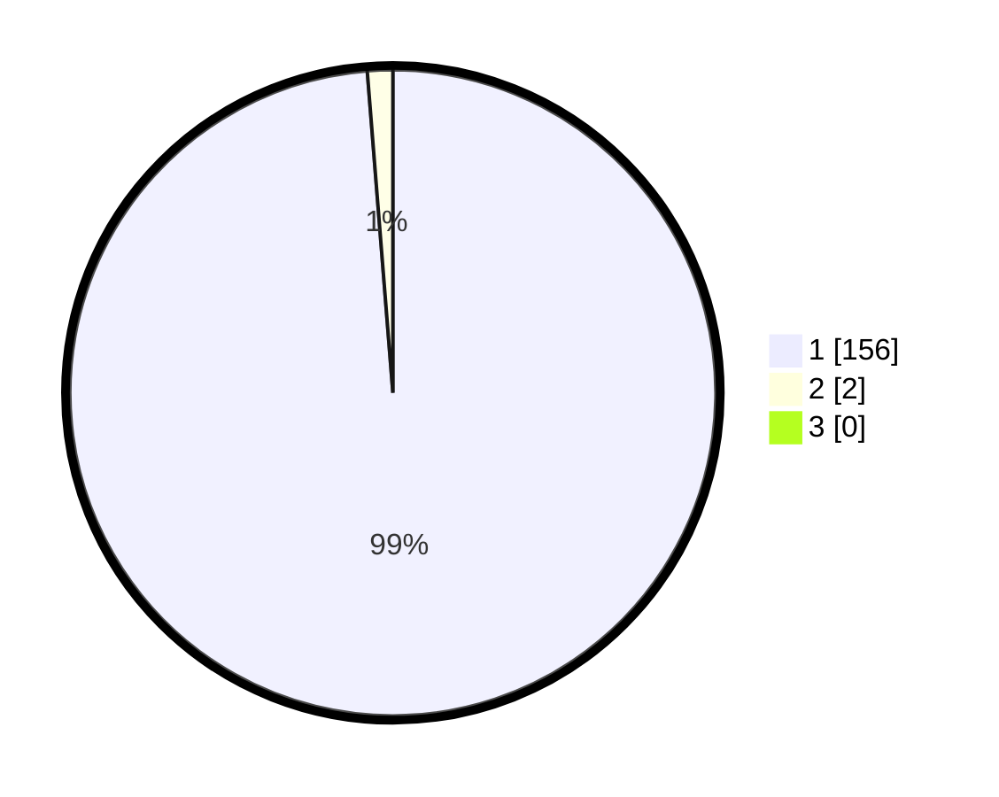

# Hasil

## Grafik

## Tabel

| No. | Nama Paslon    | Suara | Suara (raw) | Persentase |
|:--- |:-------------- | -----:| -----------:| ----------:|
| 1   | ANIES MUHAIMIN | 156   | [156][p-1]  | 98,73      |
| 2   | PRABOWO GIBRAN | 2     | [2][p-2]    | 1,27       |
| 3   | GANJAR MAHFUD  | 0     | [0][p-3]    | 0,00       |

[p-1]: https://github.com/gigit-pemilu/pemilu-2024/blob/main/pilpres/hitung-suara/sub/11-aceh/sub/08-aceh-utara/sub/15-sawang/sub/2038-blang-cut/sub/002-tps/sub/paslon-1.txt
[p-2]: https://github.com/gigit-pemilu/pemilu-2024/blob/main/pilpres/hitung-suara/sub/11-aceh/sub/08-aceh-utara/sub/15-sawang/sub/2038-blang-cut/sub/002-tps/sub/paslon-2.txt
[p-3]: https://github.com/gigit-pemilu/pemilu-2024/blob/main/pilpres/hitung-suara/sub/11-aceh/sub/08-aceh-utara/sub/15-sawang/sub/2038-blang-cut/sub/002-tps/sub/paslon-3.txt

## Foto C Plano

https://sirekap-obj-formc.kpu.go.id/d026/pemilu/ppwp/11/08/15/20/38/1108152038002-20240225-145224--d3d04890-5a15-4ca4-aa3b-e26a1f991f45.jpg

https://sirekap-obj-formc.kpu.go.id/d026/pemilu/ppwp/11/08/15/20/38/1108152038002-20240225-145500--8ba3411f-22e6-40e3-9ba3-744b6f4dd9b6.jpg

https://sirekap-obj-formc.kpu.go.id/d026/pemilu/ppwp/11/08/15/20/38/1108152038002-20240225-145555--24d405d3-86a4-42ae-8ca3-1018bc1754ba.jpg

## Metadata

| Key        | Value               |
| ---------- | ------------------- |
| Time Stamp | 2024-02-29 11:00:00 |

