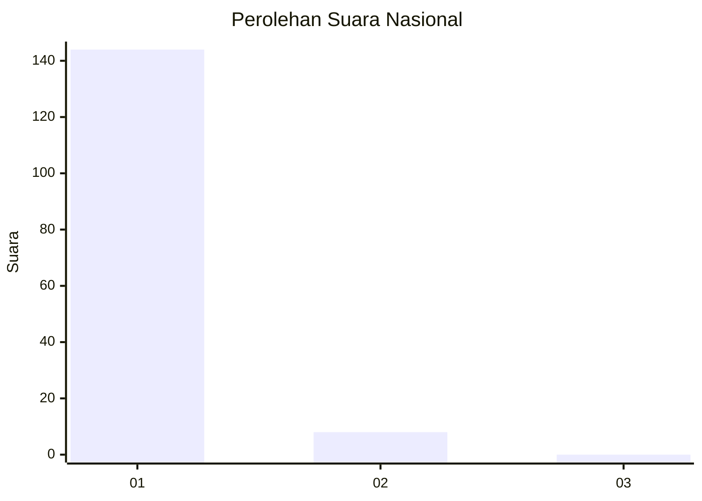
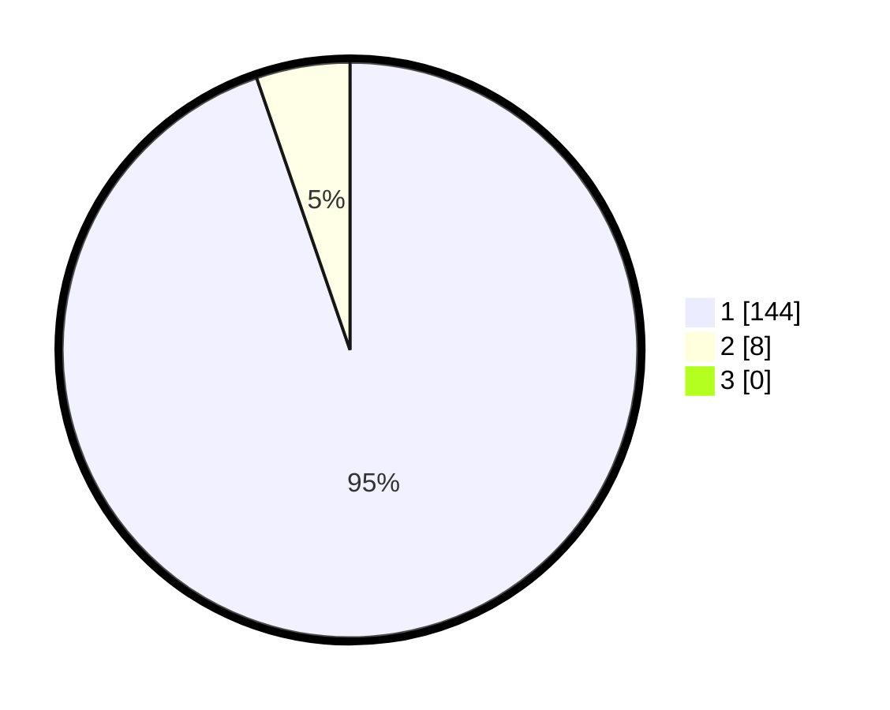

# Hasil

## Grafik

## Tabel

| No. | Nama Paslon    | Suara | Suara (raw) | Persentase |
|:--- |:-------------- | -----:| -----------:| ----------:|
| 1   | ANIES MUHAIMIN | 144   | [144][p-1]  | 94,74      |
| 2   | PRABOWO GIBRAN | 8     | [8][p-2]    | 5,26       |
| 3   | GANJAR MAHFUD  | 0     | [0][p-3]    | 0,00       |

[p-1]: https://github.com/gigit-pemilu/pemilu-2024/blob/main/pilpres/hitung-suara/sub/11-aceh/sub/08-aceh-utara/sub/16-nisam/sub/2020-meunasah-beunot/sub/001-tps/sub/paslon-1.txt
[p-2]: https://github.com/gigit-pemilu/pemilu-2024/blob/main/pilpres/hitung-suara/sub/11-aceh/sub/08-aceh-utara/sub/16-nisam/sub/2020-meunasah-beunot/sub/001-tps/sub/paslon-2.txt
[p-3]: https://github.com/gigit-pemilu/pemilu-2024/blob/main/pilpres/hitung-suara/sub/11-aceh/sub/08-aceh-utara/sub/16-nisam/sub/2020-meunasah-beunot/sub/001-tps/sub/paslon-3.txt

## Foto C Plano

https://sirekap-obj-formc.kpu.go.id/9150/pemilu/ppwp/11/08/16/20/20/1108162020001-20240214-213449--10a38eaf-d326-4ebe-92ce-7ce3cfd34c91.jpg

https://sirekap-obj-formc.kpu.go.id/9150/pemilu/ppwp/11/08/16/20/20/1108162020001-20240214-213546--946b4a14-9c74-4187-afa6-5d31b4ad28de.jpg

https://sirekap-obj-formc.kpu.go.id/9150/pemilu/ppwp/11/08/16/20/20/1108162020001-20240214-213639--3978c4f3-554c-4ee8-a33a-17934a6ee21b.jpg

## Metadata

| Key        | Value               |
| ---------- | ------------------- |
| Time Stamp | 2024-02-15 18:00:26 |

