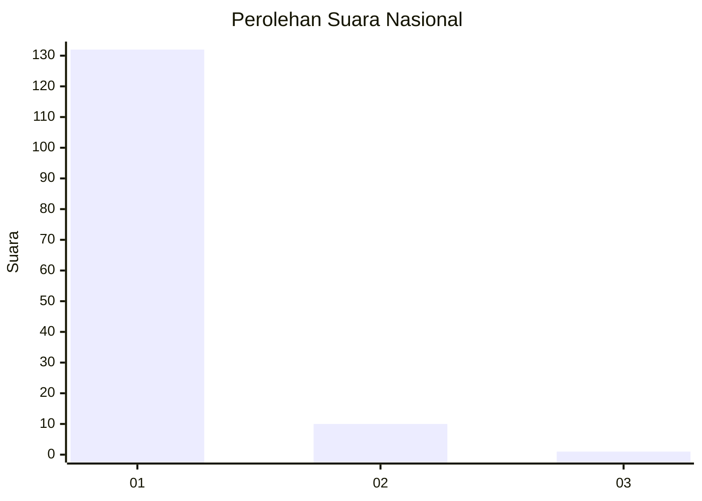
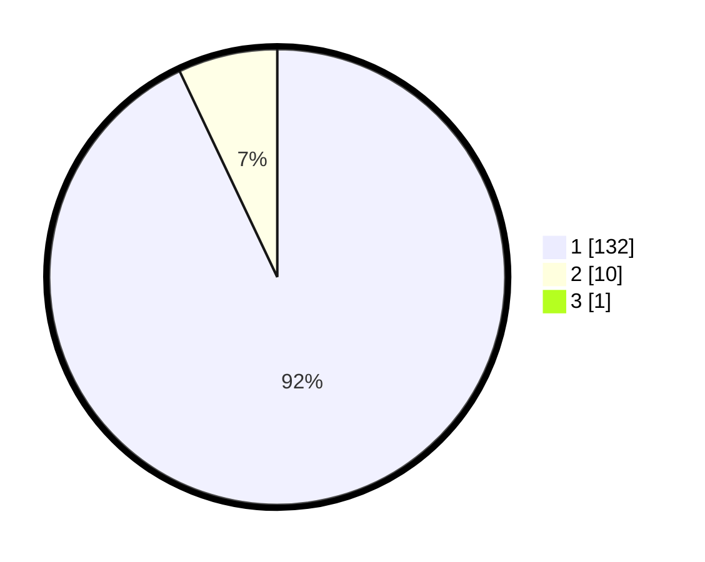

# Hasil

## Grafik

## Tabel

| No. | Nama Paslon    | Suara | Suara (raw) | Persentase |
|:--- |:-------------- | -----:| -----------:| ----------:|
| 1   | ANIES MUHAIMIN | 132   | [132][p-1]  | 92,31      |
| 2   | PRABOWO GIBRAN | 10    | [10][p-2]   | 6,99       |
| 3   | GANJAR MAHFUD  | 1     | [1][p-3]    | 0,70       |

[p-1]: https://github.com/gigit-pemilu/pemilu-2024/blob/main/pilpres/hitung-suara/sub/11-aceh/sub/08-aceh-utara/sub/16-nisam/sub/2021-seuneubok/sub/002-tps/sub/paslon-1.txt
[p-2]: https://github.com/gigit-pemilu/pemilu-2024/blob/main/pilpres/hitung-suara/sub/11-aceh/sub/08-aceh-utara/sub/16-nisam/sub/2021-seuneubok/sub/002-tps/sub/paslon-2.txt
[p-3]: https://github.com/gigit-pemilu/pemilu-2024/blob/main/pilpres/hitung-suara/sub/11-aceh/sub/08-aceh-utara/sub/16-nisam/sub/2021-seuneubok/sub/002-tps/sub/paslon-3.txt

## Foto C Plano

https://sirekap-obj-formc.kpu.go.id/a275/pemilu/ppwp/11/08/16/20/21/1108162021002-20240215-010805--497e320f-e848-4bd3-9c4a-4c1657c951f8.jpg

https://sirekap-obj-formc.kpu.go.id/a275/pemilu/ppwp/11/08/16/20/21/1108162021002-20240215-011638--be3acda8-5523-4bb8-939f-13cb674aca30.jpg

https://sirekap-obj-formc.kpu.go.id/a275/pemilu/ppwp/11/08/16/20/21/1108162021002-20240215-031125--857ba12d-b8a0-4ac5-bde3-4dafa56859d7.jpg

## Metadata

| Key        | Value               |
| ---------- | ------------------- |
| Time Stamp | 2024-02-17 01:00:00 |

