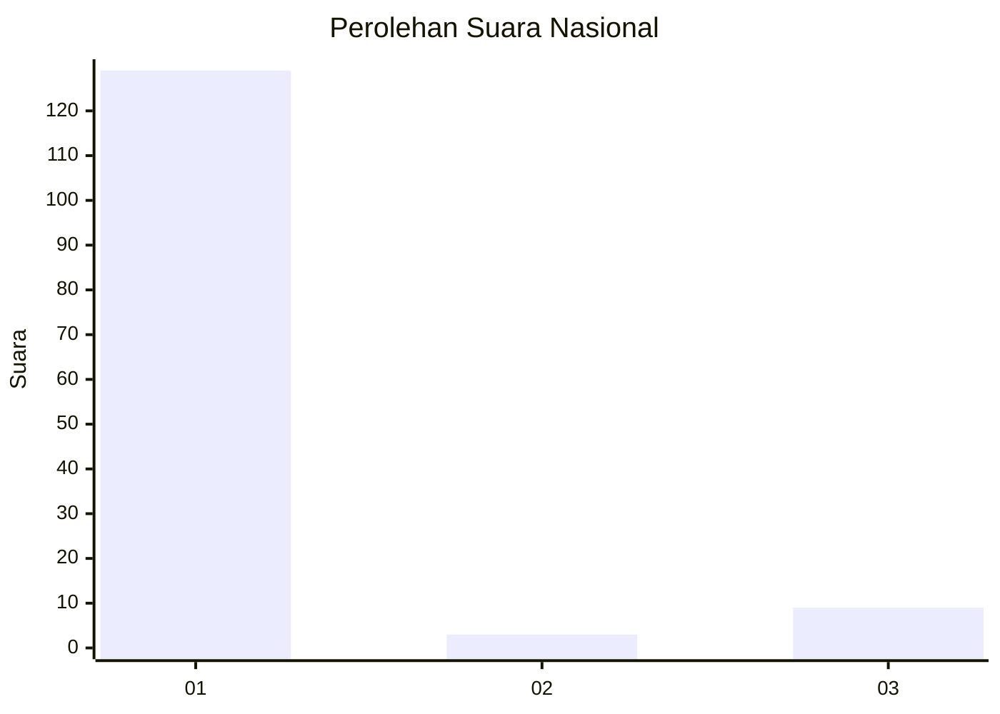
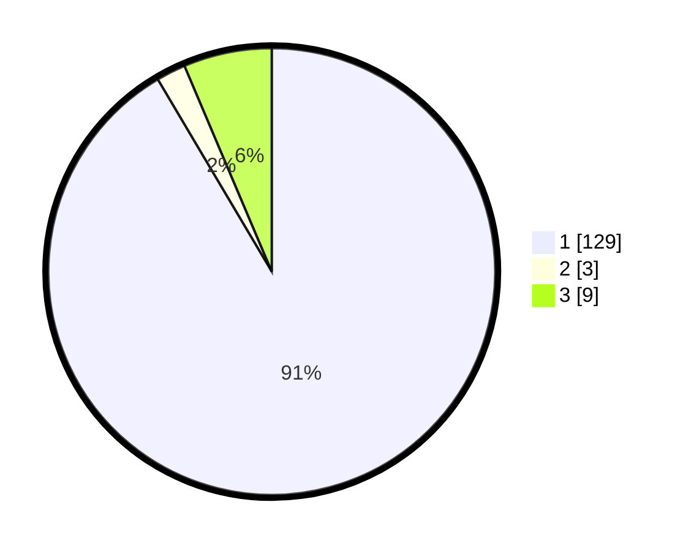

# Hasil

## Grafik

## Tabel

| No. | Nama Paslon    | Suara | Suara (raw) | Persentase |
|:--- |:-------------- | -----:| -----------:| ----------:|
| 1   | ANIES MUHAIMIN | 129   | [129][p-1]  | 91,49      |
| 2   | PRABOWO GIBRAN | 3     | [3][p-2]    | 2,13       |
| 3   | GANJAR MAHFUD  | 9     | [9][p-3]    | 6,38       |

[p-1]: https://github.com/gigit-pemilu/pemilu-2024/blob/main/pilpres/hitung-suara/sub/11-aceh/sub/08-aceh-utara/sub/16-nisam/sub/2032-jeulikat/sub/002-tps/sub/paslon-1.txt
[p-2]: https://github.com/gigit-pemilu/pemilu-2024/blob/main/pilpres/hitung-suara/sub/11-aceh/sub/08-aceh-utara/sub/16-nisam/sub/2032-jeulikat/sub/002-tps/sub/paslon-2.txt
[p-3]: https://github.com/gigit-pemilu/pemilu-2024/blob/main/pilpres/hitung-suara/sub/11-aceh/sub/08-aceh-utara/sub/16-nisam/sub/2032-jeulikat/sub/002-tps/sub/paslon-3.txt

## Foto C Plano

https://sirekap-obj-formc.kpu.go.id/8a2f/pemilu/ppwp/11/08/16/20/32/1108162032002-20240220-115321--c36bc16f-0dc8-4022-bfd4-81227746d257.jpg

https://sirekap-obj-formc.kpu.go.id/8a2f/pemilu/ppwp/11/08/16/20/32/1108162032002-20240220-115410--c5b33526-2b66-4206-beeb-38150faabe79.jpg

https://sirekap-obj-formc.kpu.go.id/8a2f/pemilu/ppwp/11/08/16/20/32/1108162032002-20240220-120940--44b4f736-e1b1-4bd0-87cc-cd086bda8ae8.jpg

## Metadata

| Key        | Value               |
| ---------- | ------------------- |
| Time Stamp | 2024-02-24 22:31:28 |

