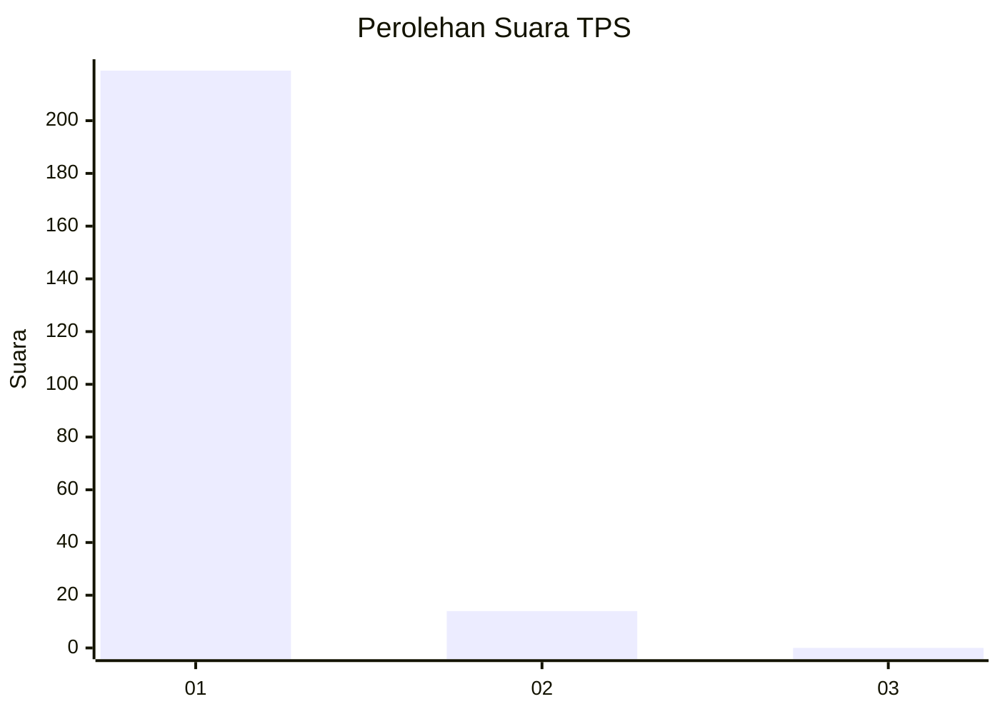
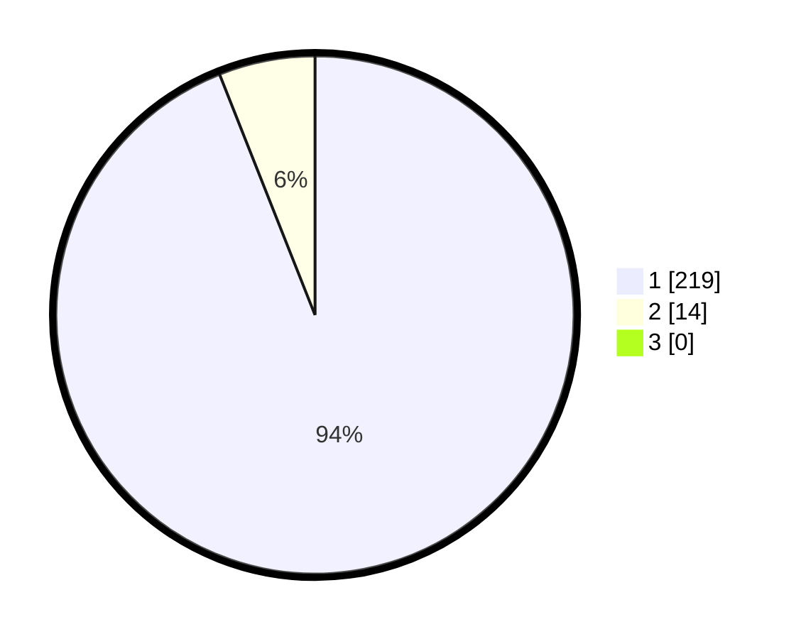

# Hasil

## Grafik

## Tabel

| No. | Nama Paslon    | Suara | Suara (raw) | Persentase |
|:--- |:-------------- | -----:| -----------:| ----------:|
| 1   | ANIES MUHAIMIN | 219   | [219][p-1]  | 93,99      |
| 2   | PRABOWO GIBRAN | 14    | [14][p-2]   | 6,01       |
| 3   | GANJAR MAHFUD  | 0     | [0][p-3]    | 0,00       |

[p-1]: https://github.com/gigit-pemilu/pemilu-2024-11-aceh/blob/main/pilpres/hitung-suara/sub/11-aceh/sub/08-aceh-utara/sub/16-nisam/sub/2034-cot-mambong/sub/001-tps/sub/paslon-1.txt
[p-2]: https://github.com/gigit-pemilu/pemilu-2024-11-aceh/blob/main/pilpres/hitung-suara/sub/11-aceh/sub/08-aceh-utara/sub/16-nisam/sub/2034-cot-mambong/sub/001-tps/sub/paslon-2.txt
[p-3]: https://github.com/gigit-pemilu/pemilu-2024-11-aceh/blob/main/pilpres/hitung-suara/sub/11-aceh/sub/08-aceh-utara/sub/16-nisam/sub/2034-cot-mambong/sub/001-tps/sub/paslon-3.txt

## Foto C Plano

https://sirekap-obj-formc.kpu.go.id/52d6/pemilu/ppwp/11/08/16/20/34/1108162034001-20240215-073318--dad73263-9429-40a9-83d2-38e0e723fe2b.jpg

https://sirekap-obj-formc.kpu.go.id/52d6/pemilu/ppwp/11/08/16/20/34/1108162034001-20240215-073925--d34548ed-c2aa-43e3-9293-9dbb6537494f.jpg

https://sirekap-obj-formc.kpu.go.id/52d6/pemilu/ppwp/11/08/16/20/34/1108162034001-20240215-074222--4268e216-da6f-4da9-8cea-a6fa5601a4c9.jpg

## Metadata

| Key        | Value               |
| ---------- | ------------------- |
| Time Stamp | 2024-02-17 01:00:00 |

