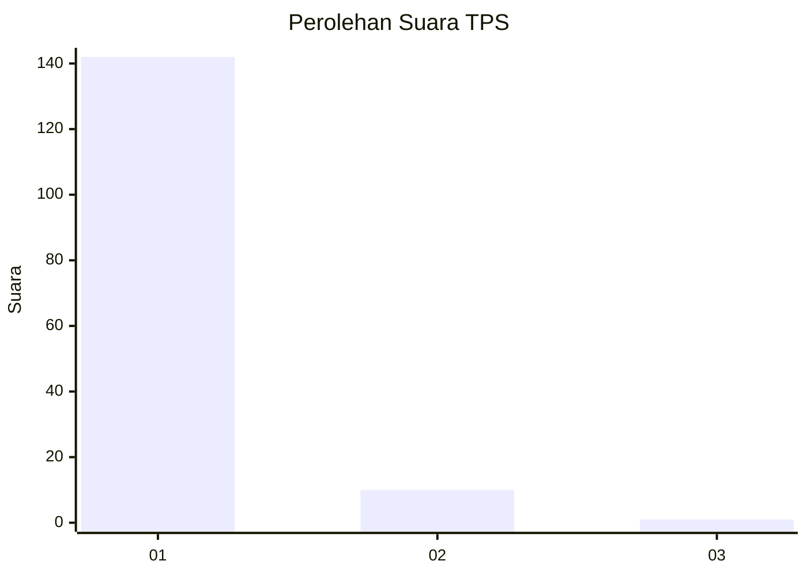
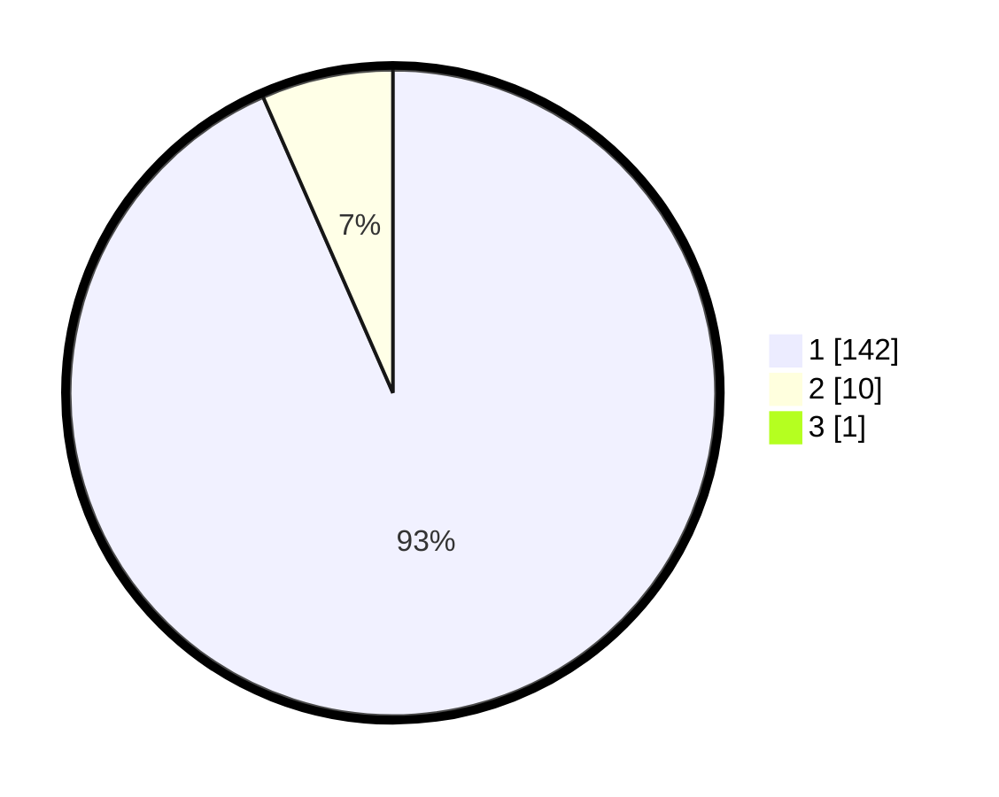

# Hasil

## Grafik

## Tabel

| No. | Nama Paslon    | Suara | Suara (raw) | Persentase |
|:--- |:-------------- | -----:| -----------:| ----------:|
| 1   | ANIES MUHAIMIN | 142   | [142][p-1]  | 92,81      |
| 2   | PRABOWO GIBRAN | 10    | [10][p-2]   | 6,54       |
| 3   | GANJAR MAHFUD  | 1     | [1][p-3]    | 0,65       |

[p-1]: https://github.com/gigit-pemilu/pemilu-2024-11-aceh/blob/main/pilpres/hitung-suara/sub/11-aceh/sub/08-aceh-utara/sub/16-nisam/sub/2037-blang-dalam-baroh/sub/001-tps/sub/paslon-1.txt
[p-2]: https://github.com/gigit-pemilu/pemilu-2024-11-aceh/blob/main/pilpres/hitung-suara/sub/11-aceh/sub/08-aceh-utara/sub/16-nisam/sub/2037-blang-dalam-baroh/sub/001-tps/sub/paslon-2.txt
[p-3]: https://github.com/gigit-pemilu/pemilu-2024-11-aceh/blob/main/pilpres/hitung-suara/sub/11-aceh/sub/08-aceh-utara/sub/16-nisam/sub/2037-blang-dalam-baroh/sub/001-tps/sub/paslon-3.txt

## Foto C Plano

https://sirekap-obj-formc.kpu.go.id/7c49/pemilu/ppwp/11/08/16/20/37/1108162037001-20240214-195353--c6706859-181c-4f85-80ce-a5f85bec2ffe.jpg

https://sirekap-obj-formc.kpu.go.id/7c49/pemilu/ppwp/11/08/16/20/37/1108162037001-20240214-195505--7494e424-bb73-475e-85cc-e0356b04b931.jpg

https://sirekap-obj-formc.kpu.go.id/7c49/pemilu/ppwp/11/08/16/20/37/1108162037001-20240214-195735--2363a7a0-47cf-44c4-8711-233f4291847c.jpg

## Metadata

| Key        | Value               |
| ---------- | ------------------- |
| Time Stamp | 2024-02-17 01:00:00 |

