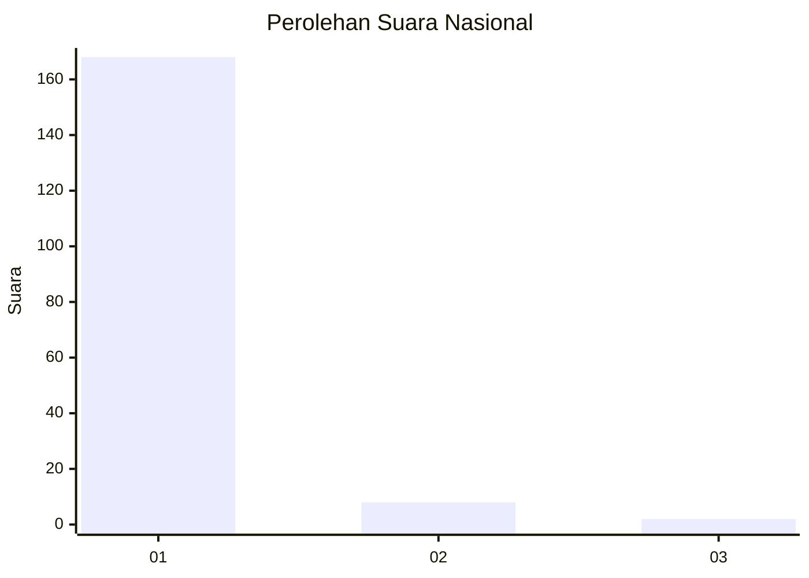
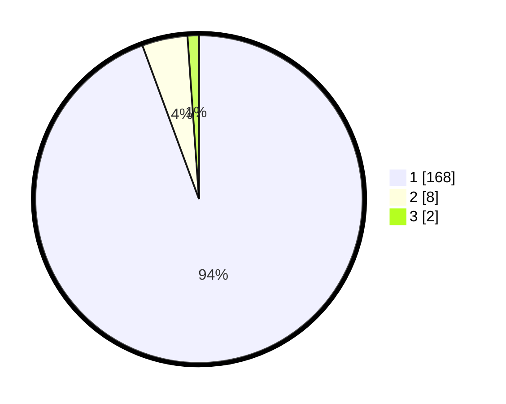

# Hasil

## Grafik

## Tabel

| No. | Nama Paslon    | Suara | Suara (raw) | Persentase |
|:--- |:-------------- | -----:| -----------:| ----------:|
| 1   | ANIES MUHAIMIN | 168   | [168][p-1]  | 94,38      |
| 2   | PRABOWO GIBRAN | 8     | [8][p-2]    | 4,49       |
| 3   | GANJAR MAHFUD  | 2     | [2][p-3]    | 1,12       |

[p-1]: https://github.com/gigit-pemilu/pemilu-2024/blob/main/pilpres/hitung-suara/sub/11-aceh/sub/08-aceh-utara/sub/16-nisam/sub/2038-cot-mee/sub/001-tps/sub/paslon-1.txt
[p-2]: https://github.com/gigit-pemilu/pemilu-2024/blob/main/pilpres/hitung-suara/sub/11-aceh/sub/08-aceh-utara/sub/16-nisam/sub/2038-cot-mee/sub/001-tps/sub/paslon-2.txt
[p-3]: https://github.com/gigit-pemilu/pemilu-2024/blob/main/pilpres/hitung-suara/sub/11-aceh/sub/08-aceh-utara/sub/16-nisam/sub/2038-cot-mee/sub/001-tps/sub/paslon-3.txt

## Foto C Plano

https://sirekap-obj-formc.kpu.go.id/6582/pemilu/ppwp/11/08/16/20/38/1108162038001-20240215-143635--c2acfd99-1cf5-424d-bfbe-c7f61d1891a0.jpg

https://sirekap-obj-formc.kpu.go.id/6582/pemilu/ppwp/11/08/16/20/38/1108162038001-20240215-143641--97f49aca-5b2b-44f5-832b-e074b007dd3e.jpg

https://sirekap-obj-formc.kpu.go.id/6582/pemilu/ppwp/11/08/16/20/38/1108162038001-20240215-143647--090cc1b1-5014-46d1-987f-6f4b5028388d.jpg

## Metadata

| Key        | Value               |
| ---------- | ------------------- |
| Time Stamp | 2024-02-15 19:00:26 |

