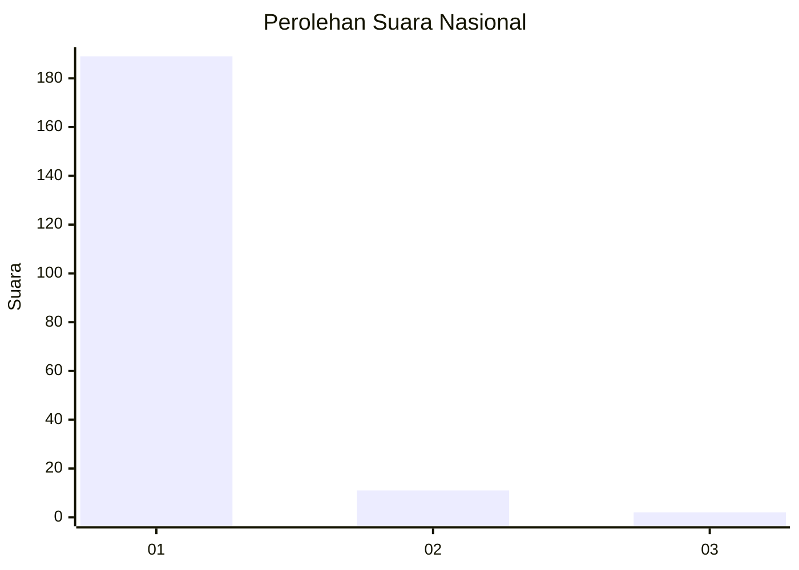
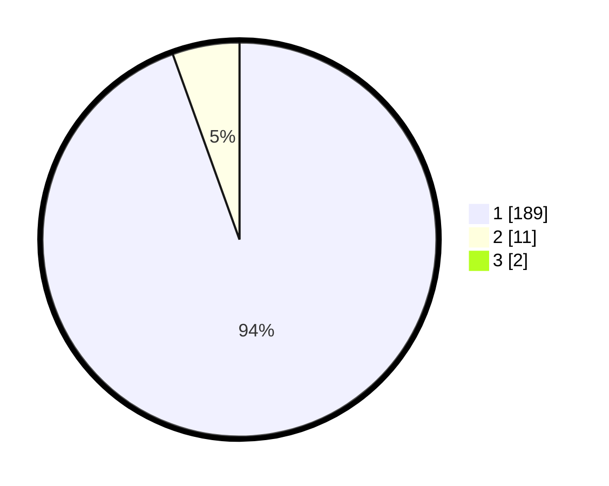

# Hasil

## Grafik

## Tabel

| No. | Nama Paslon    | Suara | Suara (raw) | Persentase |
|:--- |:-------------- | -----:| -----------:| ----------:|
| 1   | ANIES MUHAIMIN | 189   | [189][p-1]  | 93,56      |
| 2   | PRABOWO GIBRAN | 11    | [11][p-2]   | 5,45       |
| 3   | GANJAR MAHFUD  | 2     | [2][p-3]    | 0,99       |

[p-1]: https://github.com/gigit-pemilu/pemilu-2024/blob/main/pilpres/hitung-suara/sub/11-aceh/sub/08-aceh-utara/sub/16-nisam/sub/2042-binjee/sub/003-tps/sub/paslon-1.txt
[p-2]: https://github.com/gigit-pemilu/pemilu-2024/blob/main/pilpres/hitung-suara/sub/11-aceh/sub/08-aceh-utara/sub/16-nisam/sub/2042-binjee/sub/003-tps/sub/paslon-2.txt
[p-3]: https://github.com/gigit-pemilu/pemilu-2024/blob/main/pilpres/hitung-suara/sub/11-aceh/sub/08-aceh-utara/sub/16-nisam/sub/2042-binjee/sub/003-tps/sub/paslon-3.txt

## Foto C Plano

https://sirekap-obj-formc.kpu.go.id/7b97/pemilu/ppwp/11/08/16/20/42/1108162042003-20240215-021624--126544b7-7a92-416e-a7ae-e41297468b1a.jpg

https://sirekap-obj-formc.kpu.go.id/7b97/pemilu/ppwp/11/08/16/20/42/1108162042003-20240215-022224--dc5b5695-c723-4927-8220-cc759bd07489.jpg

https://sirekap-obj-formc.kpu.go.id/7b97/pemilu/ppwp/11/08/16/20/42/1108162042003-20240215-022254--46f1b878-d9f9-423f-a3f6-749b81254bd6.jpg

## Metadata

| Key        | Value               |
| ---------- | ------------------- |
| Time Stamp | 2024-02-15 15:00:29 |

