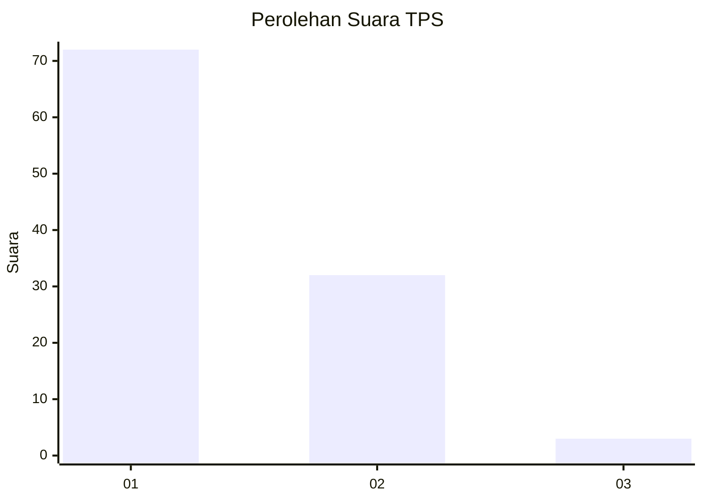
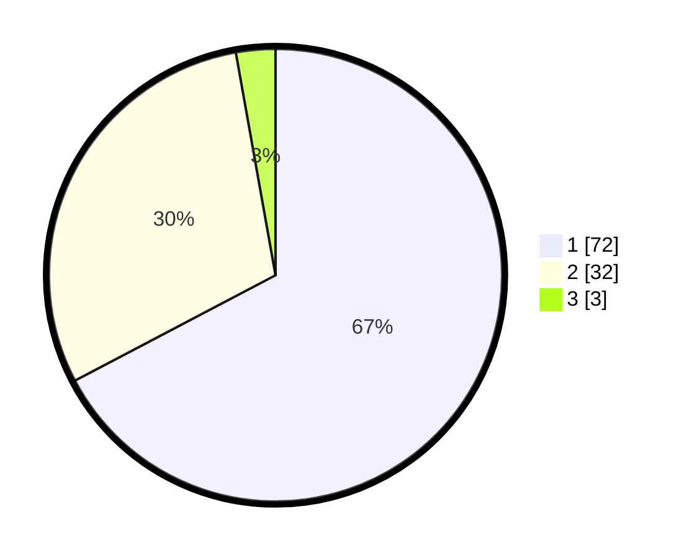

# Hasil

## Grafik

## Tabel

| No. | Nama Paslon    | Suara | Suara (raw) | Persentase |
|:--- |:-------------- | -----:| -----------:| ----------:|
| 1   | ANIES MUHAIMIN | 72    | [72][p-1]   | 67,29      |
| 2   | PRABOWO GIBRAN | 32    | [32][p-2]   | 29,91      |
| 3   | GANJAR MAHFUD  | 3     | [3][p-3]    | 2,80       |

[p-1]: https://github.com/gigit-pemilu/pemilu-2024-11-aceh/blob/main/pilpres/hitung-suara/sub/11-aceh/sub/08-aceh-utara/sub/17-cot-girek/sub/2001-cot-girek/sub/001-tps/sub/paslon-1.txt
[p-2]: https://github.com/gigit-pemilu/pemilu-2024-11-aceh/blob/main/pilpres/hitung-suara/sub/11-aceh/sub/08-aceh-utara/sub/17-cot-girek/sub/2001-cot-girek/sub/001-tps/sub/paslon-2.txt
[p-3]: https://github.com/gigit-pemilu/pemilu-2024-11-aceh/blob/main/pilpres/hitung-suara/sub/11-aceh/sub/08-aceh-utara/sub/17-cot-girek/sub/2001-cot-girek/sub/001-tps/sub/paslon-3.txt

## Foto C Plano

https://sirekap-obj-formc.kpu.go.id/e077/pemilu/ppwp/11/08/17/20/01/1108172001001-20240215-083251--ff82fd70-97ec-4f31-adee-9b5b4b32609f.jpg

https://sirekap-obj-formc.kpu.go.id/e077/pemilu/ppwp/11/08/17/20/01/1108172001001-20240215-161005--1812945c-49fd-46be-aaca-34411c941a55.jpg

https://sirekap-obj-formc.kpu.go.id/e077/pemilu/ppwp/11/08/17/20/01/1108172001001-20240214-213913--3b252653-4ef0-4d17-a308-0afde4b6a74f.jpg

## Metadata

| Key        | Value               |
| ---------- | ------------------- |
| Time Stamp | 2024-02-16 11:00:29 |

