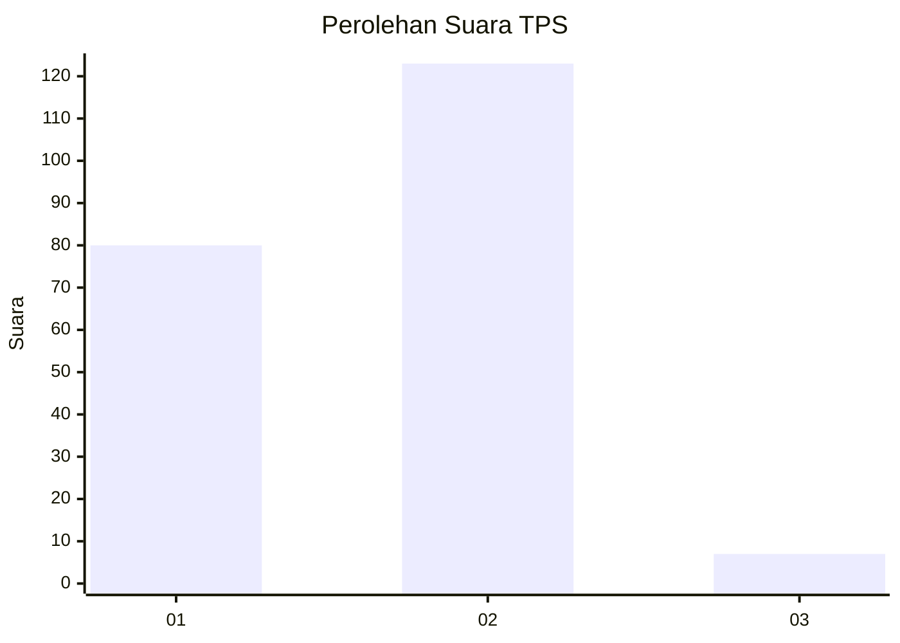
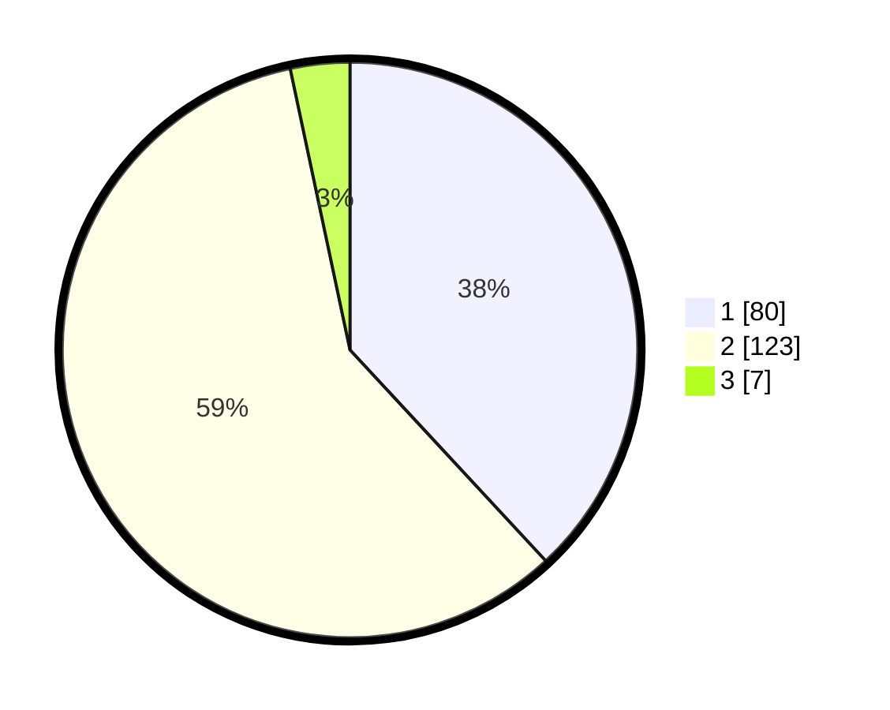

# Hasil

## Grafik

## Tabel

| No. | Nama Paslon    | Suara | Suara (raw) | Persentase |
|:--- |:-------------- | -----:| -----------:| ----------:|
| 1   | ANIES MUHAIMIN | 80    | [80][p-1]   | 38,10      |
| 2   | PRABOWO GIBRAN | 123   | [123][p-2]  | 58,57      |
| 3   | GANJAR MAHFUD  | 7     | [7][p-3]    | 3,33       |

[p-1]: https://github.com/gigit-pemilu/pemilu-2024-11-aceh/blob/main/pilpres/hitung-suara/sub/11-aceh/sub/08-aceh-utara/sub/17-cot-girek/sub/2001-cot-girek/sub/005-tps/sub/paslon-1.txt
[p-2]: https://github.com/gigit-pemilu/pemilu-2024-11-aceh/blob/main/pilpres/hitung-suara/sub/11-aceh/sub/08-aceh-utara/sub/17-cot-girek/sub/2001-cot-girek/sub/005-tps/sub/paslon-2.txt
[p-3]: https://github.com/gigit-pemilu/pemilu-2024-11-aceh/blob/main/pilpres/hitung-suara/sub/11-aceh/sub/08-aceh-utara/sub/17-cot-girek/sub/2001-cot-girek/sub/005-tps/sub/paslon-3.txt

## Foto C Plano

https://sirekap-obj-formc.kpu.go.id/190d/pemilu/ppwp/11/08/17/20/01/1108172001005-20240222-154922--db9396c4-6ef4-4abb-93ab-166c4384f027.jpg

https://sirekap-obj-formc.kpu.go.id/190d/pemilu/ppwp/11/08/17/20/01/1108172001005-20240222-154924--3a1f4e33-0a6d-4fd4-a643-91951daa84cc.jpg

https://sirekap-obj-formc.kpu.go.id/190d/pemilu/ppwp/11/08/17/20/01/1108172001005-20240222-154923--642d7e35-0c1c-4a50-ac09-4e4321324e74.jpg

## Metadata

| Key        | Value               |
| ---------- | ------------------- |
| Time Stamp | 2024-02-24 22:31:28 |

## DATA PEMILIH TETAP

Jumlah pemilih dalam DPT: **0**.
 * L: **0**.
 * P: **0**.

## DATA PENGGUNA HAK PILIH

Jumlah pengguna hak pilih dalam DPT: **0**.
 * L: **0**.
 * P: **0**.

Jumlah pengguna hak pilih dalam DPTb: **0**.
 * L: **0**.
 * P: **0**.

Jumlah pengguna hak pilih dalam DPK: **0**.
 * L: **0**.
 * P: **0**.

Jumlah pengguna hak pilih: **0**.
 * L: **0**.
 * P: **0**.

## JUMLAH SUARA SAH DAN TIDAK SAH

JUMLAH SELURUH SUARA SAH: **210**.

JUMLAH SUARA TIDAK SAH: **1**.

JUMLAH SELURUH SUARA SAH DAN SUARA TIDAK SAH: **211**.

