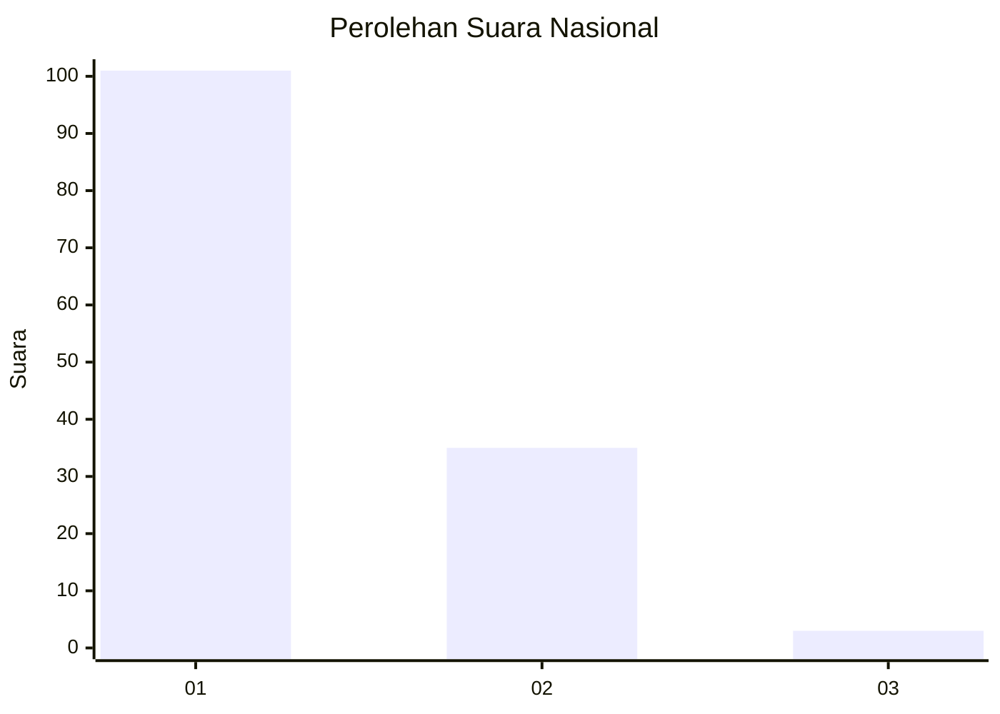
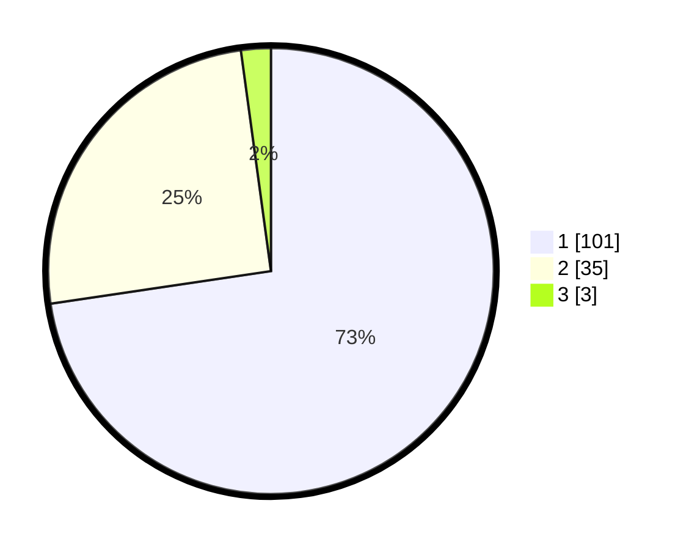

# Hasil

## Grafik

## Tabel

| No. | Nama Paslon    | Suara | Suara (raw) | Persentase |
|:--- |:-------------- | -----:| -----------:| ----------:|
| 1   | ANIES MUHAIMIN | 101   | [101][p-1]  | 72,66      |
| 2   | PRABOWO GIBRAN | 35    | [35][p-2]   | 25,18      |
| 3   | GANJAR MAHFUD  | 3     | [3][p-3]    | 2,16       |

[p-1]: https://github.com/gigit-pemilu/pemilu-2024/blob/main/pilpres/hitung-suara/sub/11-aceh/sub/08-aceh-utara/sub/17-cot-girek/sub/2001-cot-girek/sub/010-tps/sub/paslon-1.txt
[p-2]: https://github.com/gigit-pemilu/pemilu-2024/blob/main/pilpres/hitung-suara/sub/11-aceh/sub/08-aceh-utara/sub/17-cot-girek/sub/2001-cot-girek/sub/010-tps/sub/paslon-2.txt
[p-3]: https://github.com/gigit-pemilu/pemilu-2024/blob/main/pilpres/hitung-suara/sub/11-aceh/sub/08-aceh-utara/sub/17-cot-girek/sub/2001-cot-girek/sub/010-tps/sub/paslon-3.txt

## Foto C Plano

https://sirekap-obj-formc.kpu.go.id/d846/pemilu/ppwp/11/08/17/20/01/1108172001010-20240214-231604--da55109b-3333-4de5-be36-cae13fbc7584.jpg

https://sirekap-obj-formc.kpu.go.id/d846/pemilu/ppwp/11/08/17/20/01/1108172001010-20240215-075613--6f1991b4-fe7c-4885-bfa5-533f40655662.jpg

https://sirekap-obj-formc.kpu.go.id/d846/pemilu/ppwp/11/08/17/20/01/1108172001010-20240214-232452--a9babaa8-7e4c-4ebb-80e8-a72ddf48ac54.jpg

## Metadata

| Key        | Value               |
| ---------- | ------------------- |
| Time Stamp | 2024-02-17 01:00:00 |

