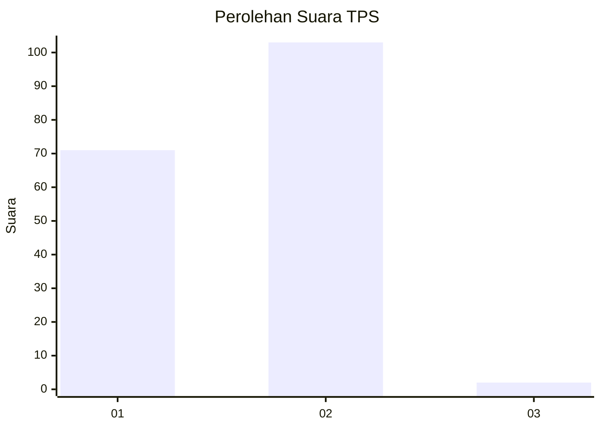
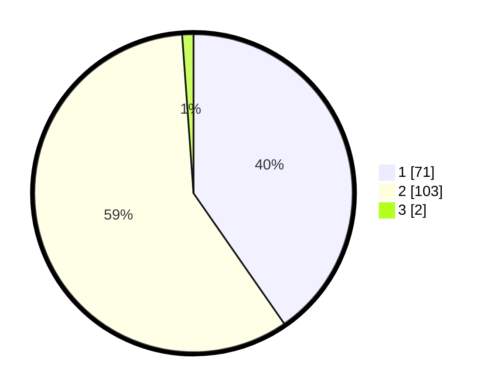

# Hasil

## Grafik

## Tabel

| No. | Nama Paslon    | Suara | Suara (raw) | Persentase |
|:--- |:-------------- | -----:| -----------:| ----------:|
| 1   | ANIES MUHAIMIN | 71    | [71][p-1]   | 40,34      |
| 2   | PRABOWO GIBRAN | 103   | [103][p-2]  | 58,52      |
| 3   | GANJAR MAHFUD  | 2     | [2][p-3]    | 1,14       |

[p-1]: https://github.com/gigit-pemilu/pemilu-2024-11-aceh/blob/main/pilpres/hitung-suara/sub/11-aceh/sub/08-aceh-utara/sub/17-cot-girek/sub/2001-cot-girek/sub/016-tps/sub/paslon-1.txt
[p-2]: https://github.com/gigit-pemilu/pemilu-2024-11-aceh/blob/main/pilpres/hitung-suara/sub/11-aceh/sub/08-aceh-utara/sub/17-cot-girek/sub/2001-cot-girek/sub/016-tps/sub/paslon-2.txt
[p-3]: https://github.com/gigit-pemilu/pemilu-2024-11-aceh/blob/main/pilpres/hitung-suara/sub/11-aceh/sub/08-aceh-utara/sub/17-cot-girek/sub/2001-cot-girek/sub/016-tps/sub/paslon-3.txt

## Foto C Plano

https://sirekap-obj-formc.kpu.go.id/b422/pemilu/ppwp/11/08/17/20/01/1108172001016-20240214-212217--ccff52f1-df77-4631-acb4-162ba424cefb.jpg

https://sirekap-obj-formc.kpu.go.id/b422/pemilu/ppwp/11/08/17/20/01/1108172001016-20240214-202308--4f7a1d33-aa47-46be-a086-5a2621c2a351.jpg

https://sirekap-obj-formc.kpu.go.id/b422/pemilu/ppwp/11/08/17/20/01/1108172001016-20240214-212331--b6153801-3e2e-4294-acfa-3e4dba40f0e8.jpg

## Metadata

| Key        | Value               |
| ---------- | ------------------- |
| Time Stamp | 2024-02-15 12:00:28 |

