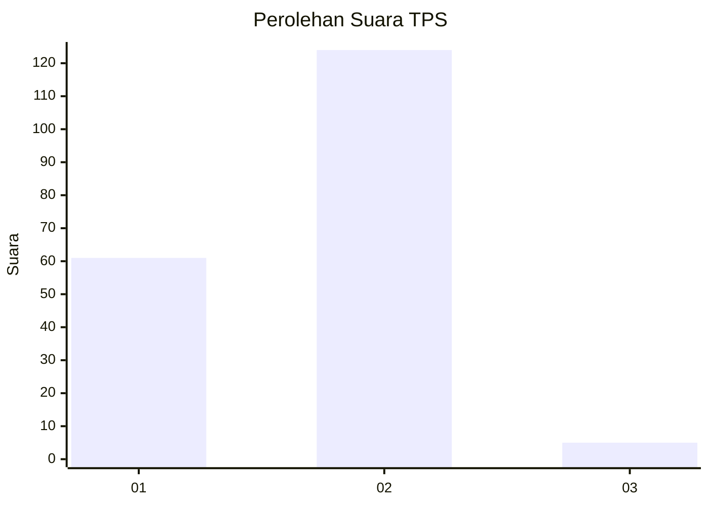
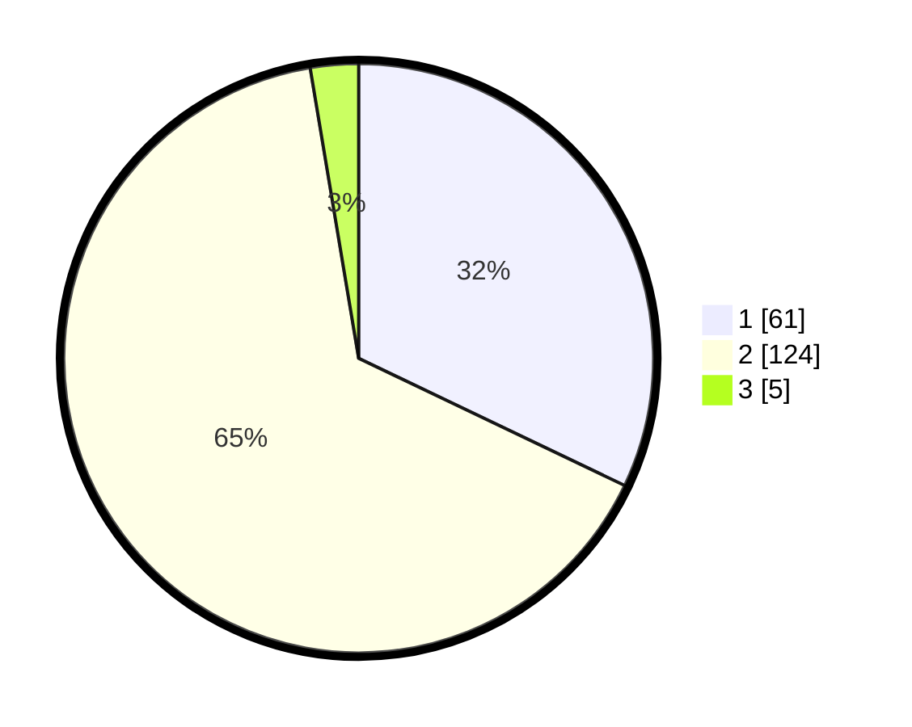

# Hasil

## Grafik

## Tabel

| No. | Nama Paslon    | Suara | Suara (raw) | Persentase |
|:--- |:-------------- | -----:| -----------:| ----------:|
| 1   | ANIES MUHAIMIN | 61    | [61][p-1]   | 32,11      |
| 2   | PRABOWO GIBRAN | 124   | [124][p-2]  | 65,26      |
| 3   | GANJAR MAHFUD  | 5     | [5][p-3]    | 2,63       |

[p-1]: https://github.com/gigit-pemilu/pemilu-2024-11-aceh/blob/main/pilpres/hitung-suara/sub/11-aceh/sub/08-aceh-utara/sub/17-cot-girek/sub/2001-cot-girek/sub/017-tps/sub/paslon-1.txt
[p-2]: https://github.com/gigit-pemilu/pemilu-2024-11-aceh/blob/main/pilpres/hitung-suara/sub/11-aceh/sub/08-aceh-utara/sub/17-cot-girek/sub/2001-cot-girek/sub/017-tps/sub/paslon-2.txt
[p-3]: https://github.com/gigit-pemilu/pemilu-2024-11-aceh/blob/main/pilpres/hitung-suara/sub/11-aceh/sub/08-aceh-utara/sub/17-cot-girek/sub/2001-cot-girek/sub/017-tps/sub/paslon-3.txt

## Foto C Plano

https://sirekap-obj-formc.kpu.go.id/f13c/pemilu/ppwp/11/08/17/20/01/1108172001017-20240215-080849--021ca4e9-3886-4108-931d-1e6c00e55fe2.jpg

https://sirekap-obj-formc.kpu.go.id/f13c/pemilu/ppwp/11/08/17/20/01/1108172001017-20240215-081029--e50ef7ac-c1ec-4bff-bbbf-0bf2a292a5b2.jpg

https://sirekap-obj-formc.kpu.go.id/f13c/pemilu/ppwp/11/08/17/20/01/1108172001017-20240215-081220--7452b06b-8ec9-4c94-b1af-5f945c7f0db8.jpg

## Metadata

| Key        | Value               |
| ---------- | ------------------- |
| Time Stamp | 2024-02-17 01:00:00 |

