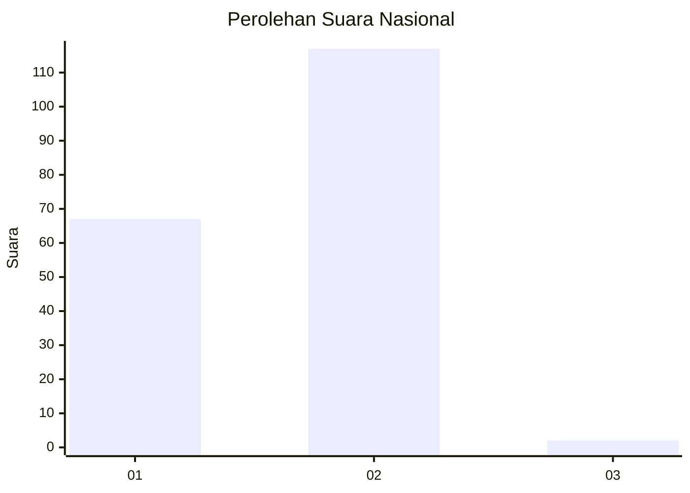
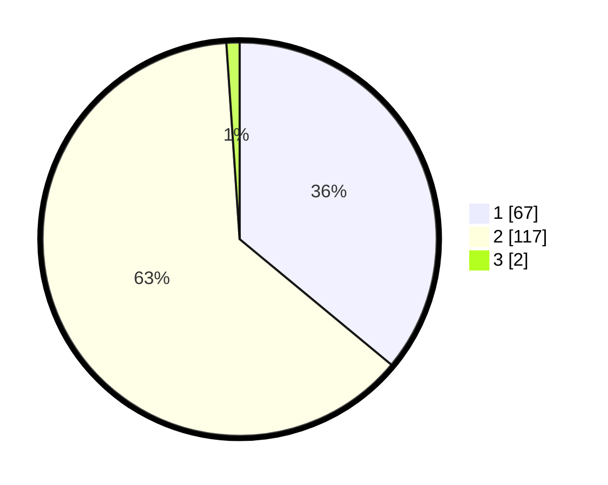

# Hasil

## Grafik

## Tabel

| No. | Nama Paslon    | Suara | Suara (raw) | Persentase |
|:--- |:-------------- | -----:| -----------:| ----------:|
| 1   | ANIES MUHAIMIN | 67    | [67][p-1]   | 36,02      |
| 2   | PRABOWO GIBRAN | 117   | [117][p-2]  | 62,90      |
| 3   | GANJAR MAHFUD  | 2     | [2][p-3]    | 1,08       |

[p-1]: https://github.com/gigit-pemilu/pemilu-2024/blob/main/pilpres/hitung-suara/sub/11-aceh/sub/08-aceh-utara/sub/17-cot-girek/sub/2002-lhok-meurbo/sub/001-tps/sub/paslon-1.txt
[p-2]: https://github.com/gigit-pemilu/pemilu-2024/blob/main/pilpres/hitung-suara/sub/11-aceh/sub/08-aceh-utara/sub/17-cot-girek/sub/2002-lhok-meurbo/sub/001-tps/sub/paslon-2.txt
[p-3]: https://github.com/gigit-pemilu/pemilu-2024/blob/main/pilpres/hitung-suara/sub/11-aceh/sub/08-aceh-utara/sub/17-cot-girek/sub/2002-lhok-meurbo/sub/001-tps/sub/paslon-3.txt

## Foto C Plano

https://sirekap-obj-formc.kpu.go.id/86ee/pemilu/ppwp/11/08/17/20/02/1108172002001-20240214-223918--42dbe630-16c9-4965-b664-5fb553ec7bd0.jpg

https://sirekap-obj-formc.kpu.go.id/86ee/pemilu/ppwp/11/08/17/20/02/1108172002001-20240214-224202--fd72b36f-94b7-47c8-8bff-0dbacb734d64.jpg

https://sirekap-obj-formc.kpu.go.id/86ee/pemilu/ppwp/11/08/17/20/02/1108172002001-20240215-144947--d1cbf295-3a0e-480b-804a-fa8e5f44d1d2.jpg

## Metadata

| Key        | Value               |
| ---------- | ------------------- |
| Time Stamp | 2024-02-16 08:00:28 |

