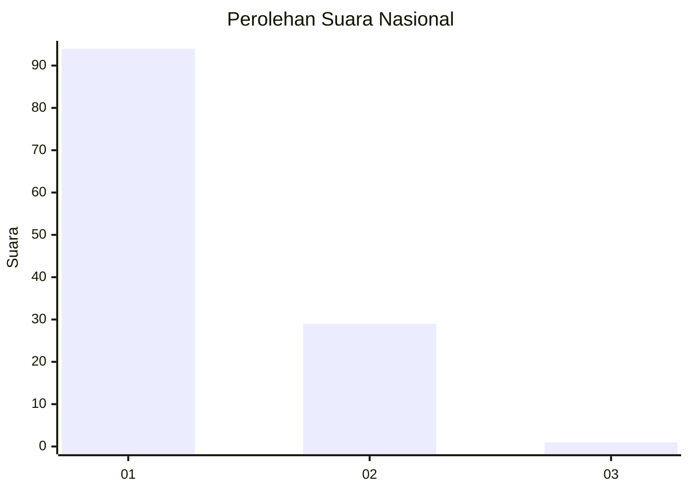
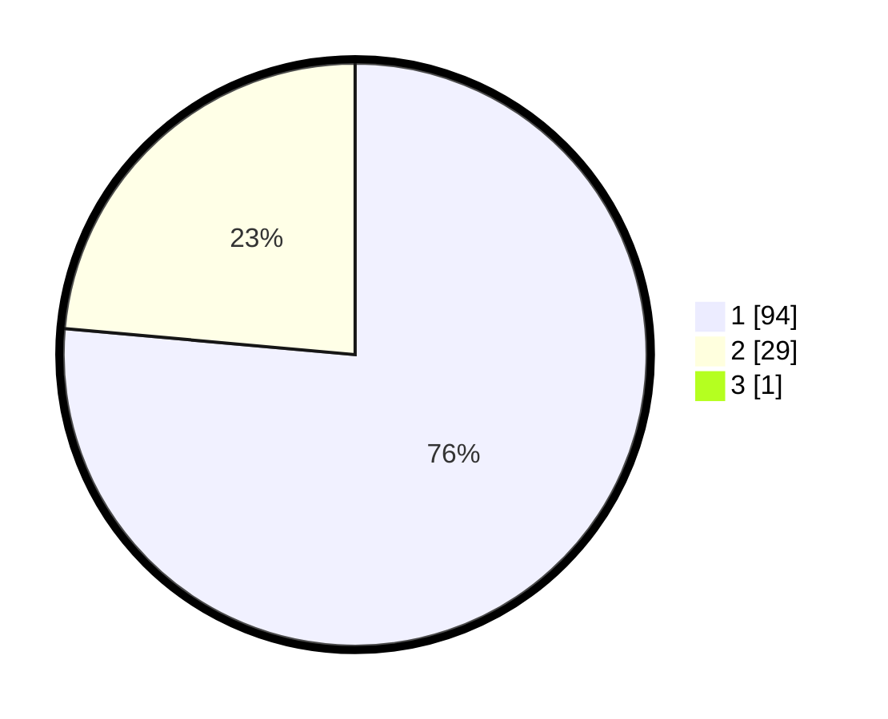

# Hasil

## Grafik

## Tabel

| No. | Nama Paslon    | Suara | Suara (raw) | Persentase |
|:--- |:-------------- | -----:| -----------:| ----------:|
| 1   | ANIES MUHAIMIN | 94    | [94][p-1]   | 75,81      |
| 2   | PRABOWO GIBRAN | 29    | [29][p-2]   | 23,39      |
| 3   | GANJAR MAHFUD  | 1     | [1][p-3]    | 0,81       |

[p-1]: https://github.com/gigit-pemilu/pemilu-2024/blob/main/pilpres/hitung-suara/sub/11-aceh/sub/08-aceh-utara/sub/17-cot-girek/sub/2004-alue-seumambu/sub/002-tps/sub/paslon-1.txt
[p-2]: https://github.com/gigit-pemilu/pemilu-2024/blob/main/pilpres/hitung-suara/sub/11-aceh/sub/08-aceh-utara/sub/17-cot-girek/sub/2004-alue-seumambu/sub/002-tps/sub/paslon-2.txt
[p-3]: https://github.com/gigit-pemilu/pemilu-2024/blob/main/pilpres/hitung-suara/sub/11-aceh/sub/08-aceh-utara/sub/17-cot-girek/sub/2004-alue-seumambu/sub/002-tps/sub/paslon-3.txt

## Foto C Plano

https://sirekap-obj-formc.kpu.go.id/f382/pemilu/ppwp/11/08/17/20/04/1108172004002-20240214-194102--76b64f48-49ec-43b7-82ec-df6c56ceca7b.jpg

https://sirekap-obj-formc.kpu.go.id/f382/pemilu/ppwp/11/08/17/20/04/1108172004002-20240214-193503--1798e56c-70b4-423c-86d9-69c15c44951d.jpg

https://sirekap-obj-formc.kpu.go.id/f382/pemilu/ppwp/11/08/17/20/04/1108172004002-20240214-194704--40ce837d-ee9d-4f53-af80-1c19e5e6783a.jpg

## Metadata

| Key        | Value               |
| ---------- | ------------------- |
| Time Stamp | 2024-02-17 01:00:00 |

