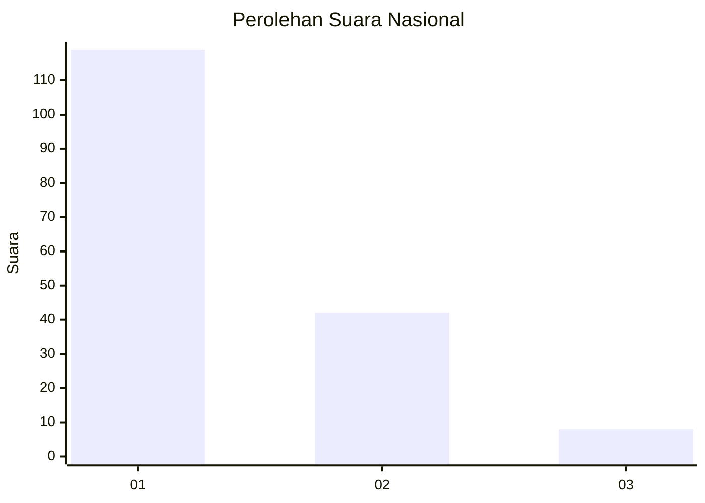
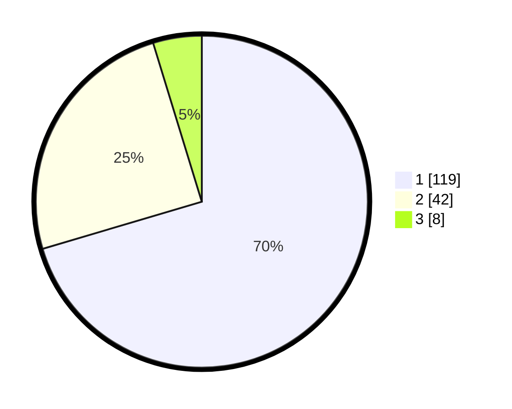

# Hasil

## Grafik

## Tabel

| No. | Nama Paslon    | Suara | Suara (raw) | Persentase |
|:--- |:-------------- | -----:| -----------:| ----------:|
| 1   | ANIES MUHAIMIN | 119   | [119][p-1]  | 70,41      |
| 2   | PRABOWO GIBRAN | 42    | [42][p-2]   | 24,85      |
| 3   | GANJAR MAHFUD  | 8     | [8][p-3]    | 4,73       |

[p-1]: https://github.com/gigit-pemilu/pemilu-2024/blob/main/pilpres/hitung-suara/sub/11-aceh/sub/08-aceh-utara/sub/17-cot-girek/sub/2005-ulee-gampong/sub/002-tps/sub/paslon-1.txt
[p-2]: https://github.com/gigit-pemilu/pemilu-2024/blob/main/pilpres/hitung-suara/sub/11-aceh/sub/08-aceh-utara/sub/17-cot-girek/sub/2005-ulee-gampong/sub/002-tps/sub/paslon-2.txt
[p-3]: https://github.com/gigit-pemilu/pemilu-2024/blob/main/pilpres/hitung-suara/sub/11-aceh/sub/08-aceh-utara/sub/17-cot-girek/sub/2005-ulee-gampong/sub/002-tps/sub/paslon-3.txt

## Foto C Plano

https://sirekap-obj-formc.kpu.go.id/eb1b/pemilu/ppwp/11/08/17/20/05/1108172005002-20240215-011449--4da1219a-82b0-462a-b4c0-46aa8de61a7c.jpg

https://sirekap-obj-formc.kpu.go.id/eb1b/pemilu/ppwp/11/08/17/20/05/1108172005002-20240215-011640--4e43f2a8-26cf-4a83-b35a-4dfb60222b74.jpg

https://sirekap-obj-formc.kpu.go.id/eb1b/pemilu/ppwp/11/08/17/20/05/1108172005002-20240215-114029--0faa2e05-03d4-409b-9e65-c357e5c8112a.jpg

## Metadata

| Key        | Value               |
| ---------- | ------------------- |
| Time Stamp | 2024-02-17 01:00:00 |

