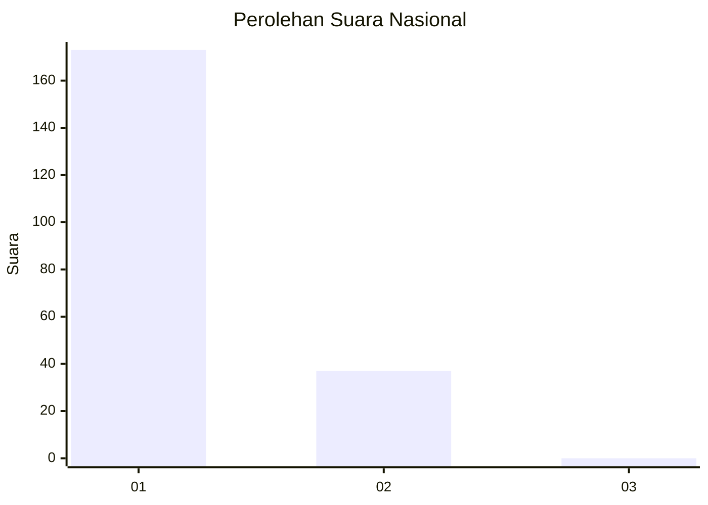
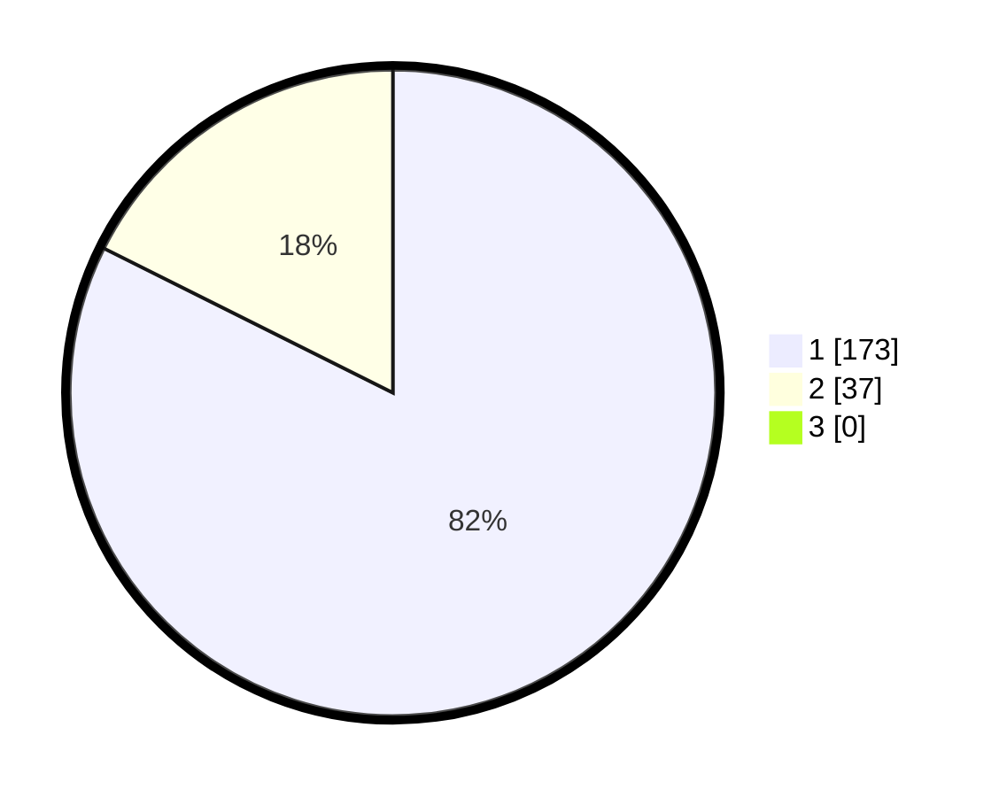

# Hasil

## Grafik

## Tabel

| No. | Nama Paslon    | Suara | Suara (raw) | Persentase |
|:--- |:-------------- | -----:| -----------:| ----------:|
| 1   | ANIES MUHAIMIN | 173   | [173][p-1]  | 82,38      |
| 2   | PRABOWO GIBRAN | 37    | [37][p-2]   | 17,62      |
| 3   | GANJAR MAHFUD  | 0     | [0][p-3]    | 0,00       |

[p-1]: https://github.com/gigit-pemilu/pemilu-2024/blob/main/pilpres/hitung-suara/sub/11-aceh/sub/08-aceh-utara/sub/17-cot-girek/sub/2016-lhok-reuhat/sub/001-tps/sub/paslon-1.txt
[p-2]: https://github.com/gigit-pemilu/pemilu-2024/blob/main/pilpres/hitung-suara/sub/11-aceh/sub/08-aceh-utara/sub/17-cot-girek/sub/2016-lhok-reuhat/sub/001-tps/sub/paslon-2.txt
[p-3]: https://github.com/gigit-pemilu/pemilu-2024/blob/main/pilpres/hitung-suara/sub/11-aceh/sub/08-aceh-utara/sub/17-cot-girek/sub/2016-lhok-reuhat/sub/001-tps/sub/paslon-3.txt

## Foto C Plano

https://sirekap-obj-formc.kpu.go.id/a273/pemilu/ppwp/11/08/17/20/16/1108172016001-20240215-101650--4da21e5a-fa38-480b-851e-fde6824a7c58.jpg

https://sirekap-obj-formc.kpu.go.id/a273/pemilu/ppwp/11/08/17/20/16/1108172016001-20240215-101719--b1d32e01-f42c-4b06-bef3-50751401bf46.jpg

https://sirekap-obj-formc.kpu.go.id/a273/pemilu/ppwp/11/08/17/20/16/1108172016001-20240215-101743--3fe9b8ab-366f-4de8-b9fe-5bb3cf6299d9.jpg

## Metadata

| Key        | Value               |
| ---------- | ------------------- |
| Time Stamp | 2024-02-17 01:00:00 |

