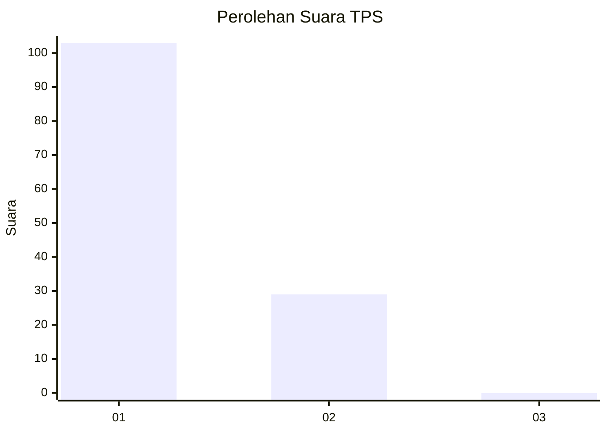
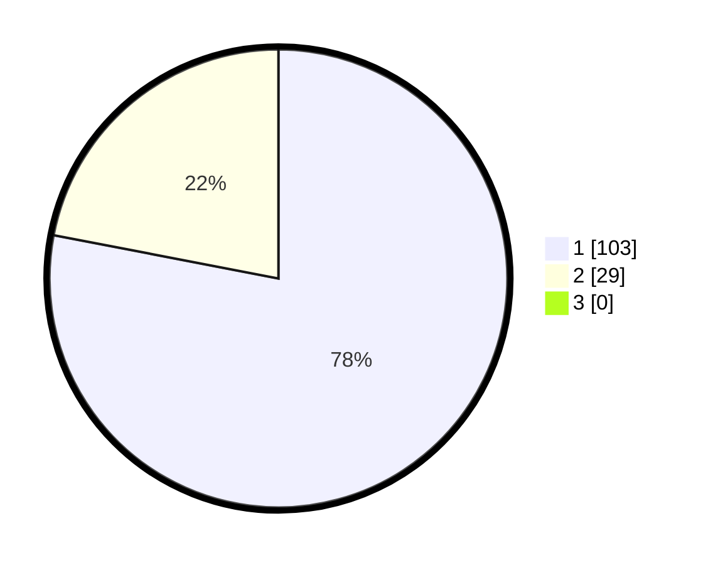

# Hasil

## Grafik

## Tabel

| No. | Nama Paslon    | Suara | Suara (raw) | Persentase |
|:--- |:-------------- | -----:| -----------:| ----------:|
| 1   | ANIES MUHAIMIN | 103   | [103][p-1]  | 78,03      |
| 2   | PRABOWO GIBRAN | 29    | [29][p-2]   | 21,97      |
| 3   | GANJAR MAHFUD  | 0     | [0][p-3]    | 0,00       |

[p-1]: https://github.com/gigit-pemilu/pemilu-2024-11-aceh/blob/main/pilpres/hitung-suara/sub/11-aceh/sub/08-aceh-utara/sub/17-cot-girek/sub/2021-beurandang-krueng/sub/002-tps/sub/paslon-1.txt
[p-2]: https://github.com/gigit-pemilu/pemilu-2024-11-aceh/blob/main/pilpres/hitung-suara/sub/11-aceh/sub/08-aceh-utara/sub/17-cot-girek/sub/2021-beurandang-krueng/sub/002-tps/sub/paslon-2.txt
[p-3]: https://github.com/gigit-pemilu/pemilu-2024-11-aceh/blob/main/pilpres/hitung-suara/sub/11-aceh/sub/08-aceh-utara/sub/17-cot-girek/sub/2021-beurandang-krueng/sub/002-tps/sub/paslon-3.txt

## Foto C Plano

https://sirekap-obj-formc.kpu.go.id/83b1/pemilu/ppwp/11/08/17/20/21/1108172021002-20240215-045327--59388694-d764-40fd-8cf4-d90397fdcc42.jpg

https://sirekap-obj-formc.kpu.go.id/83b1/pemilu/ppwp/11/08/17/20/21/1108172021002-20240215-045646--2b89a2e7-f700-41da-91f9-ca5704723f2e.jpg

https://sirekap-obj-formc.kpu.go.id/83b1/pemilu/ppwp/11/08/17/20/21/1108172021002-20240215-045924--34b5a376-ec0e-4acd-952b-855f3a0e4cf2.jpg

## Metadata

| Key        | Value               |
| ---------- | ------------------- |
| Time Stamp | 2024-02-16 12:51:22 |

