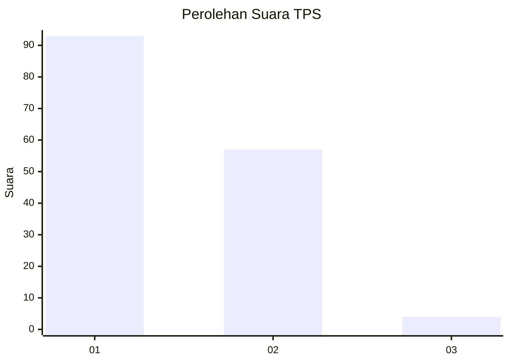
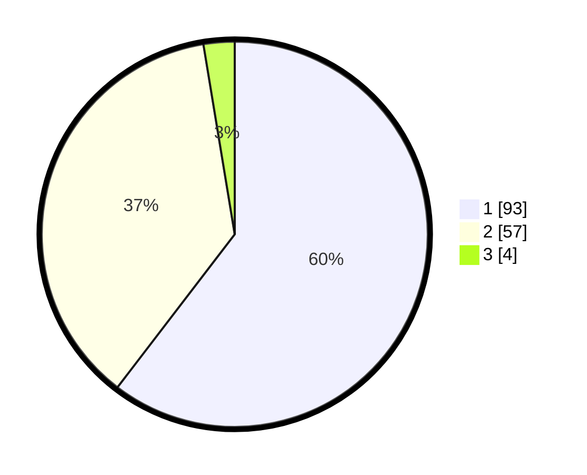

# Hasil

## Grafik

## Tabel

| No. | Nama Paslon    | Suara | Suara (raw) | Persentase |
|:--- |:-------------- | -----:| -----------:| ----------:|
| 1   | ANIES MUHAIMIN | 93    | [93][p-1]   | 60,39      |
| 2   | PRABOWO GIBRAN | 57    | [57][p-2]   | 37,01      |
| 3   | GANJAR MAHFUD  | 4     | [4][p-3]    | 2,60       |

[p-1]: https://github.com/gigit-pemilu/pemilu-2024-11-aceh/blob/main/pilpres/hitung-suara/sub/11-aceh/sub/08-aceh-utara/sub/18-langkahan/sub/2001-cot-bada/sub/001-tps/sub/paslon-1.txt
[p-2]: https://github.com/gigit-pemilu/pemilu-2024-11-aceh/blob/main/pilpres/hitung-suara/sub/11-aceh/sub/08-aceh-utara/sub/18-langkahan/sub/2001-cot-bada/sub/001-tps/sub/paslon-2.txt
[p-3]: https://github.com/gigit-pemilu/pemilu-2024-11-aceh/blob/main/pilpres/hitung-suara/sub/11-aceh/sub/08-aceh-utara/sub/18-langkahan/sub/2001-cot-bada/sub/001-tps/sub/paslon-3.txt

## Foto C Plano

https://sirekap-obj-formc.kpu.go.id/d9a3/pemilu/ppwp/11/08/18/20/01/1108182001001-20240215-143014--f64401ae-0ab9-4cb0-843b-e282ddaf8ceb.jpg

https://sirekap-obj-formc.kpu.go.id/d9a3/pemilu/ppwp/11/08/18/20/01/1108182001001-20240215-143637--dbb67560-8781-4fae-ab70-21b5c73bfc43.jpg

https://sirekap-obj-formc.kpu.go.id/d9a3/pemilu/ppwp/11/08/18/20/01/1108182001001-20240215-142342--c77d69c4-ab19-4778-9051-fbd58415c140.jpg

## Metadata

| Key        | Value               |
| ---------- | ------------------- |
| Time Stamp | 2024-02-17 00:28:35 |

