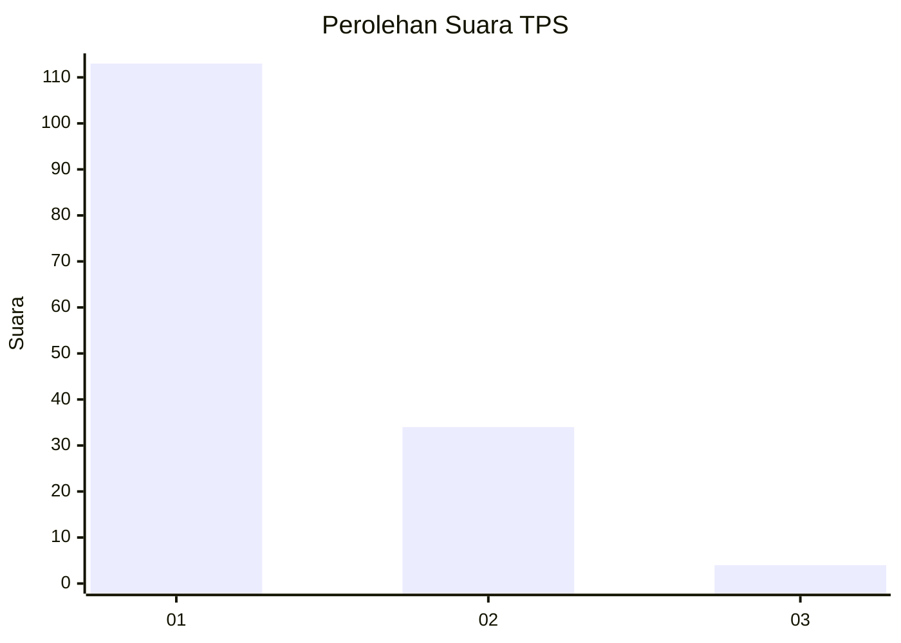
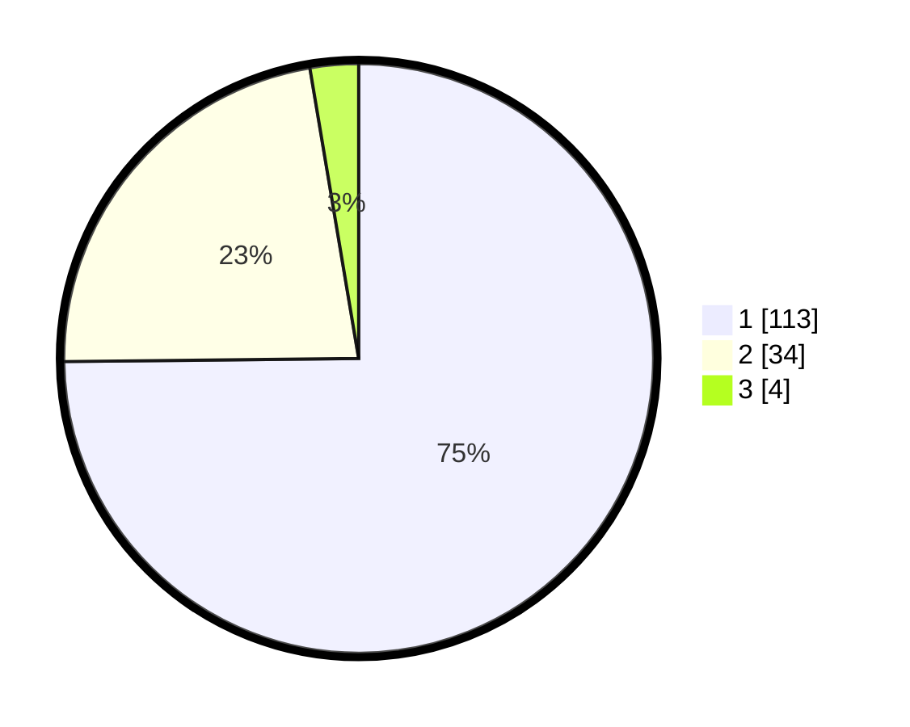

# Hasil

## Grafik

## Tabel

| No. | Nama Paslon    | Suara | Suara (raw) | Persentase |
|:--- |:-------------- | -----:| -----------:| ----------:|
| 1   | ANIES MUHAIMIN | 113   | [113][p-1]  | 74,83      |
| 2   | PRABOWO GIBRAN | 34    | [34][p-2]   | 22,52      |
| 3   | GANJAR MAHFUD  | 4     | [4][p-3]    | 2,65       |

[p-1]: https://github.com/gigit-pemilu/pemilu-2024-11-aceh/blob/main/pilpres/hitung-suara/sub/11-aceh/sub/08-aceh-utara/sub/18-langkahan/sub/2001-cot-bada/sub/002-tps/sub/paslon-1.txt
[p-2]: https://github.com/gigit-pemilu/pemilu-2024-11-aceh/blob/main/pilpres/hitung-suara/sub/11-aceh/sub/08-aceh-utara/sub/18-langkahan/sub/2001-cot-bada/sub/002-tps/sub/paslon-2.txt
[p-3]: https://github.com/gigit-pemilu/pemilu-2024-11-aceh/blob/main/pilpres/hitung-suara/sub/11-aceh/sub/08-aceh-utara/sub/18-langkahan/sub/2001-cot-bada/sub/002-tps/sub/paslon-3.txt

## Foto C Plano

https://sirekap-obj-formc.kpu.go.id/8404/pemilu/ppwp/11/08/18/20/01/1108182001002-20240215-124052--724eb5ff-104f-4ed2-9456-a68a314e7d1a.jpg

https://sirekap-obj-formc.kpu.go.id/8404/pemilu/ppwp/11/08/18/20/01/1108182001002-20240215-123747--e5353453-4327-4146-8218-4161b03deea2.jpg

https://sirekap-obj-formc.kpu.go.id/8404/pemilu/ppwp/11/08/18/20/01/1108182001002-20240215-124020--de259372-6ff3-4c1d-bfeb-bd9594937113.jpg

## Metadata

| Key        | Value               |
| ---------- | ------------------- |
| Time Stamp | 2024-02-17 00:28:35 |

