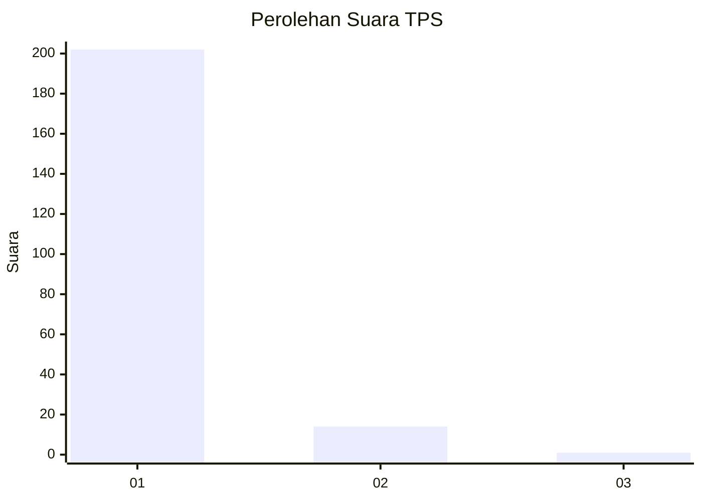
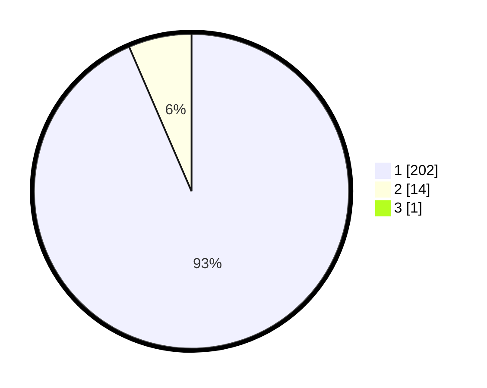

# Hasil

## Grafik

## Tabel

| No. | Nama Paslon    | Suara | Suara (raw) | Persentase |
|:--- |:-------------- | -----:| -----------:| ----------:|
| 1   | ANIES MUHAIMIN | 202   | [202][p-1]  | 93,09      |
| 2   | PRABOWO GIBRAN | 14    | [14][p-2]   | 6,45       |
| 3   | GANJAR MAHFUD  | 1     | [1][p-3]    | 0,46       |

[p-1]: https://github.com/gigit-pemilu/pemilu-2024-11-aceh/blob/main/pilpres/hitung-suara/sub/11-aceh/sub/08-aceh-utara/sub/18-langkahan/sub/2005-paya-tukai/sub/002-tps/sub/paslon-1.txt
[p-2]: https://github.com/gigit-pemilu/pemilu-2024-11-aceh/blob/main/pilpres/hitung-suara/sub/11-aceh/sub/08-aceh-utara/sub/18-langkahan/sub/2005-paya-tukai/sub/002-tps/sub/paslon-2.txt
[p-3]: https://github.com/gigit-pemilu/pemilu-2024-11-aceh/blob/main/pilpres/hitung-suara/sub/11-aceh/sub/08-aceh-utara/sub/18-langkahan/sub/2005-paya-tukai/sub/002-tps/sub/paslon-3.txt

## Foto C Plano

https://sirekap-obj-formc.kpu.go.id/3f3f/pemilu/ppwp/11/08/18/20/05/1108182005002-20240215-150901--ea004bd3-6637-44d1-bf33-17d94af7c86e.jpg

https://sirekap-obj-formc.kpu.go.id/3f3f/pemilu/ppwp/11/08/18/20/05/1108182005002-20240215-151049--13acea38-ecdb-481d-a1e1-6413a1c628b0.jpg

https://sirekap-obj-formc.kpu.go.id/3f3f/pemilu/ppwp/11/08/18/20/05/1108182005002-20240215-151215--56713f87-b7e1-4c80-bc53-760dea80603c.jpg

## Metadata

| Key        | Value               |
| ---------- | ------------------- |
| Time Stamp | 2024-02-17 00:28:35 |

