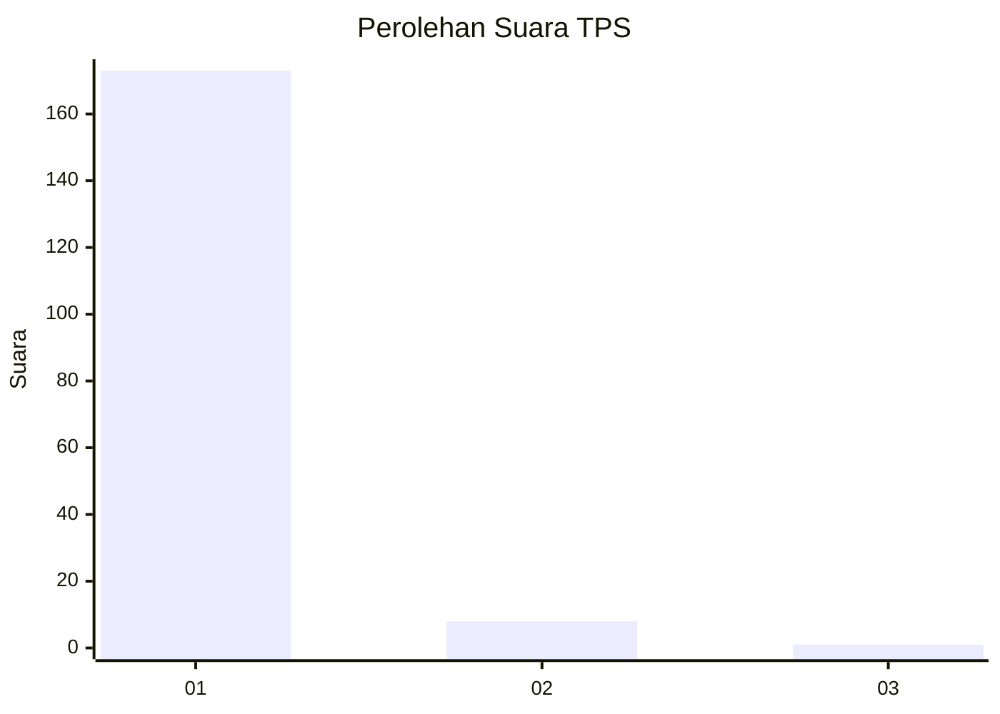
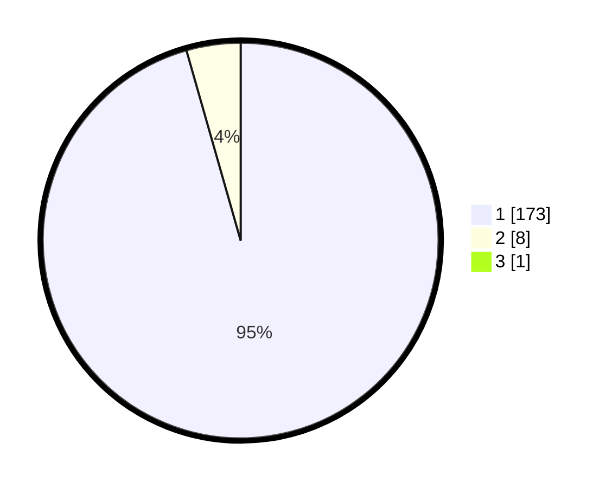

# Hasil

## Grafik

## Tabel

| No. | Nama Paslon    | Suara | Suara (raw) | Persentase |
|:--- |:-------------- | -----:| -----------:| ----------:|
| 1   | ANIES MUHAIMIN | 173   | [173][p-1]  | 95,05      |
| 2   | PRABOWO GIBRAN | 8     | [8][p-2]    | 4,40       |
| 3   | GANJAR MAHFUD  | 1     | [1][p-3]    | 0,55       |

[p-1]: https://github.com/gigit-pemilu/pemilu-2024-11-aceh/blob/main/pilpres/hitung-suara/sub/11-aceh/sub/08-aceh-utara/sub/18-langkahan/sub/2007-krueng-lingka/sub/001-tps/sub/paslon-1.txt
[p-2]: https://github.com/gigit-pemilu/pemilu-2024-11-aceh/blob/main/pilpres/hitung-suara/sub/11-aceh/sub/08-aceh-utara/sub/18-langkahan/sub/2007-krueng-lingka/sub/001-tps/sub/paslon-2.txt
[p-3]: https://github.com/gigit-pemilu/pemilu-2024-11-aceh/blob/main/pilpres/hitung-suara/sub/11-aceh/sub/08-aceh-utara/sub/18-langkahan/sub/2007-krueng-lingka/sub/001-tps/sub/paslon-3.txt

## Foto C Plano

https://sirekap-obj-formc.kpu.go.id/7381/pemilu/ppwp/11/08/18/20/07/1108182007001-20240218-202529--6f35d5f0-7d43-471f-a020-50a5703ecb26.jpg

https://sirekap-obj-formc.kpu.go.id/7381/pemilu/ppwp/11/08/18/20/07/1108182007001-20240215-082015--0e7e4171-ea36-41d1-9907-959aa8d3a7e3.jpg

https://sirekap-obj-formc.kpu.go.id/7381/pemilu/ppwp/11/08/18/20/07/1108182007001-20240215-082141--216dc857-fc5b-4563-a9d8-2e5fd1325eb6.jpg

## Metadata

| Key        | Value               |
| ---------- | ------------------- |
| Time Stamp | 2024-02-19 06:16:00 |

