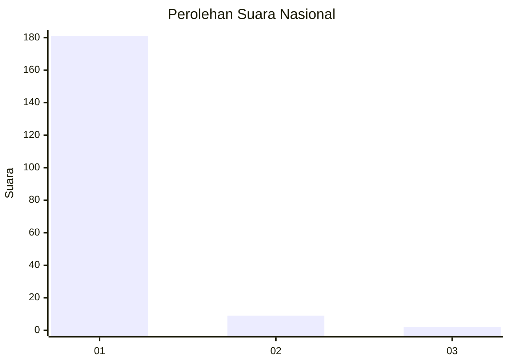
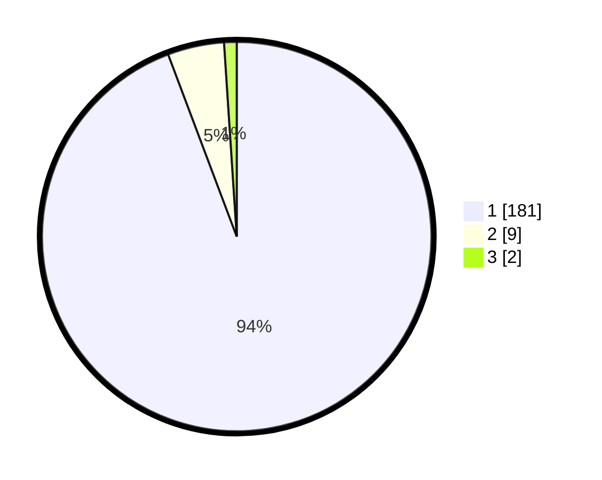

# Hasil

## Grafik

## Tabel

| No. | Nama Paslon    | Suara | Suara (raw) | Persentase |
|:--- |:-------------- | -----:| -----------:| ----------:|
| 1   | ANIES MUHAIMIN | 181   | [181][p-1]  | 94,27      |
| 2   | PRABOWO GIBRAN | 9     | [9][p-2]    | 4,69       |
| 3   | GANJAR MAHFUD  | 2     | [2][p-3]    | 1,04       |

[p-1]: https://github.com/gigit-pemilu/pemilu-2024/blob/main/pilpres/hitung-suara/sub/11-aceh/sub/08-aceh-utara/sub/18-langkahan/sub/2007-krueng-lingka/sub/003-tps/sub/paslon-1.txt
[p-2]: https://github.com/gigit-pemilu/pemilu-2024/blob/main/pilpres/hitung-suara/sub/11-aceh/sub/08-aceh-utara/sub/18-langkahan/sub/2007-krueng-lingka/sub/003-tps/sub/paslon-2.txt
[p-3]: https://github.com/gigit-pemilu/pemilu-2024/blob/main/pilpres/hitung-suara/sub/11-aceh/sub/08-aceh-utara/sub/18-langkahan/sub/2007-krueng-lingka/sub/003-tps/sub/paslon-3.txt

## Foto C Plano

https://sirekap-obj-formc.kpu.go.id/03c9/pemilu/ppwp/11/08/18/20/07/1108182007003-20240215-072038--8762647d-6825-4fd1-bd2b-990b0f38e26b.jpg

https://sirekap-obj-formc.kpu.go.id/03c9/pemilu/ppwp/11/08/18/20/07/1108182007003-20240215-072120--119465ff-006e-4829-99b6-3ae7103c8fd1.jpg

https://sirekap-obj-formc.kpu.go.id/03c9/pemilu/ppwp/11/08/18/20/07/1108182007003-20240215-072154--8bbe84e3-f4f6-42d2-987f-eb72c329f801.jpg

## Metadata

| Key        | Value               |
| ---------- | ------------------- |
| Time Stamp | 2024-02-17 00:28:35 |

