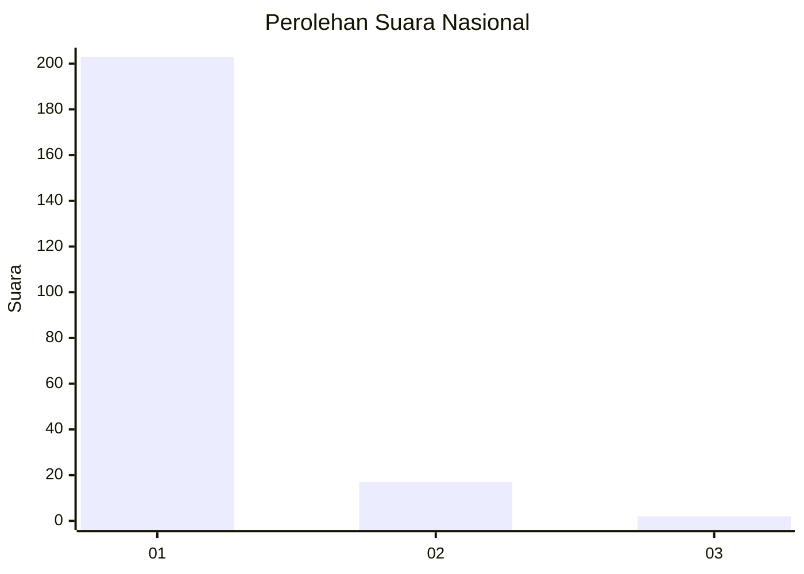
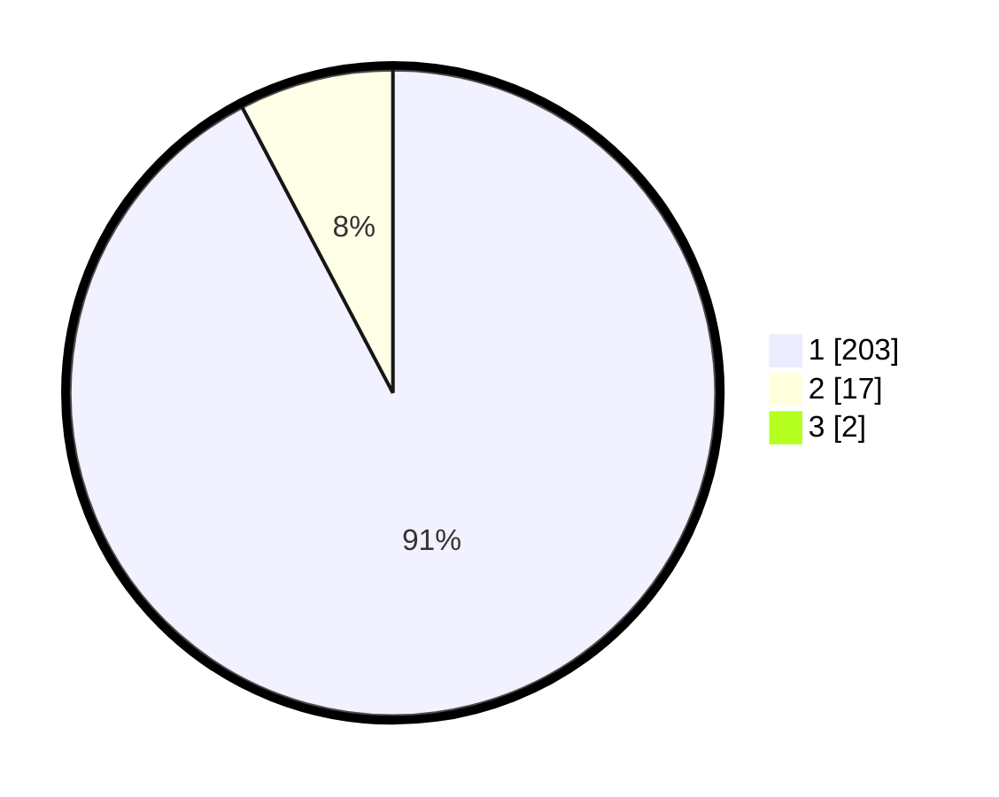

# Hasil

## Grafik

## Tabel

| No. | Nama Paslon    | Suara | Suara (raw) | Persentase |
|:--- |:-------------- | -----:| -----------:| ----------:|
| 1   | ANIES MUHAIMIN | 203   | [203][p-1]  | 91,44      |
| 2   | PRABOWO GIBRAN | 17    | [17][p-2]   | 7,66       |
| 3   | GANJAR MAHFUD  | 2     | [2][p-3]    | 0,90       |

[p-1]: https://github.com/gigit-pemilu/pemilu-2024/blob/main/pilpres/hitung-suara/sub/11-aceh/sub/08-aceh-utara/sub/18-langkahan/sub/2010-leubok-mane/sub/002-tps/sub/paslon-1.txt
[p-2]: https://github.com/gigit-pemilu/pemilu-2024/blob/main/pilpres/hitung-suara/sub/11-aceh/sub/08-aceh-utara/sub/18-langkahan/sub/2010-leubok-mane/sub/002-tps/sub/paslon-2.txt
[p-3]: https://github.com/gigit-pemilu/pemilu-2024/blob/main/pilpres/hitung-suara/sub/11-aceh/sub/08-aceh-utara/sub/18-langkahan/sub/2010-leubok-mane/sub/002-tps/sub/paslon-3.txt

## Foto C Plano

https://sirekap-obj-formc.kpu.go.id/eb69/pemilu/ppwp/11/08/18/20/10/1108182010002-20240215-103052--ac95645a-cf1a-4023-b186-74825d5ce76b.jpg

https://sirekap-obj-formc.kpu.go.id/eb69/pemilu/ppwp/11/08/18/20/10/1108182010002-20240215-103541--773170d9-c939-4707-a9c1-fdd56edf8170.jpg

https://sirekap-obj-formc.kpu.go.id/eb69/pemilu/ppwp/11/08/18/20/10/1108182010002-20240215-103720--e9298ccd-0b82-4419-8dfa-4ebb9aac408e.jpg

## Metadata

| Key        | Value               |
| ---------- | ------------------- |
| Time Stamp | 2024-02-17 16:36:25 |

