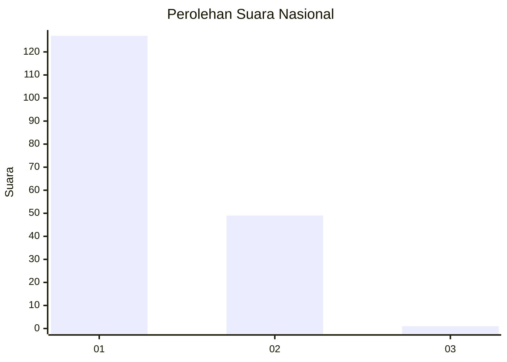
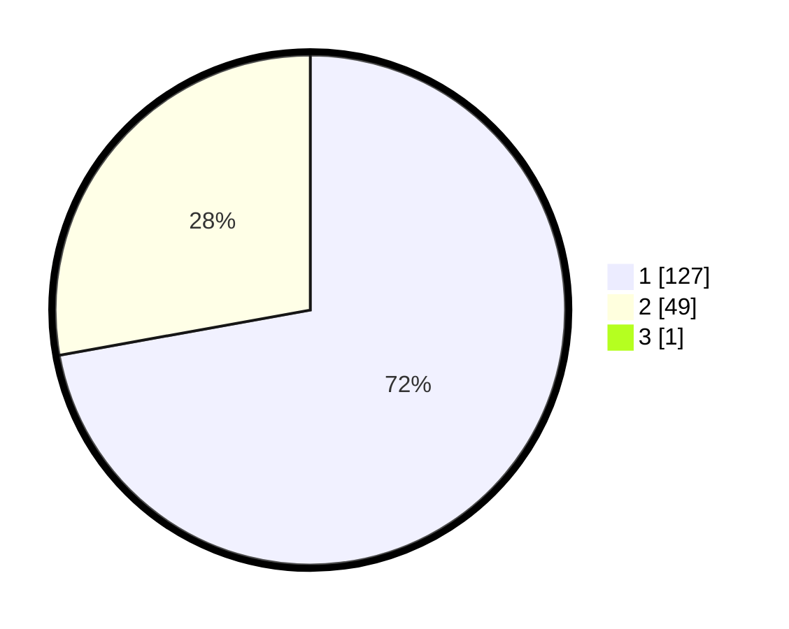

# Hasil

## Grafik

## Tabel

| No. | Nama Paslon    | Suara | Suara (raw) | Persentase |
|:--- |:-------------- | -----:| -----------:| ----------:|
| 1   | ANIES MUHAIMIN | 127   | [127][p-1]  | 71,75      |
| 2   | PRABOWO GIBRAN | 49    | [49][p-2]   | 27,68      |
| 3   | GANJAR MAHFUD  | 1     | [1][p-3]    | 0,56       |

[p-1]: https://github.com/gigit-pemilu/pemilu-2024/blob/main/pilpres/hitung-suara/sub/11-aceh/sub/08-aceh-utara/sub/18-langkahan/sub/2013-alue-krak-kayee/sub/002-tps/sub/paslon-1.txt
[p-2]: https://github.com/gigit-pemilu/pemilu-2024/blob/main/pilpres/hitung-suara/sub/11-aceh/sub/08-aceh-utara/sub/18-langkahan/sub/2013-alue-krak-kayee/sub/002-tps/sub/paslon-2.txt
[p-3]: https://github.com/gigit-pemilu/pemilu-2024/blob/main/pilpres/hitung-suara/sub/11-aceh/sub/08-aceh-utara/sub/18-langkahan/sub/2013-alue-krak-kayee/sub/002-tps/sub/paslon-3.txt

## Foto C Plano

https://sirekap-obj-formc.kpu.go.id/52a1/pemilu/ppwp/11/08/18/20/13/1108182013002-20240215-143117--dc7d4d25-f505-4a10-80b2-62f9182524b3.jpg

https://sirekap-obj-formc.kpu.go.id/52a1/pemilu/ppwp/11/08/18/20/13/1108182013002-20240215-141102--3bb20a1e-22d1-4d33-826e-14b3f4245767.jpg

https://sirekap-obj-formc.kpu.go.id/52a1/pemilu/ppwp/11/08/18/20/13/1108182013002-20240215-141248--d48405cb-c333-4a6b-97db-1b29cd9434ce.jpg

## Metadata

| Key        | Value               |
| ---------- | ------------------- |
| Time Stamp | 2024-02-15 19:30:26 |

